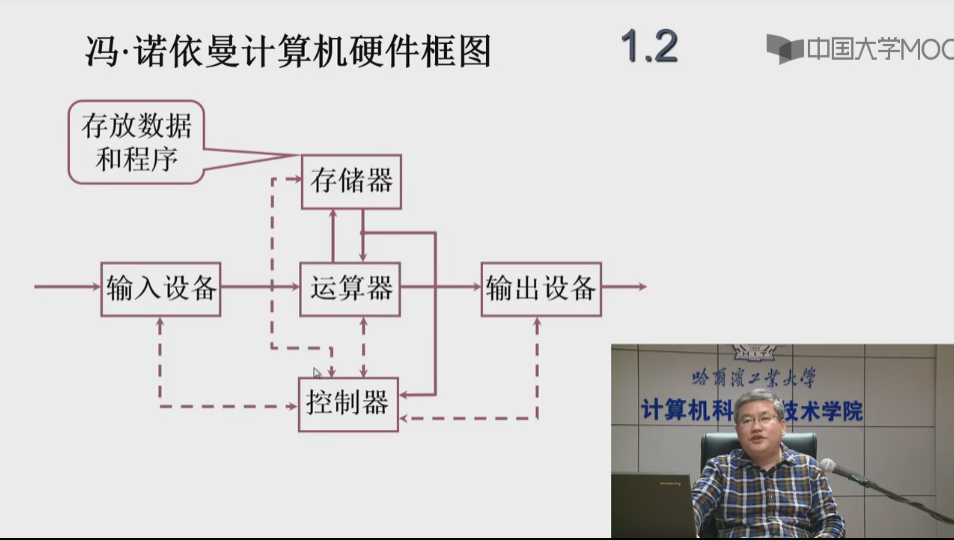
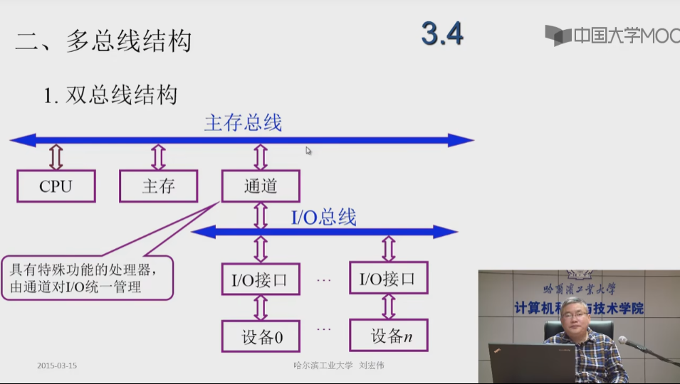
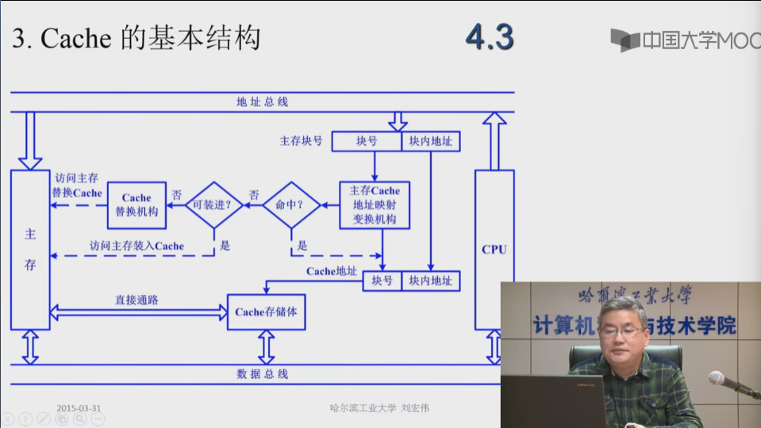
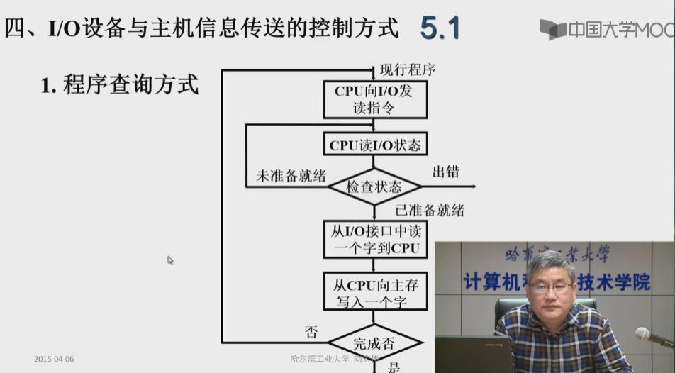
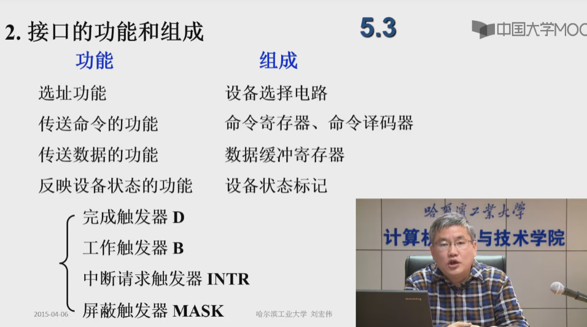

# 计算机组成原理

## 第一章 计算机系统概论

### 1.1 计算机系统简介

#### 一、计算机的软硬件概念

##### 1.计算机系统

问题 1： 现代计算机系统是由哪两部分组成？

把传感器嵌入和装备到电网、铁路、桥梁、隧道、公路、建筑、供水系统、大坝、油气管道等各种物体中，并且被普遍连接，形成所谓的“物联网”，然后将“物联网”与现有的互联网整合起来，实现人类社会与物理系统的整合，形成智慧地球。

回答 ：计算机系统分为：

- 硬件
  - 计算机的实体：如主机、外设等
- 软件：由具有各类特殊功能的信息程序组成
  - 系统软件：用来管理整个计算机系统
    - 语言处理程序
    - 操作系统
    - 服务性程序
    - 数据库管理系统
  - 应用软件：按任务需要编制成的各种程序

#### 二、计算机系统的层次结构

简单的一个层次结构：

下层是计算机系统的硬件，对硬件进行了相对的封装，对软件提供了接口，比如说提供了指令集，软件可以用这些指令集来编写能够完成一定功能的软件。
软件又分为了应用软件和系统软件，系统软件又利用了硬件提供的接口，完成自己的功能，比如说对系统当中的软硬件资源进行管理，为用户提供了人机交互界面；应用软件利用系统软件提供的接口，调用系统软件的接口，来实现自己的功能。

- 系统复杂性管理的方法-1
  - 抽象：对于一个过程或者一件制品的某些细节有目的的隐藏，以便把其他方面、细节或者结构表达得更加清楚
    
- 系统复杂性管理的方法-2
  - 层次化：将被设计的系统划分为多个模块或者子模块
  - 模块化：有明确定义的功能和接口
  - 规则性：模块更容易被重用

#### 三、计算机体系结构和计算机组成

- 计算机体系结构： 程序员所见到的计算机系统的属性概念性的结构与功能特性（指令系统、数据类型、寻址技术、I/O 机理）
- 计算机组成： 实现计算机体系结构所体现的属性（具体指令的实现）
  

### 1.2 计算机的基本组成

#### 一、冯·诺伊曼计算机的特点

- 1. 计算机由五大部件组成：存储器、运算器、控制器、输入设备和输出设备
- 2. 指令和数据以同等地位存于存储器，可按地址寻访
- 3. 指令和数据用二进制表示
- 4. 指令由操作码和地址码
- 5. 存储程序
- 6. 以运算器为中心

实线表述数据通路，虚线表示控制和状态变化

问题所在：所有的操作都必须经过运算器，那么运算器负载太大；设计图比较乱，不具有层次化的特征

#### 二、计算机硬件框图

怎么对冯·诺伊曼计算机进行改进？
改进图：

双箭头代表数据传输

- 1.以存储器为中心

#### 三、计算机的工作步骤

- 1. 上机前的准备
  - 建立数学模型
  - 确定计算方法
  - 编制解题程序
    - 程序-运算的全部步骤
    - 指令-每一个步骤

- 2. 计算机的解题过程

  - （1）存储器的基本组成
    
    存储体——存储单元——存储元件 0/1
    （大楼——房间——床位 没人/有人）

    存储单元：存放一串二进制代码

    存储字：存储单元中二进制代码的组合

    存储字长：存储单元中存储字的长度，二进制代码的位数

    按照地址寻址

    MAR：存储器地址寄存器，反映存储单元的个数，
    MDR：存储器数据寄存器，反映存储字长

    MAR（Memory Address Register，存储器地址寄存器）：用于存储 CPU 要访问的内存单元的地址。当 CPU 需要访问内存时，会将要访问的地址写入 MAR 中，以便内存控制器根据地址找到对应的内存单元并将其内容返回给 CPU。

    MDR（Memory Data Register，存储器数据寄存器）：用于存储 CPU 从内存中读取的数据，或将要写入内存的数据。当 CPU 需要从内存中读取数据时，内存控制器会将数据传输到 MDR 中，CPU 再从 MDR 中读取数据。当 CPU 需要向内存写入数据时，会将要写入的数据先存储到 MDR 中，再将要访问的内存地址写入 MAR 中，以便内存控制器根据地址将数据写入相应的内存单元。

    每一个存储体都会存放很多存储单元，存储单元的个数是由存储器地址寄存器 MAR 存储，比如：4 位=从 0000-1111 一共 16 个存储地址，
    每一个存储单元存放的数据称为存储字，每一个存储字的长度由存储器数据寄存器存放，比如：8 位=一个存储字的长度为 8 位，即访问出来的数据是 8 位。

    总结：存储体用来存放 01 代码，可能是指令也可能是数据，被分成了多个存储单元，每个存储单元都保存了 01，01 的个数我们称为存储字长，每个存储单元保存的数据我们称为一个存储字。对于存储器的读出和写入，我们要用 MAR 和 MDR 两个寄存器。

  - （2）运算器的基本组成以及操作过程
    
    在计算机组成中，ACC（Accumulator）指的是累加寄存器，用于存放计算结果；MQ（Multiplier-quotient）指的是乘商寄存器，通常用于存放除法和乘法运算中的商和乘积；X 指的是通用寄存器，用于存放操作数和地址；ALU（Arithmetic Logic Unit）指的是算术逻辑单元，是计算机运算器的核心部件，用于实现计算机的算术和逻辑运算。

    
    
    
    

  - （3）控制器的基本结构
    
    完成一条指令：

    - 取指令 PC：程序计数器
    - 分析指令 IR：指令寄存器，存放当前执行的这条指令
    - 执行指令 CU：控制单元

    PC 存放当前欲执行指令的地址，具有计数功能（PC）+ 1 =》 PC

  - （4）主机完成一条指令的过程
    以取数指令为例：
    

    以存数指令为例：
    

### 1.3 计算机硬件的主要技术指标

- 买这台机器做什么
- 你有多少钱
- 机器的性能能否满足你的要求

* 如果在购买前对计算机的性能进行评价

  - 处理速度快、内存容量大

* 1. 机器字长

  CPU 一次能处理数据的位数，与 CPU 中的寄存器位数有关

* 2. 运算速度

  - 主频
  - 核数，每个核支持的线程数
  - 吉普森法 $$\sum_{i=1}^n i^2 = \frac{n(n+1)(2n+1)}{6}$$
  - CPI 执行一条指令所需要的时钟周期数
  - MIPS 每秒能够执行百万条指令
  - FLOPS 每秒浮点运算次数

* 3. 存储容量
     存放二进制信息的总位数
     

## 第二章 计算机的发展和应用

### 2.1 计算机的发展史

#### 一、计算机的产生和发展

1946 年 美国 ENIAC
十进制运算

18000 多个电子管
1500 多个继电器
150 千瓦
30 吨
1500 平法英尺
5000 次加法/秒
用手动搬动开关和插拔电缆来编程

现代计算机产生的驱动力：需求、技术发展（电子技术的发展）、体系结构技术发展

冯·诺伊曼机器

### 2.2 计算机的应用

### 2.3 计算机的展望

## 第三章 系统总线

### 3.1 总线的基本概念

#### 一、为什么要用总线

总线在计算机中扮演了重要的角色，它是计算机内部各个部件之间传输数据和信号的通路。计算机内部的各个组件，如 CPU、内存、硬盘、显卡等，需要相互通信传递数据，而总线就提供了这样一个传输数据的通道。

总线可以简化计算机内部的连接方式，使得不同组件之间的连接更加灵活，同时也方便了计算机系统的维护和扩展。使用总线可以有效地减少连接线路的数量，降低计算机的成本和复杂度。

总线还可以提高计算机系统的性能和效率。通过总线，计算机内部各个组件可以并行工作，同时进行数据传输和处理，从而加快计算机系统的运行速度。总线也可以支持多个组件同时访问内存或其他共享资源，提高了计算机系统的并发性和吞吐量。

#### 二、什么是总线

总线（Bus）是连接各个部件的信息传输线，是各个部件共享的传输介质。
在任何时刻，只有一对部件可以使用总线。

#### 三、总线上信息的传输

串行总线走的是串行信号，并行总线走的是并行信号。
并行信号就是以并行方式通信的信号，在并行通信中一个字节（8 位）数据是在 8 条并行传输线上同时由源端传到目的地，也可以说有多个数据线（几根就是几位），在每个时钟脉冲下可以发送多个数据位（几位的并行口就发送几位）。
而串行信号就是以串行方式通信的信号。串行通信指数据在单条一位宽的传输线上，一比特接一比特地按顺序传送的方式，在早期的定义里也有说只有一根数据线，每个时钟脉冲下只能发送一位数据的方式。

通常情况下，并线支持短线传输，而串行支持远线传输。因为在远距离传输的过程中，线号更容易收到干扰，并行情况下会导致多条信号错误。

#### 四、总线结构的计算机举例

1. 单总线结构框图
   
   单总线的弊端：因为任何情况下，同一时间只能有一对部件可以使用总线。如果有一个 I/O 设备一直向主存中写入数据，那么 CPU 就会停止运行程序。

1. 面向 CPU 的双总线结构框图
   
   CPU 和主存之间连了一条 M 总线，加快了 CPU 从主存中取指令和数据的速度，不会收到 I/O 总线的干扰。但是 I/O 总线向主存的写入还是会经过 CPU。
   面向 CPU 总线的弊端：如果有一个 I/O 设备一直向主存中写入数据，那么 CPU 还是会停止运行程序。

1. 面向主存的双总线结构图
   

### 3.2 总线的分类

- 1. 片内总线：芯片内部的总线
- 2. 系统总线：计算机各部件之间的信息传输线
  - 数据总线：双向，与机器字长、存储字长有关，一般总线的宽度是小于等于机器字长或者存储字长的
  - 地址总线：单向，与存储地址、I/O 地址有关
  - 控制总线：有出、有入
- 3. 通信总线：用于计算机系统之间或者计算机系统与其它系统（如控制仪表、移动通信等）之间的通信
     传输方式：
  - 串行通信总线
  - 并行通信总线

### 3.3 总线的特性及性能指标

#### 一、总线物理实现

#### 二、总线特性

- 1. 机械特性
     尺寸、形状、管脚数及排列顺序
- 2. 电气特性
     传输方向和有效的电平范围
- 3. 功能特性
     每根传输线的功能：地址、数据、控制
- 4. 时间特性
     信号的时序关系

#### 三、总线的性能指标

- 1. 总线宽度
     数据线的根数
- 2. 标准传输率
     每秒传输的最大字节量（MBps）
- 3. 时钟同步/异步
     同步、不同步
- 4. 总线复用
     地址线与数据线复用（8086），是为了减少芯片的管脚数，管脚数减少了，芯片大小也会减少
- 5. 信号线数
     地址线、数据线与控制线的总和
- 6. 总线控制方式
     突发、自动、仲裁、逻辑、计数
- 7. 其他指标
     负载能力：这条总线上能挂载多少个 I/O 设备

#### 四、总线标准

总线标准：

- ISA
- EISA
- VESA（LV-BUS）
- PCI
- AGP
- USB
  

### 3.4 总线结构

#### 一、单总线结构

#### 二、多总线结构

1. 双总线结构
   
   
   除了面向 CPU 和面向主存的双总线结构，还有其他的结构
   

2. 三总线结构
   

3. 三总线结构的又一形式
   
   可能存在的问题：不同传输速度的外部设备同时使用扩展总线

4. 四总线结构
   
   特点：把高速设备和低速设备分类

### 3.5 总线控制

多个设备可能同时向总线发出占用请求，那么到底要让哪一个设备占用？

当一对设备占用了总线，那么这对设备要怎么通信来保证通信过程的正确？

#### 一、总线判优控制

1. 基本概念
   通过是否能够向总线提出请求，把设备分成：

- 主设备（主模块）
  对总线具有控制权，可以提出总线的占用申请，并且在占用之后，可以控制和另外一台设备之间进行的通信过程
- 从设备
  不能对总线提出请求和进行控制，只能响应从 主设备发来的总线命令

一个设备不一定一定是主设备或者从设备；一条总线上不一定只有一个主设备。

总线判优控制：两种判优逻辑

- 集中式，这种方法我们可以把总线的判优逻辑给做在一个部件上，比如放在 cpu 中
  - 链式查询
  - 计数器定时查询
  - 独立请求方式
- 分布式，这种判优逻辑会分配到各个部件上

2. 链式查询方式
   
   GPT：
   在总线控制的链式查询中，BR，BS 和 BG 是标志寄存器中的三个位，用于控制总线传输和中断处理：
   - BR（Bus Request）：表示一个设备正在请求总线控制权。当 BR 位被设为 1 时，表示当前设备正在请求总线控制权，此时其他设备不能请求总线控制权。
   - BS（Bus Stop）：表示请求总线控制权的设备已经完成了总线传输，并释放了总线控制权。当 BS 位被设为 1 时，表示当前设备已经完成了总线传输并释放了总线控制权，此时其他设备可以请求总线控制权。
   - BG（Bus Grant）：表示总线控制权被授予给了请求总线控制权的设备。当 BG 位被设为 1 时，表示总线控制权已被授予给了请求总线控制权的设备。
     特点：
   - 总线控制部件是集中在一起的。
   - 数据总线，用于信息交互过程当中数据的传输。
   - 地址总线，主设备占用了之后，要通过地址总线来找到要通讯的那个从设备。
   - BR，总线请求，所有的设备都通过 BR 来发出总线占用或者总线使用的这个请求。
   - BS，总线忙，如果某一个设备，占用了总线的控制权，就通过 BS 这个信号告诉其他部件总线忙。
   - BG，总线授权，是为什么叫链式查询的原因，BG 是一个一个的向下查询。过程：如果挂接在总线上的这些 I/O 接口有总线占用请求的话，I/O 接口会通过 BR 向总线控制部件提出占用请求。总线控制部件在接收到这个占用请求后，并且可以让出这个总线的控制权，可以把控制权交给 IO 设备进行使用，这个时候就要查询。因为所有的 IO 设备都是通过 BR 这条总线提出的总线占用请求，不知道该到哪一个设备占用了，所以要一个个链式的查询。
     问题：
   - 因为此时优先权的判定是 BG 这条线上 IO 设备的先后，当一个设备处在比较靠后的位置上时，它就很难拿到总线控制。
   - 对电路故障特别敏感，尤其是 BG 这条线。如果某一个电路接口出现故障，后面的 IO 设备永远不能对总线占用了。
3. 计数器定时查询
   
   - 在总线控制部件里面有一个计数器，初值无所谓大小。如果某一个主设备想要占用总线，想和一个从设备进行数据传输。这个设备通过 BR 提出总线占用请求，那么总线控制器接收到总线占用请求，在可以响应的前提下，可以让出总线使用权的情况下，就会启动这个计数器，这个计数器的值是通过设备地址线发出的。
   - 设备地址线给出信号以后，就对 IO 接口`x`进行查询，如果`x`没有提出总线占用请求的话，计数器就会自动进行加 1。如果有发出占用请求，就会通过 BS 这条线进行应答
   - 特点：还是有地址线和数据线。有一条新的线：设备地址线。设备地址线运用了计数器查询方式，这条线上传输的地址实际上是由一个计数器给出的。通过这个地址来查找某一个设备是否发出了总线的占用请求。
   - 优点：优先级确定非常灵活，可以是事先确定的（计数器初值设置为`x`）。也可以是不确定的，比如说从上一次停止的地方。
4. 独立请求方式
   
   总线控制部件内部有一个排队器。

#### 二、总线通信控制

1. 目的
   解决主从设备（通信双方）协调配合问题
2. 总线传输周期
   主设备和从设备之间完成一次完整的、可靠的通信的时间。
   - 申请分配阶段：主模块申请，总线仲裁决定
   - 寻址阶段：主模块向从模块给出地址和命令
   - 传数阶段：主模块和从模块交换数据
   - 结束阶段：主模块撤销有关信息
3. 总线通信的四种方式
   - 同步通信：由统一时标（定宽、定距）控制数据传输，即在固定的传输点上给出固定的传输操作
     
     
   - 异步通信：没有统一时标，采用应答方式，没有公共时钟标准
     
     在这个当中，主设备不管是否接收到响应信号，在一段时间后，都会撤销请求信号；从设备也不管是否主设备接收到应答信号，一段时间后，也会撤销应答信号
     
     在这个当中，主设备会等到从设备响应接收到之后，才关闭请求。但是从设备还是不管主设备是否接受到应答，一段时间后还是会自己关闭应答。
     
     都要保证主从设备互相接收到各自发出的信号。主设备在接收到应答之后会关闭自己的请求，并通知从设备，让从设备关闭自己的应答。
   - 半同步通信：同步、异步结合
     - 同步：发送方 用系统时钟前沿发信号；接受方 用系统时钟后沿判断、识别
     - 异步：允许不同速度的模块和谐工作；为了调整主从设备之间的差异增加一条“等待”响应信号 `WAIT`（上划线），由从模块发出
       
       假设，主模块是 cpu，从模块是存储器，cpu 处理数据和命令的速度要远大于存储器的。从模块如果不能在接收到指令后的下一个时钟周期将数据准备好，就会主动发出 wait 等待信号，让 wait 信号电平为低电平。主模块会在下一个时序开始前监测 wait 电平，如果当前电平为低电平，就在主模块的时序中添加一个时钟周期。
       
       
       特点：
     1. 主模块发地址、命令 —— 占用总线
     2. 从模块准备数据 —— 不占用总线，但因为要等待应答，总线仍被主从一方占用，因此总线空闲
     3. 从模块向主模块发数据 —— 占用总线
   - 分离式通信：充分挖掘系统总线每个瞬间的相应
     一个总线传输周期，分为
     - 子周期 1：主模块申请占用总线，发出地址和命令；使用完后，放弃总线的使用权
     - 子周期 2：从模块申请占用总线，将各种信息送至总线上
       特点：
     1. 各个模块都有权申请占用总线
     2. 采用同步方式通信，不等待对方应答
     3. 各个模块准备数据时，不占用总线
     4. 总线被占用时，无空闲

## 第四章 存储器

### 4.1 概述

#### 一、存储器分类

1. 按存储介质分类
   - （1）半导体存储器 TTL、MOS
   - （2）磁表面存储器 磁头、磁载体
   - （3）磁芯存储器 硬磁材料、环状元件
   - （4）光盘存储器 激光
2. 按存取方式分类
   随机访问的解释：不管这个数据存放在存储体什么位置，只要给出地址，不同的地址可以在相同时间内将信息取出或者写入。
   - （1）存取时间与物理地址无关（随机访问）：随机存储器 RAM（在程序执行过程中可读可写）、只读存储器 ROM（在程序的执行过程中只读）
   - （2）存取时间与物理地址有关（串行访问）：顺序存取存储器（比如：磁带）、直接存取存储器（比如：磁盘）
     磁盘的机理：磁盘在存取的时候，首先要找到给定的磁道，这个过程是通过磁头或者读写头在磁盘表面进行镜像移动来完成的，然后磁头停留在指定的磁道上，磁盘转动，直到指定的扇区转到磁头下才能开始这个读出或者写入过程。
3. 按在计算机中的作用分类
   存储器：

- 主存储器：
  - RAM：一般来说，用户的数据，用户的程序都需要可读可写
    - 静态 RAM
    - 动态 RAM
  - ROM：系统程序系统当中的一些参数，为了防止用户修改
    - MROM
    - PROM
    - EPROM
    - EEPROM
- 辅助存储器，是计算机中用于长期存储数据和程序的设备，也被称为外部存储器。与主存储器相比，辅助存储器的容量更大，价格更便宜，但访问速度较慢。主要作用是扩展计算机的存储容量，使得大量数据和程序可以长期保存，并随时读取和修改。常见的辅助存储器包括硬盘、光盘、闪存驱动器等。
- Flash Memory 便携式存储器，辅助存储器的缓冲（主存储器和辅助存储器速度差距大）
- 高速缓冲存储器 Cache，放在 CPU 和主存储器之间

#### 二、存储器的层次结构

1. 存储器的三个主要特性的关系
   速度、容量、价格
   
2. 缓存 - 主存层次和主存 - 辅存层次
   
   计算机的主机有 CPU 和存储器两部分构成。CPU 可以从主存储器中读信息，也可以把运行的结果保存到主存储器中。主存储器的大小不足以放置足够多的数据时，就要求我们要有辅助存储器。我们用软硬件相结合的方法把主存储器和辅助存储器构成一个整体。从应用程序员的角度来看，这个架构有主存储器的速度，辅助存储器的容量和价格。在程序执行的过程中，即使程序非常大，超过了主存储器的容量，应用程序员也不需要考虑哪些部分放置在哪个存储器当中。

   缓存里面保存的信息是主存储器当中一些信息的副本，那么 CPU 可以直接访问缓存，通过访问缓存来访问主存储器。缓存和主存储器之间也进行信息交互。如果说缓存当中保存的内容是 CPU 最常用的信息，绝大多数都可以从缓存当中获得的话，那么计算机的速度就会得到很大的提升。成为程序的局部性原理，包括：时间的局部性和空间的局部性。

   缓存和主存储器之间我们需要这个处理过程非常快，所以需要通过硬件进行操作；而主存储器和辅助存储器之间需要解决的问题是主存储器的容量问题，就不需要全部由硬件来完成，可以通过软硬件结合的方式。

   那么就会产生一个问题：主存储器和辅助存储器构成的这个整体我们一般称为虚拟存储器。既然它是由主存储器和辅助存储器构成的，那虚拟存储器的空间地址应该由什么来定义呢？在这个层次中，给出了一个新的定义：虚地址，也就是在编写程序的过程中，大家用到的逻辑地址。在编写过程中，我们所用到的地址都是以 0 开头的。那真正的物理地址是在这个程序被装入到内存或者是在指令要执行的时候，由特定的机构，把这个地址由虚拟地址或者是逻辑地址转换为内存单元当中的这个地址。

   那缓存和主存储器之间是直接使用主存储器的地址，没有定义一个空间，也没有使用缓存的地址。实际上，缓存是按照内容来进行查找的，即使给出一个地址，比如说缓存块的编号。所以在程序的执行过程当中，即使指令在缓存当中的，指令当中的地址或者是我么执行的时候需要的地址，实际上也是主存储器的地址，我们把主存储器的地址再转化成它在缓存中的这个块号还要块中的便偏移地址。最后，完成信息的读取。

### 4.2 主存储器

#### 一、概述

1. 主存储器的基本组成
   
   存储体
   MAR 当中保存了我们要访问的那个存储单元的地址。必须进过译码器编译之后，才能选定指定的存储单元。
   MDR 当中保存了我们要读出或者写入的数据。到底是读出还是写入主要通过读写电路和控制电路来控制。如果是写入，就要把 MDR 当中的数据送入到 MAR 指定的那个存储单元中。

注意！MAR 和 MDR 都是集成在 CPU 上的，但是属于主存部分。

2. 主存储器和 CPU 的联系
   
   CPU 和主存储器之间的连接信号分成了三类：数据总线、地址总线和控制总线。数据总线完成了 CPU 和主存储器之间的信息传输，所以数据总线直接连接在 MDR 上，是双向的，可以读出和写入。

3. 主存储器中存储单元的地址分配
   假设，我们现在主存储器的结构存储字长是 32 位（进行读写的最长数据长度是 32 位，即 32 个 0/1），编制单位是字节，每一个字节都有一个地址。在这种情况下，一个存储字是 32 位，一个字节是 8 位，都有一个地址，那么数据是长度为 8 的 16 进制。那这八个 16 进制数用二进制来表示的话，每一个占 4 位，一共是 32 位，正好保存在一个存储单元当中。

   像这样的一个长度为 8 的 16 进制数应该怎么保存呢？

   - 把高位字节的地址作为我们存储器的地址，4 个字节就会对应 4 个地址，我们把高位的 4 个字节所在的地址定义为字的地址。
   - 高位字节地址为字地址
     
   - 低位字节地址为字地址
     

   这里要学会计算通过两种寻址方式得到寻址范围：
   假设有地址线 24 根，按字节寻址，一根地址线就能得到一个地址，一个地址对应一个字节，`2^24 = 16MB`。假设我取的是 16 位的数字，而且在这个计算机当中，它的存储字长或者机器字长就是 16 位，按照字来寻址，一个字节是一个长度为 8 的 16 进制数，`8MW`。

   如果是按字寻址，上面讲到要为字中的字节编码，这个字长为 32，被分为 4 个字节，一个字节等于 8 位字长，就需要地址线单独拿出最后的两根保存字节的地址。于是乎，这 24 根要刨去两根，还有 22 根用来按字寻址，所以按字寻址的范围是`2^22^=2^20^*2^2^=1M *4=4M`

4. 主存储器的技术指标
   （1）存储容量
   主存当中存放的二进制代码的总位数
   （2）存储速度
   - 存取时间 TA： 指从启动一次存储器操作到完成该操作所经历的时间，分为读出时间和写入时间
   - 存取周期 TM： 又称读写周期或访问周期。 它是指存储器进行一次完整的读写操作所需的全部时间，即连续两次独立访问存储器操作（读或写操作）之间所需的最小时间间隔

对于存储速度的三个关键点我们需要注意存取时间不等于存储周期，并且通常情况下存储周期大于存取时间。这是因为对于任何一种存储器，在经历读写操作之后，还需要一段时间来进行内部状态的恢复。对于破坏性读出的存储器，存取周期往往比存取时间大得多，甚至可达 Tm= 2Ta，因为存储器中的信息读出后需要马上进行再生。
（3）存储器的带宽 ： 我们每秒能够读取或者能够向存储器当中写入多少位的数据

#### 二、半导体存储器芯片的简介

1. 半导体存储芯片的基本结构
   
   基本结构经过抽象化之后，就是包括了存储矩阵（存储了 0/1 代码）、译码驱动和读写电路。
   除了核心结构之外，它还要有接口和 CPU 进行连接、和外设的控制器进行连接，以外部设备进行数据交换。那么这些线包括了：

   - 地址线，地址线是输入的，CPU 给出地址，外部设备给出地址，并表示要存还是要取，这个数据在存储矩阵中哪一块中存储，经过译码驱动电路，选择指定存储单元完成读写操作。
   - 数据线，数据线是双向的
   - 片选线：是用于在多个芯片（如存储器、I/O 设备等）中选择某一个芯片进行数据读写的信号。通常，一个计算机系统中会有多个存储器和 I/O 设备，每个设备都会占用一定的地址空间，芯片选择信号就是用来区分不同设备的。在 CPU 发出的地址总线信号中，除了包含地址信息，还会包含芯片选择信号，以告知系统中的其他设备哪一个设备应该响应 CPU 的读写请求
   - 读写控制信号：可能是一条，可能是两条

   地址是单向的，由 CPU 指向存储器，或者是由 I/O 设备的控制权指向存储器。

   数据线是双向的，完成数据的双向传输。如果读，数据线是向外的；如果写，数据线是向内的，把数据送到存储器中。

   如果利用地址线和数据线来计算芯片的容量？
   假如说我们的地址线是 10 位的，数据线是 4 位的。这就是意味着，实际上我们在进行存储的时候，有`2^10`个存储单元，每个单元包含了 4 位数据。那么芯片的容量我们就可以用`2^10 * 4 = 1k * 4位`来表示。

   片选线在内存条上，每个内存条上有很多芯片。那么本次访问访问的信息在哪一个或者哪几个芯片中，就是由片选线来确定的。那么半导体存储芯片，它的片选线一般有两种标识方式：`$\bar{CS}$`和`$\bar{CE}$`。

   这个管脚如果是低电平的话，那么这次数据访问的地址就是在我们这个存储矩阵当中，`$\bar{CS}$`就是芯片选择的缩写。还可以用另外一个信号来标识，`$\bar{CE}$`，是芯片的使能信号。

   读写控制线，表示这次对半导体芯片的操作到底是读操作还是写操作。可以用一根线或者两根线来表示。如果是一根线的话`$\bar{WE}$`，表示当这个信号是低电平的时候，我们要对这个芯片进行写操作；反之是读操作。

   也可以用两根信号线表示`$\bar{OE}$`，如果这条信号线是低电平的时候，表示数据输出使能，即要把存储单元中的数据写到数据线中去；第二根线`$\bar{WE}$`，表示当这个信号是低电平的时候，我们要把数据线上的数据写到存储单元当中。

问题： 如何用 16 _ 1 的芯片构成 64 _ 8 的芯片？
拿 8 个这样的芯片构成，保证拿着这八个芯片对相同的地址同时进行读写操作。就能构成一个 16 _ 8 的一个芯片。如果放置 4 组这样的芯片，就能构成一个 64 _ 8 的芯片了。

2. 半导体存储芯片的译码驱动方式
   （1）线选法
   
   图片中给出的是 A0 到 A3，是四位地址对应一个存储单元，说明一共有`2 ^ 4 = 16`个存储单元，每一个存储单元是多少位呢？是要根据数据线的条数来确定，图片中给出的读/写控制电路中标明了一共是 8 条数据线（D0 到 D7），说明一个存储单元能够存储的位数是 8 位。

   弊端：对于地址线很大的芯片来说，要将数量这么庞大的地址线都集成到一个芯片上，几乎不可能。

   （2）重合法
   
   将地址分为了行地址和列地址。行列地址分别进行译码，只能有一条线是有效的。

#### 三、随机存取存储器 RAM

1. 静态 RAM SRAM
   
   静态 RAM 基本电路的核心是利用了一个触发器，T1 到 T4 构成了一个触发器，这个触发器是一个双稳态的触发器，在这两端存储信息。一端就是触发器的 q 端，另一端触发器的 c 端。T1 到 T4 解决了用什么样的电路，我们来存放 0/1

   T5 和 T6 是行开关。用于解决我们对这个存储元件是进行读还是写的。

   

2. 动态 RAM DRAM
   （1）动态 RAM 基本单元电路
   方式一：
   
   T4 是一个预充电信号，T4 打开后，VDD 会给读数据线充电，读数据线为高电平，表示 1。当我们选择读的时候，读选择线被选中，T2 被导通。如果此时 Cg 当中电容没有充电，即没有信息，T1 的栅极为低电平，T1 就不会被导通，读数据线就会保持高电平，就表示没有信息。

   如果 Cg 是 1，有信息，T1 的栅极就是 1，T1 被导通，此时 T1 和 T2 的栅极都是高电平，读数据线就会通过 T1 和 T2 放点，使读数据线变为低电平，表示有信息。

   说明： 读出与原存信息相反（也就是说，这个信号如果我想从单元信号中读出来，并想得到一个正确的信号，在读数据线的输出端就要加一个非门），写入与输入信息相同。
   方式二：
   

   （2）动态 RAM 刷新
   刷新与行地址有关

   刷新方式：

   - 集中刷新，以`128 * 128`为例，存取周期为 0.5 微秒
     
   - 分散刷新，存取周期 1 微秒
     
   - 异步刷新
     

3. 动态 RAM 和静态 RAM 的比较
   

#### 四、只读存储器 ROM

1. 掩模 ROM（MROM）
   
   行列选择线交叉处有 MOS 管为“1”
   行列选择线交叉处无 MOS 管为“0”
2. PROM（一次性编程）
   
   熔丝断为“0”，否则为“1”
3. EPROM（多次性编程）
   
   G：栅极 S：源 D:漏
   如果 G 上有电，就能导通源极和漏极。
   当我们给漏极加正电压的时候，会形成浮动栅，使得 S 与 D 不导通。此时，我们认为为“0”，即不保存信息。
   否则，为“1”，即保存信息。

   如果要对每一个单元电路当中存放的信息进行重写写入的话，就要驱散浮动栅，需要用到紫外线光进行擦除。

4. EEPROM（多次性编程）
   电可擦写，并且可以局部擦写，也可以全部擦写。
5. Flash Memory（闪速型存储器）

#### 五、存储器与 CPU 的连接

（1）存储器容量的扩展

1. 位扩展
   位扩展的目的是为了增加存储字的字长。
   假如有一个 1K _ 4 位的存储芯片，我们要构成的存储体是 1K _ 8 位的，我们就可以用两个 1K \* 4 位的存储芯片进行构成。对这两个芯片同时进行片选，两个芯片同时被选中。因此需要芯片的个数就是两片，地址线的条数是 10 条，数据线的条数是 8 条。
   
2. 字扩展
   如果一个芯片的容量不够，我们如何进行扩展？
   假如有一个 1K _ 8 位的存储芯片要组成 2K _ 8 位的存储器，我们需要两个这样的芯片构成。
   但是我们不能让这两块芯片同时进行工作，因为两个芯片的同一个地址都会输出一个 8 位数据并送到数据线上，就会造成数据混乱。怎么让两片芯片不同时工作呢？因为 2K = 2 的 11 次方，也就说明一共有 11 条地址线。对于 A0 到 A9 这 10 条线，我们就让它们作为正常的地址线进行输入。而对于 A10，我们将它看作是片选信号线，如果 A10 为“0”，我们就选第一片芯片；否则选择第二片。
   
3. 同时扩展
   假如有一个 1K _ 4 位的存储芯片要组成 4K _ 8 位的存储器，我们需要 8 个这样的芯片构成。
   首先我们可以使用两个 1K _ 4 位的存储芯片来构成一个 1K _ 8 位的存储器，作为 1 组。其中，我们要保证这两个芯片同时工作，片选信号相同。要完成 4K \* 8 位的任务，我们就需要 4 组这样的组合。
   

（2）存储器与 CPU 的连接

1. 地址线的连接
   首先要完成地址线的连接，CPU 给出地址，存储器要根据 CPU 给出的地址，要找到相应的存储单元。这个存储单元在哪一个芯片当中，是芯片中哪一个存储单元。一般来说，我们把地址的低位作为地址给他送入到存储器的地址线当中，高位作为芯片选择信号。
2. 数据线的连接
   CPU 的数据线的条数可能比芯片的数据线的条数要多，这种情况下，我们就要做位扩展。使存储器输出的数据能满足 CPU 的要求。
3. 读写控制线
   一般来说，CPU 给出读写命令，我们可以把读写线连接到每一个芯片上，连接到它的读写控制端上。
4. 片选线的连接  
   这次访问，它的地址空间落在哪一个或是哪几个芯片上，就是由片选线来决定的。
5. 合理选择芯片
6. 其他的因素：时序、负载

例 1：现在我们要做 CPU 和存储器的连接，CPU 有 16 根地址线，说明这个 CPU 的寻址范围是 64K 的，有 8 根数据线，也就是 CPU 向存储器读、写数据都是 8 位。用 MREQ 作为访存控制信号（低电平有效），也就是说 CPU 的这颗线上是低电平的时候，那这次 CPU 给出的这个地址访问是访问存储器的；否则是访问 I/O 的。存储芯片有以下几种：RAM 和 ROM，大小分别有 1K _ 4 位、2K _ 8 位、4K _ 8 位、8K _ 8 位。问题：我们要构成一个存储器，要求从 6000H 开始到 67FFH 是系统程序区（16 进制的）；从 6800H 到 6BFFH 是用户程序区。怎么构成？
(1) 写出对应的二进制地址码

(2) 确定芯片的数量和类型

（3）分配地址线

例 2：假设同前，要求最小 4K 为系统程序区，相邻的 8K 为用户程序区。

#### 六、存储器的校验

那么编码的检测能力和纠错能力和什么有关呢？
与任意两组合法代码之间二进制位的最少差异数有关。

1. 编码的最小距离

   指：任意两组合法代码之间二进制位的最少差异数。也就是合法代码集合当中一个合法代码，把它变成这个集合当中另外一个合法代码，我们需要改变的最少的二进制数的个数，就是编码的最小距离。

   编码的纠错、检错能力与编码的最小距离有关。`L - 1 = D + C (D >= C)`

   L ====> 编码的最小距离
   D ====> 检测错误的位数
   C ====> 纠正错误的位数

2. 汉明码的组成
   

   - 汉明码采用奇偶校验
     奇偶校验位是一个表示给定位数的二进制数中 1 的个数是奇数还是偶数的二进制数。奇偶校验位是最简单的错误检测码。奇偶校验位有两种类型：偶校验位与奇校验位。如果一组给定数据位中 1 的个数是奇数，那么偶校验位就置为 1，从而使得总的 1 的个数是偶数；如果给定一组数据位中 1 的个数是偶数，那么奇校验位就置为 1，使得总的 1 的个数是奇数。
   - 汉明码采用分组校验
     假如将一个 8 位的数据进行分组，分成前 4 后 4，分别进行奇偶校验，就能得到一个新的校验码。
   - 汉明码的分组是一种非划分方式：组和组之间有重叠。校验位应该放在`2 ^ i`的位置上，因为校验位只对当前这一组数据进行校验，绝对不会和其他组有任何重叠。
   - 汉明编码分组特征
     
   - 汉明码的三要素
     - 汉明码的组成需要添加？位校验位：`2 ^ k >= n + k + 1`
     - 检测位的位置？：`2 ^ i`
     - 检测位的取值？：与该位所在的检测“小组”承担的奇偶教研任务有关
       

3. 汉明码的纠错过程
   发送方和接收方之间要有协议，协议说明了发送的或者接受的这个码是由汉明码进行编码的，编码采用的是奇校验/偶校验，根据接收到的位数来判断编码被编成了多少组，对每一组都要看一下是不是符合编码规则。每一组都会形成一个`pi`，位数会形成多少个`pi`和组的个数有关，和我们添加了多少个检验位是相等的。

   假如增添了三位，新的检测位是 p1、p2、p4，接收方要按照相同的规则把这些数据分成三组，并且对每一组数据进行校验。组成的二进制数的顺序是 p4 p2 p1。
   

#### 七、提高主存的访问速度

- 采用高速器件
- 采用层次结构 Cache-主存
- 调整主存结构

1. 单体多字系统
   
2. 多体并行系统
   （1）高位交叉，存储器字长扩展
   
   （2）低位交叉，存储器带宽扩展
   

### 4.3 高速缓冲存储器

#### 一、概述

1. 问题的提出
   Cache 就是为了解决 CPU 的处理速度和主存储器数据处理速度的“剪刀差”而出现的，避免了 CPU“空等”的现象。

在 CPU 和主存储器之间我们加入一级，小的但是速度很快的设备，称为 Cache（高速缓冲存储器），是用静态 RAM 来实现。和主存储器相比，Cache 容量小，速度高。如果想充分利用 Cache，使得机器的运行速度得到充分提高，必须保证 CPU 访问的数据或是指令，在大多数情况下都能在 Cache 中取出。我们要依靠程序的局部性原理。

程序的局部性原理在计算机系统结构当中是一个非常重要的基本性原理，是人们在研究程序的执行过程中得到的，程序执行或是数据使用的一个规律。程序的局部性原理分为两块：时间的局部性和空间的局部性。

- 时间的局部性是说当前正在使用的指令和数据在不久的将来还会被使用；那么当前正在使用的指令和数据，我们就要把它放到 Cache 当中去，将来再使用的时候，直接在 Cache 中取出。
- 空间的局部性是说当前正在使用一个指令或者数据，在不久的将来，相邻的指令和数据就可能会被用到。这样的话，我们把当前的正在使用的指令或数据放到 Cache 当中，同时还需要把相邻的指令或数据也存放到 Cache 当中去。
- Cache 和主存之间数据交换的单位是：一块。这个块当中既包括了正在使用的数据或指令，也包括了相邻的指令和数据。块的大小要通过实验来确定。
  

2. Cache 的工作原理
   （1）主存和缓存的编址
   
   我们把主存储器和 Cache 分成大小相等的块，主存当中一共有 M 块，Cache 中有 C 块，C 远小于 M。如果我们把主存和 Cache 分成若干块的话，那么 CPU 给出的这个内存地址就可以分成两部分：主存块号和块内偏移地址。

   块内偏移地址的位数决定了块的大小。比如说，一个块包含了 16 个字节，并且内存的编制单位是字节，那么块内地址部分就是四位，即`2 ^ 4 = 16`用四位二进制数来表示偏移地址。剩余的部分就是储存块的编号。

   同样，Cache 的地址也分为了缓存块号和块内偏移地址。

   主存储器块和 Cache 块的大小是相同的，所以块内地址的位数是完全相同的。另外，一个块在内存和 Cache 之间进行传送的时候，是整体进行传送的，块内字节的顺序不会发生改变。因此，主存储器块内地址部分和 Cache 块内地址部分是完全相同的。还有 Cache 上有一个标记，标记了主存储器块和 Cache 块之间的对应关系。如果一个主存储器块被调用到 Cache 当中了，我们就可以把这个主存储器块号写到这个标记当中。将来 CPU 给出一个主存储的地址，它希望从 Cache 中获取这个数据，首先就要确定这个块是否首先被送到 Cache 当中了，CPU 就要拿它给出地址的这个主存块号和 Cache 中的标记进行比较。如果这个块号和 Cache 中的标记正好匹配，并且这个 Cache 块是有效的，那么这个块里面就保存了 CPU 想要访问的在主存储器中存放的数据。CPU 就可以直接从 Cache 中获取想要的数据。

   （2）命中和未命中
   

   （3）命中率
   

   （4）Cache-主存系统的效率
   

3. Cache 基本结构
   

4. 对 Cache 的读写操作
   
   

#### 二、Cache-主存的地址映射

1. 直接映射
   
   直接映射就是指：主存当中任意一个给定模块，它只能映射到或只能装载到某一个指定的 Cache 块中。
   这种方法的具体做法如下：

   - 可以拿 Cache 存储体作为一个尺子，然后去度量，然后去度量主存储体，根据主存储体和 Cache 存储体的大小，把主存储体划分成若干个与 Cache 存储体相等的区，每个区的大小和 Cache 存储体的大小是相同的。每个区中包含的字块数和 Cache 存储体当中包含的字块数是相等的。
   - 这样的话，每个区里面的字块进行编号的时候，都可以从 0 号开始编起，一直到`2 ^ 7 - 1`。
   - 在进行映射的时候，任何一个区的第 0 块只能放到 Cache 存储体的第 0 块当中；任何一个区的第 1 块只能放到 Cache 存储体的第 1 块当中。

2. 全相联映射
   
   之所以被称为全相联映射，是因为：

   - 主存中任何一个块可以被放入到 Cache 的任何一个块当中。
   - 任何一个在主存当中的块想要被缓存到 Cache 当中，只要 Cache 当中有空闲的块，都能被加载到 Cache 当中。

3. 组相联映射
   
   组相联映射是直相联映射和全相联映射的折中。我们先把 Cache 分成块，然后这些块又被分为若干个组。每组当中可以包含两块、四块、八块、甚至十六块。我们把主存储器当中它的字块也进行分区，每个区的大小和 Cache 当中它的组数是相同的，也就是说 Cache 被分为了多少组，那么主存储器的每个区也就包含了多少个块。映像的时候，每个区它的第 0 块可以放到 Cache 当中第 0 组的任何一个位置，也就是说，主存储器当中每个区内的块，它在区里面的编号也就直接决定了他在放入到 Cache 当中的哪个组。

#### 三、替换算法

1. FIFO 算法（先进先出）
2. LRU 算法（近期最少使用）

### 4.4 辅助存储器

#### 一、概述

1. 特点
   辅助存储器的主要作用是帮助我们存储程序、数据、文档和影像资料。
   并不能直接与 CPU 进行数据交换。程序要运行，必须要被调用到主存储器中，经过主存储器，CPU 才能对数据等进行读或者写。
2. 磁表明存储器的技术指标
   （1）记录密度
   道密度：我们硬盘在它的镜像方向上，单位长度有多少个磁道。
   位密度：单位长度的磁道保存了多少位二进制信息。磁盘是多个同心圆形状的磁道组成，每个轨道的位密度是不同的，但每道的容量是相同的。0 道是最外面的轨道，其位密度最小。
   （2）存储容量
   有多少盘面，每个盘面有多少磁道，每个磁道能保存多少二进制信息。
   （3）平均寻址时间
   这个寻址实际上给出的时间是硬盘或者是软盘它的寻址时间。
   一个是寻道时间：就是我们的读写头在硬盘表明进行移动，找到指定的磁道所需要的时间。
   另一个是等待时间：找到了给定的磁道以后，读写头停止，磁盘转动，等待给定的扇区转到磁头下面所需要的时间。
   辅助存储器的速度 = 平均寻址时间 + 磁头读写时间
   （4）数据传输率
   数据传输率和位密度有关。
   磁盘给定的磁道旋转到磁头下方以后，随着磁盘的旋转，磁头开始读写数据。当给定的磁道离开磁头，这个读写过程就结束了。所以数据传输率就可以用位密度和旋转速度的乘积来进行计算。
   `Dr = Db * V`
   （5）误码率
   是出错信息的位数和读出信息的位数的比值。

#### 二、磁记录原理和记录方式

1. 磁记录原理
   

#### 三、硬磁盘存储器的类型

1. 硬磁盘存储器的类型
   （1）固定磁头和移动磁头
   （2）可换盘和固定盘

## 第五章 输入输出系统

### 5.1 概述

#### 一、输入输出系统的发展概况

1. 早期
   早期时间，外部设备比较少，外部设备与主机的连接主要采用分散连接的方式。也就是说每一个设备都有一个专门的控制电路，这些控制电路和 CPU 的控制电路耦合在一起。这个时候增加或者删除一个外部设备就非常麻烦。

   但是由于当时外部设备的数量少，这种设计是值得的。这个时候，外部设备和主机的连接主要采用程序查询方式。CPU 的工作和 I/O 的工作是串行进行的。I/O 进行数据的输入和输出的时候，CPU 必须运行相应的程序。

2. 接口模块和 DMA 阶段
   随着外部设备的增多，分散连接的方式以及不适应外部设备的发展和计算机技术的发展，这种情况下就出现了 I/O 接口和 DMA 控制器，与主机 CPU 相互配合，完成数据的输入输出功能。

   连接方式也发生了变化，采用总线的方式。I/O 设备通过接口连接在总线上，一个总线可以连接多个设备，总线另外一端和主机相连。这种情况下，主机和 I/O 设备进行传输控制方式，要求 CPU 和 I/O 之间要进行并行方式。出现了两种并行工作方式：中断方式和 DMA 方式。

3. 具有通道结构的阶段
4. 具有 I/O 处理机的阶段

#### 二、输入输出系统的组成

1. I/O 软件
   （1）I/O 指令
   CPU 指令的一部分：操作码 + 命令码 + 设备码
   （2）通道指令
   通道是一种小型的 DMA 设备，能够实现 CPU 和 I/O 设备直接进行信息传送。
   指出数组的首地址、传送字数、操作命令。
2. I/O 硬件
   设备 I/O 硬件

#### 三、I/O 设备与主机的联系方式

1. I/O 设备编制方式
   （1）统一编制
   就是指：把 I/O 设备的编制看成是内存地址的一部分。
   （2）单独编制
   就是指：在内存地址空间之外专门设置一个地址空间。要有专门的 I/O 指令来区分 CPU 对 I/O 设备是进行什么操作，而不是用 CPU 对主存储器中进行操作的指令统一划分。
2. 设备选址
   通过一个设备选择电路来识别某一个设备是否被选中。只要把 CPU 给出的地址和设备中自己保存的地址进行比较，如果两者相同，设备就选中了。
3. 传送方式
   （1）串行：一位一位地进行传输，传输速度较慢，但是适合远程传输
   （2）并行：同时有多位数据进行传输，传输线有多条，通常是八的倍数
4. 联络方式
   （1）立即响应
   对于一些结构简单的 I/O 设备，状态数量也比较少，当对其进行输入输出的时候，就会直接对这个操作作出相应。
   （2）异步工作采用应答信号
   异步又分为两种：并行传输和串行传输。
   并行传输：CPU 和接口之间一般都是并行传输，所以应答信号一般是 I/O 接口和 I/O 设备之间进行传输的。为了进行并行工作，I/O 接口和 I/O 设备之间要有多条数据线组成的类似总线结构的数据线来完成数据并行的输入和输出。
   
   
   （3）同步工作采用同步时标
5. I/O 设备与主机的连接方式
   （1）分散式连接
   
   （2）总线连接
   便于增删设备

#### 四、I/O 设备与主机信息传送的控制方式

1. 程序查询方式
   CPU 和外设采用串型方式连接。
   
   如果 I/O 设备接口的状态码没有置为数据准备好，那么 CPU 就仍会不停地访问这个状态位，直到数据准备好。
   这个阶段，CPU 不会停止去完成其他指令操作。这样 CPU 的效率就非常低。
2. 程序中断方式
   CPU 实现了和 I/O 设备之间部分的并行工作。也就是在 I/O 设备进行数据准备的时候，CPU 还可以执行自己的程序，不需要停止。
   
   I/O 设备的工作可以分成两个阶段：自身准备和与主机交换数据。
   在 I/O 设备或者 I/O 端口进行数据准备的时候，CPU 不进行查询，只有当 I/O 设备和内存或者主机之间开始进行数据交换的时候，（会向 CPU 提出一个中断请求）CPU 才会暂停现有程序，对输入和输出进行服务。
3. DMA 方式
   把 CPU 进一步从数据的输入输出这个工作中解放出来，使外部设备和内存之间可以建立直接的连接。由 DMA 控制器或者接口，直接通过外部设备接口与存储器直接进行数据交换。
   
   周期窃取（周期挪用）：是指利用 CPU 不访问存储器的那些周期（几个存储周期）来实现 DMA 操作，此时 DMA 可以使用总线而不用通知 CPU 也不会妨碍 CPU 的工作，但此时 CPU 不能使用此总线。
4. 比较
   

### 5.2 外部设备

#### 一、概述

外部设备包括了两大部分：设备控制器和机、电、磁、光部分。这些部分外部设备通过 I/O 接口，和主机之间进行数据交换，主机通过 I/O 接口向设备控制器发出控制指令，控制外部设备进行相关操作。同样主机通过 I/O 接口读取外部设备的状态。

外部设备大致分为三大类：

- 人机交互设备：这类设备主要是把人能够识别的信息转换为机器能识别的信息，并把它输入到计算机设备当中或者是计算机当中二进制的一些信息转换为人能够识别的文字。
- 计算机信息存储设备：磁盘、磁带、光盘等都是外部存储设备。这些外部设备也是需要通过 I/O 接口和主机之间进行数据交换。
- 机 —— 机通信设备：计算机和某些小型设备进行数据交换

#### 二、输入设备

1. 键盘
   
2. 鼠标
3. 触摸屏

#### 三、输出设备

1. 显示器
   （1）字符显示：字符发生器
   （2）图形显示：主观图像
   （3）图像显示：客观图像
2. 打印机
   （1）击打式
   （2）非击打式

### 5.3 I/O 接口

#### 一、概述

为什么要使用接口？
我们是采用总线的方式来完成外部设备和系统主机之间的连接，外部设备要有地址，主机通过地址来曲儿这次进行数据传输是和哪一个设备进行数据传输。

1. 实现设备的选择
2. 实现数据缓冲达到速度匹配
3. 实现数据串 —— 并格式转换
4. 实现电平转换
5. 传送控制命令
6. 反映设备的状态标志

#### 二、接口的功能和组成

1. 总线连接方式的 I/O 接口电路
   
   （1）设备选择线
   这条线上传输的是参与本次信息交换的设备，它的设备码或者端口号，其实就是设备的地址或是端口的地址。这个地址传输给 I/O 接口，在 I/O 接口当中进行匹配，看是否是这个接口上连接的某个设备要参与这次数据传输。
   （2）数据线
   通过这条线来完成数据的输入和输出。它的条数和接口的类型有关系。
   （3）命令线
   通过这条线输入到 I/O 接口当中，命令通过缓冲和译码以后，可以控制设备做相应的输入和输出操作。
   （4）状态线
   将 I/O 接口的状态从 I/O 接口送到 I/O 总线上，进而送到主机，由主机来了解外部设备的工作状态
2. 接口的功能和组成
   
3. I/O 接口的基本组成
   

#### 三、接口类型

1. 按照数据传送的方式分类
   并行接口
   串行接口
2. 按照功能选择的灵活性分类
   可编程接口
   不可编程接口
3. 按照通用性分类
   通用接口
   专用接口
4. 按照数据传送的控制方式分类
   不算--程序查询方式（注意：不需要接口进行控制）
   程序中断方式
   DMA 方式
