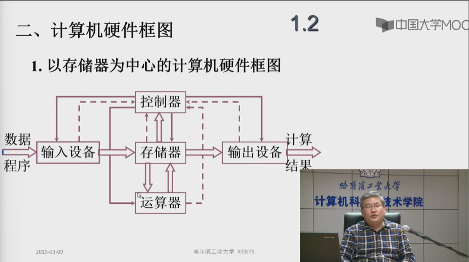

# 计算机组成原理

## 第一章 计算机系统概论

### 1.1 计算机系统简介

#### 一、计算机的软硬件概念

##### 1.计算机系统

问题 1： 现代计算机系统是由哪两部分组成？

把传感器嵌入和装备到电网、铁路、桥梁、隧道、公路、建筑、供水系统、大坝、油气管道等各种物体中，并且被普遍连接，形成所谓的“物联网”，然后将“物联网”与现有的互联网整合起来，实现人类社会与物理系统的整合，形成智慧地球。

回答 ：计算机系统分为：

- 硬件
  - 计算机的实体：如主机、外设等
- 软件：由具有各类特殊功能的信息程序组成
  - 系统软件：用来管理整个计算机系统
    - 语言处理程序
    - 操作系统
    - 服务性程序
    - 数据库管理系统
  - 应用软件：按任务需要编制成的各种程序

#### 二、计算机系统的层次结构

简单的一个层次结构：

下层是计算机系统的硬件，对硬件进行了相对的封装，对软件提供了接口，比如说提供了指令集，软件可以用这些指令集来编写能够完成一定功能的软件。
软件又分为了应用软件和系统软件，系统软件又利用了硬件提供的接口，完成自己的功能，比如说对系统当中的软硬件资源进行管理，为用户提供了人机交互界面；应用软件利用系统软件提供的接口，调用系统软件的接口，来实现自己的功能。

- 系统复杂性管理的方法-1
  - 抽象：对于一个过程或者一件制品的某些细节有目的的隐藏，以便把其他方面、细节或者结构表达得更加清楚
    
- 系统复杂性管理的方法-2
  - 层次化：将被设计的系统划分为多个模块或者子模块
  - 模块化：有明确定义的功能和接口
  - 规则性：模块更容易被重用

#### 三、计算机体系结构和计算机组成

- 计算机体系结构： 程序员所见到的计算机系统的属性概念性的结构与功能特性（指令系统、数据类型、寻址技术、I/O 机理）
- 计算机组成： 实现计算机体系结构所体现的属性（具体指令的实现）
  

### 1.2 计算机的基本组成

#### 一、冯·诺伊曼计算机的特点

- 1. 计算机由五大部件组成：存储器、运算器、控制器、输入设备和输出设备
- 2. 指令和数据以同等地位存于存储器，可按地址寻访
- 3. 指令和数据用二进制表示
- 4. 指令由操作码和地址码
- 5. 存储程序
- 6. 以运算器为中心

实线表述数据通路，虚线表示控制和状态变化

问题所在：所有的操作都必须经过运算器，那么运算器负载太大；设计图比较乱，不具有层次化的特征

#### 二、计算机硬件框图

怎么对冯·诺伊曼计算机进行改进？
改进图：

双箭头代表数据传输

- 1.以存储器为中心

#### 三、计算机的工作步骤

- 1. 上机前的准备
  - 建立数学模型
  - 确定计算方法
  - 编制解题程序
    - 程序-运算的全部步骤
    - 指令-每一个步骤

- 2. 计算机的解题过程

  - （1）存储器的基本组成
    
    存储体——存储单元——存储元件 0/1
    （大楼——房间——床位 没人/有人）

    存储单元：存放一串二进制代码

    存储字：存储单元中二进制代码的组合

    存储字长：存储单元中存储字的长度，二进制代码的位数

    按照地址寻址

    MAR：存储器地址寄存器，反映存储单元的个数，
    MDR：存储器数据寄存器，反映存储字长

    MAR（Memory Address Register，存储器地址寄存器）：用于存储 CPU 要访问的内存单元的地址。当 CPU 需要访问内存时，会将要访问的地址写入 MAR 中，以便内存控制器根据地址找到对应的内存单元并将其内容返回给 CPU。

    MDR（Memory Data Register，存储器数据寄存器）：用于存储 CPU 从内存中读取的数据，或将要写入内存的数据。当 CPU 需要从内存中读取数据时，内存控制器会将数据传输到 MDR 中，CPU 再从 MDR 中读取数据。当 CPU 需要向内存写入数据时，会将要写入的数据先存储到 MDR 中，再将要访问的内存地址写入 MAR 中，以便内存控制器根据地址将数据写入相应的内存单元。

    每一个存储体都会存放很多存储单元，存储单元的个数是由存储器地址寄存器 MAR 存储，比如：4 位=从 0000-1111 一共 16 个存储地址，
    每一个存储单元存放的数据称为存储字，每一个存储字的长度由存储器数据寄存器存放，比如：8 位=一个存储字的长度为 8 位，即访问出来的数据是 8 位。

    总结：存储体用来存放 01 代码，可能是指令也可能是数据，被分成了多个存储单元，每个存储单元都保存了 01，01 的个数我们称为存储字长，每个存储单元保存的数据我们称为一个存储字。对于存储器的读出和写入，我们要用 MAR 和 MDR 两个寄存器。

  - （2）运算器的基本组成以及操作过程
    
    在计算机组成中，ACC（Accumulator）指的是累加寄存器，用于存放计算结果；MQ（Multiplier-quotient）指的是乘商寄存器，通常用于存放除法和乘法运算中的商和乘积；X 指的是通用寄存器，用于存放操作数和地址；ALU（Arithmetic Logic Unit）指的是算术逻辑单元，是计算机运算器的核心部件，用于实现计算机的算术和逻辑运算。

    
    
    
    

  - （3）控制器的基本结构
    
    完成一条指令：

    - 取指令 PC：程序计数器
    - 分析指令 IR：指令寄存器，存放当前执行的这条指令
    - 执行指令 CU：控制单元

    PC 存放当前欲执行指令的地址，具有计数功能（PC）+ 1 =》 PC

  - （4）主机完成一条指令的过程
    以取数指令为例：
    

    以存数指令为例：
    

### 1.3 计算机硬件的主要技术指标

- 买这台机器做什么
- 你有多少钱
- 机器的性能能否满足你的要求

* 如果在购买前对计算机的性能进行评价

  - 处理速度快、内存容量大

* 1. 机器字长

  CPU 一次能处理数据的位数，与 CPU 中的寄存器位数有关

* 2. 运算速度

  - 主频
  - 核数，每个核支持的线程数
  - 吉普森法 $$\sum_{i=1}^n i^2 = \frac{n(n+1)(2n+1)}{6}$$
  - CPI 执行一条指令所需要的时钟周期数
  - MIPS 每秒能够执行百万条指令
  - FLOPS 每秒浮点运算次数

* 3. 存储容量
  存放二进制信息的总位数
  

## 第二章 计算机的发展和应用

### 2.1 计算机的发展史

#### 一、计算机的产生和发展

1946 年 美国 ENIAC
十进制运算

18000 多个电子管
1500 多个继电器
150 千瓦
30 吨
1500 平法英尺
5000 次加法/秒
用手动搬动开关和插拔电缆来编程

现代计算机产生的驱动力：需求、技术发展（电子技术的发展）、体系结构技术发展

冯·诺伊曼机器

### 2.2 计算机的应用

### 2.3 计算机的展望

## 第三章 系统总线

### 3.1 总线的基本概念

#### 一、为什么要用总线

总线在计算机中扮演了重要的角色，它是计算机内部各个部件之间传输数据和信号的通路。计算机内部的各个组件，如 CPU、内存、硬盘、显卡等，需要相互通信传递数据，而总线就提供了这样一个传输数据的通道。

总线可以简化计算机内部的连接方式，使得不同组件之间的连接更加灵活，同时也方便了计算机系统的维护和扩展。使用总线可以有效地减少连接线路的数量，降低计算机的成本和复杂度。

总线还可以提高计算机系统的性能和效率。通过总线，计算机内部各个组件可以并行工作，同时进行数据传输和处理，从而加快计算机系统的运行速度。总线也可以支持多个组件同时访问内存或其他共享资源，提高了计算机系统的并发性和吞吐量。

#### 二、什么是总线

总线（Bus）是连接各个部件的信息传输线，是各个部件共享的传输介质。
在任何时刻，只有一对部件可以使用总线。

#### 三、总线上信息的传输

串行总线走的是串行信号，并行总线走的是并行信号。
并行信号就是以并行方式通信的信号，在并行通信中一个字节（8 位）数据是在 8 条并行传输线上同时由源端传到目的地，也可以说有多个数据线（几根就是几位），在每个时钟脉冲下可以发送多个数据位（几位的并行口就发送几位）。
而串行信号就是以串行方式通信的信号。串行通信指数据在单条一位宽的传输线上，一比特接一比特地按顺序传送的方式，在早期的定义里也有说只有一根数据线，每个时钟脉冲下只能发送一位数据的方式。

通常情况下，并线支持短线传输，而串行支持远线传输。因为在远距离传输的过程中，线号更容易收到干扰，并行情况下会导致多条信号错误。

#### 四、总线结构的计算机举例

1. 单总线结构框图

单总线的弊端：因为任何情况下，同一时间只能有一对部件可以使用总线。如果有一个 I/O 设备一直向主存中写入数据，那么 CPU 就会停止运行程序。

1. 面向 CPU 的双总线结构框图

CPU 和主存之间连了一条 M 总线，加快了 CPU 从主存中取指令和数据的速度，不会收到 I/O 总线的干扰。但是 I/O 总线向主存的写入还是会经过 CPU。
面向 CPU 总线的弊端：如果有一个 I/O 设备一直向主存中写入数据，那么 CPU 还是会停止运行程序。

1. 面向主存的双总线结构图

### 3.2 总线的分类

- 1. 片内总线：芯片内部的总线
- 2. 系统总线：计算机各部件之间的信息传输线
  - 数据总线：双向，与机器字长、存储字长有关，一般总线的宽度是小于等于机器字长或者存储字长的
  - 地址总线：单向，与存储地址、I/O地址有关
  - 控制总线：有出、有入
- 3. 通信总线：用于计算机系统之间或者计算机系统与其它系统（如控制仪表、移动通信等）之间的通信
  传输方式：
  - 串行通信总线
  - 并行通信总线

### 3.3 总线的特性及性能指标

#### 一、总线物理实现

#### 二、总线特性
- 1. 机械特性
 尺寸、形状、管脚数及排列顺序
- 2. 电气特性
  传输方向和有效的电平范围
- 3. 功能特性
  每根传输线的功能：地址、数据、控制
- 4. 时间特性
  信号的时序关系

#### 三、总线的性能指标
- 1. 总线宽度
  数据线的根数
- 2. 标准传输率
  每秒传输的最大字节量（MBps）
- 3. 时钟同步/异步 
  同步、不同步
- 4. 总线复用
  地址线与数据线复用（8086），是为了减少芯片的管脚数，管脚数减少了，芯片大小也会减少
- 5. 信号线数
  地址线、数据线与控制线的总和
- 6. 总线控制方式
  突发、自动、仲裁、逻辑、计数
- 7. 其他指标
  负载能力：这条总线上能挂载多少个I/O设备

#### 四、总线标准

总线标准：
* ISA
* EISA
* VESA（LV-BUS）
* PCI
* AGP
* USB

### 3.4 总线结构
#### 一、单总线结构

#### 二、多总线结构
1. 双总线结构

除了面向CPU和面向主存的双总线结构，还有其他的结构

2. 三总线结构

3. 三总线结构的又一形式

可能存在的问题：不同传输速度的外部设备同时使用扩展总线

4. 四总线结构

特点：把高速设备和低速设备分类

### 3.5 总线控制

多个设备可能同时向总线发出占用请求，那么到底要让哪一个设备占用？

当一对设备占用了总线，那么这对设备要怎么通信来保证通信过程的正确？
#### 一、总线判优控制
1. 基本概念
通过是否能够向总线提出请求，把设备分成：
- 主设备（主模块）
  对总线具有控制权，可以提出总线的占用申请，并且在占用之后，可以控制和另外一台设备之间进行的通信过程
- 从设备
  不能对总线提出请求和进行控制，只能响应从 主设备发来的总线命令

一个设备不一定一定是主设备或者从设备；一条总线上不一定只有一个主设备。

总线判优控制：两种判优逻辑
- 集中式，这种方法我们可以把总线的判优逻辑给做在一个部件上，比如放在cpu中
  - 链式查询
  - 计数器定时查询
  - 独立请求方式
- 分布式，这种判优逻辑会分配到各个部件上

2. 链式查询方式
   
   GPT：
   在总线控制的链式查询中，BR，BS和BG是标志寄存器中的三个位，用于控制总线传输和中断处理：
   - BR（Bus Request）：表示一个设备正在请求总线控制权。当BR位被设为1时，表示当前设备正在请求总线控制权，此时其他设备不能请求总线控制权。
   - BS（Bus Stop）：表示请求总线控制权的设备已经完成了总线传输，并释放了总线控制权。当BS位被设为1时，表示当前设备已经完成了总线传输并释放了总线控制权，此时其他设备可以请求总线控制权。
   - BG（Bus Grant）：表示总线控制权被授予给了请求总线控制权的设备。当BG位被设为1时，表示总线控制权已被授予给了请求总线控制权的设备。
   特点：
   - 总线控制部件是集中在一起的。
   - 数据总线，用于信息交互过程当中数据的传输。
   - 地址总线，主设备占用了之后，要通过地址总线来找到要通讯的那个从设备。
   - BR，总线请求，所有的设备都通过BR来发出总线占用或者总线使用的这个请求。
   - BS，总线忙，如果某一个设备，占用了总线的控制权，就通过BS这个信号告诉其他部件总线忙。
   - BG，总线授权，是为什么叫链式查询的原因，BG是一个一个的向下查询。过程：如果挂接在总线上的这些I/O接口有总线占用请求的话，I/O接口会通过BR向总线控制部件提出占用请求。总线控制部件在接收到这个占用请求后，并且可以让出这个总线的控制权，可以把控制权交给IO设备进行使用，这个时候就要查询。因为所有的IO设备都是通过BR这条总线提出的总线占用请求，不知道该到哪一个设备占用了，所以要一个个链式的查询。
   问题：
   - 因为此时优先权的判定是BG这条线上IO设备的先后，当一个设备处在比较靠后的位置上时，它就很难拿到总线控制。
   - 对电路故障特别敏感，尤其是BG这条线。如果某一个电路接口出现故障，后面的IO设备永远不能对总线占用了。
3. 计数器定时查询
   
   * 在总线控制部件里面有一个计数器，初值无所谓大小。如果某一个主设备想要占用总线，想和一个从设备进行数据传输。这个设备通过BR提出总线占用请求，那么总线控制器接收到总线占用请求，在可以响应的前提下，可以让出总线使用权的情况下，就会启动这个计数器，这个计数器的值是通过设备地址线发出的。
   * 设备地址线给出信号以后，就对IO接口`x`进行查询，如果`x`没有提出总线占用请求的话，计数器就会自动进行加1。如果有发出占用请求，就会通过BS这条线进行应答
   * 特点：还是有地址线和数据线。有一条新的线：设备地址线。设备地址线运用了计数器查询方式，这条线上传输的地址实际上是由一个计数器给出的。通过这个地址来查找某一个设备是否发出了总线的占用请求。
   * 优点：优先级确定非常灵活，可以是事先确定的（计数器初值设置为`x`）。也可以是不确定的，比如说从上一次停止的地方。
4. 独立请求方式
   
   总线控制部件内部有一个排队器。

#### 二、总线通信控制
1. 目的
   解决主从设备（通信双方）协调配合问题
2. 总线传输周期
   主设备和从设备之间完成一次完整的、可靠的通信的时间。
   * 申请分配阶段：主模块申请，总线仲裁决定
   * 寻址阶段：主模块向从模块给出地址和命令
   * 传数阶段：主模块和从模块交换数据
   * 结束阶段：主模块撤销有关信息
3. 总线通信的四种方式
   * 同步通信：由统一时标（定宽、定距）控制数据传输，即在固定的传输点上给出固定的传输操作
     
     
   * 异步通信：没有统一时标，采用应答方式，没有公共时钟标准
     
     在这个当中，主设备不管是否接收到响应信号，在一段时间后，都会撤销请求信号；从设备也不管是否主设备接收到应答信号，一段时间后，也会撤销应答信号
     
     在这个当中，主设备会等到从设备响应接收到之后，才关闭请求。但是从设备还是不管主设备是否接受到应答，一段时间后还是会自己关闭应答。
     
     都要保证主从设备互相接收到各自发出的信号。主设备在接收到应答之后会关闭自己的请求，并通知从设备，让从设备关闭自己的应答。
   * 半同步通信：同步、异步结合
     - 同步：发送方 用系统时钟前沿发信号；接受方 用系统时钟后沿判断、识别
     - 异步：允许不同速度的模块和谐工作；为了调整主从设备之间的差异增加一条“等待”响应信号 `WAIT`（上划线），由从模块发出
     
     假设，主模块是cpu，从模块是存储器，cpu处理数据和命令的速度要远大于存储器的。从模块如果不能在接收到指令后的下一个时钟周期将数据准备好，就会主动发出wait等待信号，让wait信号电平为低电平。主模块会在下一个时序开始前监测wait电平，如果当前电平为低电平，就在主模块的时序中添加一个时钟周期。
     
     
     特点：
     1. 主模块发地址、命令 —— 占用总线
     2. 从模块准备数据 —— 不占用总线，但因为要等待应答，总线仍被主从一方占用，因此总线空闲
     3. 从模块向主模块发数据 —— 占用总线
   * 分离式通信：充分挖掘系统总线每个瞬间的相应
     一个总线传输周期，分为
     - 子周期1：主模块申请占用总线，发出地址和命令；使用完后，放弃总线的使用权
     - 子周期2：从模块申请占用总线，将各种信息送至总线上
     特点：
     1. 各个模块都有权申请占用总线
     2. 采用同步方式通信，不等待对方应答
     3. 各个模块准备数据时，不占用总线
     4. 总线被占用时，无空闲

## 第四章 存储器
### 4.1 概述
#### 一、存储器分类
1. 按存储介质分类
   - （1）半导体存储器 TTL、MOS
   - （2）磁表面存储器 磁头、磁载体
   - （3）磁芯存储器   硬磁材料、环状元件
   - （4）光盘存储器   激光
2. 按存取方式分类
   随机访问的解释：不管这个数据存放在存储体什么位置，只要给出地址，不同的地址可以在相同时间内将信息取出或者写入。
   - （1）存取时间与物理地址无关（随机访问）：随机存储器RAM（在程序执行过程中可读可写）、只读存储器ROM（在程序的执行过程中只读）
   - （2）存取时间与物理地址有关（串行访问）：顺序存取存储器（比如：磁带）、直接存取存储器（比如：磁盘）
       磁盘的机理：磁盘在存取的时候，首先要找到给定的磁道，这个过程是通过磁头或者读写头在磁盘表面进行镜像移动来完成的，然后磁头停留在指定的磁道上，磁盘转动，直到指定的扇区转到磁头下才能开始这个读出或者写入过程。
3. 按在计算机中的作用分类
  存储器：
  - 主存储器：
    - RAM：一般来说，用户的数据，用户的程序都需要可读可写
      - 静态RAM
      - 动态RAM 
    - ROM：系统程序系统当中的一些参数，为了防止用户修改
      - MROM
      - PROM
      - EPROM
      - EEPROM
  - 辅助存储器，是计算机中用于长期存储数据和程序的设备，也被称为外部存储器。与主存储器相比，辅助存储器的容量更大，价格更便宜，但访问速度较慢。主要作用是扩展计算机的存储容量，使得大量数据和程序可以长期保存，并随时读取和修改。常见的辅助存储器包括硬盘、光盘、闪存驱动器等。
  - Flash Memory 便携式存储器，辅助存储器的缓冲（主存储器和辅助存储器速度差距大）
  - 高速缓冲存储器 Cache，放在CPU和主存储器之间

#### 二、存储器的层次结构
1. 存储器的三个主要特性的关系
   速度、容量、价格
   
2. 缓存 - 主存层次和主存 - 辅存层次
   
   计算机的主机有CPU和存储器两部分构成。CPU可以从主存储器中读信息，也可以把运行的结果保存到主存储器中。主存储器的大小不足以放置足够多的数据时，就要求我们要有辅助存储器。我们用软硬件相结合的方法把主存储器和辅助存储器构成一个整体。从应用程序员的角度来看，这个架构有主存储器的速度，辅助存储器的容量和价格。在程序执行的过程中，即使程序非常大，超过了主存储器的容量，应用程序员也不需要考虑哪些部分放置在哪个存储器当中。

   缓存里面保存的信息是主存储器当中一些信息的副本，那么CPU可以之间访问缓存，通过访问缓存来访问主存储器。缓存和主存储器之间也进行信息交互。如果说缓存当中保存的内容是CPU最常用的信息，绝大多数都可以从缓存当中获得的话，那么计算机的速度就会得到很大的提升。成为程序的局部性原理，包括：时间的局部性和空间的局部性。
