[toc]
# 第一章 JAVA内存区域与内存溢出异常

## 1.1概述

对于Java程序猿来说，在虚拟机自动内存管理机制的帮助下，不再需要为每一个new操作去写配对的delete/free代码，不容易出现内存泄露和内存溢出问题，看起来一切都很美好。但是一旦出现了上述情况，因为Java程序员把内存控制的权利交给了Java虚拟机，排查错误、修正问题就是一项艰难的工作。

## 1.2运行时数据区域

Java虚拟机在执行Java程序的时候会把它所管理的内存划分为若干个数据区域。
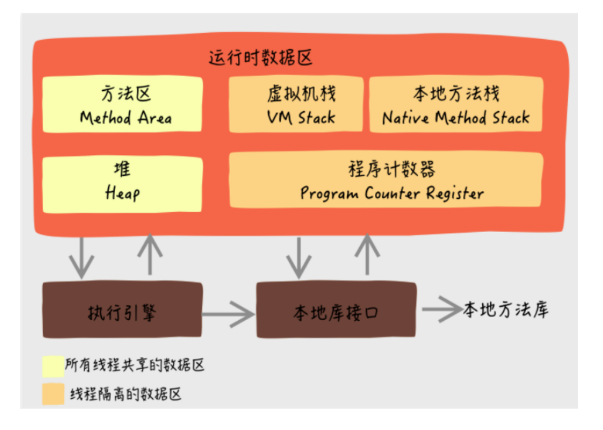
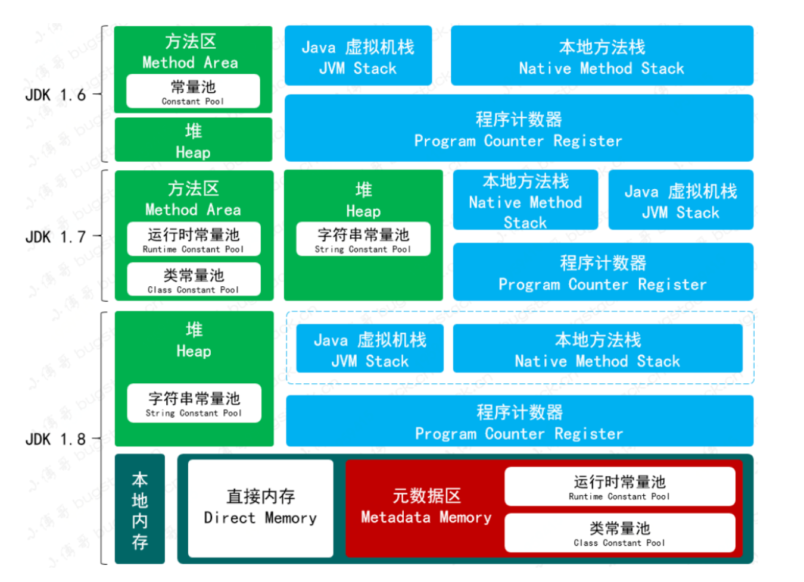

### 1.2.1 程序计数器（线程私有）

程序计数器Program Counter Register是一块较小的内存空间，它可以看作当前线程所执行的字节码的行号指示器。在Java虚拟机的概念模型里，字节码解释器工作时就是通过改变这个计数器的值来选取下一条要执行的字节码指令，它是程序控制流的指示器，分支、循环、跳转、异常处理、线程恢复等基础功能都需要依赖这个计数器来完成。

由于Java虚拟机的多线程是通过线程轮流切换、分配处理器执行时间的方式来实现的，在任何一个确定的时刻，一个处理器（对于多核处理器来说是一个内核）都只会执行一个线程中的指令。因此，为了线程切换后能恢复到正确的执行位置，每条线程都需要有一个独立的程序计数器，各条线程之间计数器互不影响，独立存储，我们称这类内存区域为“线程私有”的内存。

如果线程正在执行的是一个Java方法，这个计数器记录的是正在执行的虚拟机字节码指令的地址；如果正在执行的是本地Native方法，这个计数器的值应该为空Undefined。此内存区域是唯一一个在《Java虚拟机规范》中没有规定任何OutOfMemoryError情况的区域。

### 1.2.2 Java虚拟机栈（线程私有）

与程序计数器一样，Java虚拟机栈（Java Virtual Machine Stack）也是线程私有的，它的生命周期与线程相同。虚拟机栈描述的是Java方法执行的线程内存模型：每个方法被执行的时候，Java虚拟机都会同步创建一个栈帧（stack frame）用于存储局部变量表、操作数栈、动态连接、方法出口等信息。每个方法被调用直至执行完毕的过程，就对应一个栈帧在虚拟机栈中从入栈道出栈的过程。

局部变量表存放了编译期可知的各种Java虚拟机基本数据类型、对象引用和returnAddress类型。

这些数据类型在局部变量表中的存储空间以局部变量槽（Slot）来表示，其中64位长度的long和double类型的数据会占用两个变量槽，其余的数据类型只占用一个。局部变量表所需的内存空寂在编译期间完成分配，当进入一个方法时，这个方法需要在栈帧中分配多大的局部变量空间时完全确定的，在方法运行期间不会改变局部变量表的大小。这里书的“大小”是指变量槽的数量，虚拟机真正使用多大的内存空间来实现一个变量槽，这是完全由具体的虚拟机实现自行决定的事情。

<b>
在《Java虚拟机规范》中，对这个内存区域规定了两类异常状况：如果线程请求的栈深度大于虚拟机所允许的深度，将抛出StackOverflowError；如果Java虚拟机栈容量可以动态扩展，当栈扩展时无法申请到足够的内存会抛出OutOfMemoryError。
</b>

### 1.2.3 本地方法栈（线程私有）

本地方法栈(Native Method Stacks)与虚拟机栈所发挥的作用是非常相似的，其区别只是虚拟机栈为虚拟机执行Java方法(也就是字节码)服务，而本地方法栈则是为虚拟机使用到的本地方法服务。

《Java虚拟机规范》对本地方法栈中方法使用的语言、使用方式与数据结构并没有任何强制规定，因此具体的虚拟机可以根据需要自由实现它，甚至有的Java虚拟机（HotSpot）直接就把本地方法栈和虚拟机栈看为一个。

<b>
与虚拟机栈一样，本地方法栈在栈深度溢出或者栈扩展失败时分别抛出StackOverflowError和OutOfMemoryError。</b>

### 1.2.4 Java堆（线程共享）

对于Java应用程序来说，Java堆（Java Heap）是虚拟机所管理的内存中最大的一块。

Java堆是被所有线程共享的一块内存区域，在虚拟机启动时创建。此内存区域的唯一目标就是存放对象实例，Java世界里“几乎”所有的对象实例都在这里分配内存。在《Java虚拟机规范》中对Java堆的描述是：“所有的对象实例以及数据都应当在堆上分配”。

Java堆是垃圾收集器管理的内存区域，因此在一些资料中它也被称作“GC堆” Garbage Collected Heap。在回收内存的角度看，由于现代垃圾收集器大部分是基于分代收集理论设计的，所有Java堆中经常出现“新生代”“老生代”等名称。

如果从分配内存的角度看，所有线程共享的Java堆中可以划分出多个线程私有的分配缓冲区（Thread Local Allocation Buffer, TLAB），以提升对象分配时的效率。不过无论从什么角度，无论如何划分，都不会改变Java堆中存储内容的共性，无论是哪个区域，存储的都只能是对象的实例，将Java堆细分的目的只是为了更好的回收内存，或者更快地分配内存。

根据《Java虚拟机规范》的规定，Java堆可以处于物理上不连续的内存空间中，但在逻辑上它应该被视为是连续的，这点就像我们用磁盘空间去存储文件一样，并不要求每个文件都连续存放。但对于大对象（典型的如数组对象），多数虚拟机实现出于实现简单、存储高效的考虑，很可能会要求连续的内存空间。

Java堆可以被实现成固定大小的，也可以是可扩展的，不过当前主流的Java虚拟机都是按照可扩展来实现的。
<b>
如果在Java堆中没有内存完成实例分配，并且堆也无法再扩展时，Java虚拟机会抛出OutOfMemoryError。
</b>

### 1.2.5 方法区（线程共享）---> 元数据区

方法区（Method Area）与Java堆一样，是各个线程共享的内存区域，它用于存储已被虚拟机加载的类型信息、常量、静态变量、即使编译期编译后的代码缓存等数据。虽然《Java虚拟机规范》中把方法区描述成堆的一个逻辑部分，但它却有一个别名叫做“非堆”（Non-Heap），目的是与Java区分开。

《Java虚拟机规范》对方法区的约束非常宽松，除了和Java堆一样不需要连续的内存和可以选择固定大小或者可扩展外，甚至还可以选择不实现垃圾收集。相对而言，垃圾收集行为在这个区域的确是比价少见的，但并非数据进入了方法区就永久存在了。该区域的内存回收目标主要是针对常量池的回收和对类型的卸载，一般来说这个区域的回收效果比较难让人满意，尤其是类型卸载，条件相当苛刻，但是这部分区域的回收有时又确实有必要，避免了对该区域未完全回收而导致内存泄漏。

<b>
方法区(Method Area)与Java堆一样，是各个线程共享的内存区域，有如下特点：

- 方法区在JVM启动的时候被创建，并且它的实际的物理内存空间和Java堆区一样都可以是不连续的。
- 方法区的大小，和堆空间一样，可以选择固定大小和可扩展。
- 方法区的大小决定了系统可以保存多少个类，如果系统定义了太多的类，导致方法区溢出，虚拟机就会抛出内存溢出

错误：java.lang.OutOfMemoryError:PermGenspace或者 java.lang.OutOfMemoryError: Metaspace。
- 关闭JVM就会释放这个区域的内存。
</b>

### 1.2.6 运行时常量池（是方法区的一部分）

运行时常量池（Runtime Constant Pool）是方法区的一部分。Class文件中除了有类的版本、字段、方法、接口等描述信息外，还有一项信息是常量池（Constant Pool Table），用于存放编译期生成的各种字面量与符号引用，这部分内容将在类加载后存放到方法区的运行时变量池中。

Java虚拟机对于Class文件每一部分（自然也包括常量池）的格式都有严格规定，如每一个字节用于存放哪种数据都必须符合规范上的要求才会被虚拟机认可、加载和执行，但对于运行时常量池，《Java虚拟机规范》没有任何细节要求，不同提供商实现的虚拟机可以按照自己的需求来实现这个内存区域，不过一般来说，除了保存Class文件中描述的符号引用外，还会把由符号引用翻译出来的直接引用也存储到运行时常量池中。

运行时常量池相对于Class文件常量池的另外一个重要特征是具备动态性，Java语言并不要求常量一定只有编译期才能生成，也就是说，并非预置入Class文件中常量池的内容才能进入方法区运行时常量池，运行期间也可以将新的常量放入池中，这种特性被开发人员利用比较多的便是String类的intern()方法。

### 1.2.7 直接内存

直接内存（Direct Memory）并不是虚拟机运行时数据区的一部分，也不是《Java虚拟机规范》中定义的内存区域。但是这部分内存也被频繁地使用，而且也可能导致OutOfMemoryError异常出现。

在JDK1.4中新加入了NIO（New Input/Output）类，引入了一种基于通道（Channel）与缓冲区（Buffer）的I/O方式，它可以使用Native函数库直接分配堆外内存，然后通过一个存储在Java堆里面的DirectByteBuffer对象作为这块内存的引用进行操作。避免了在Java堆和Native堆中来回复制数据。

显然，本机直接内存的分配不会受到Java堆大小的限制，但是，既然是内存，肯定还是会受到本机总内存（包括物理内存、SWAP分区或者分页文件）大小以及处理器寻址空间的限制，一般服务器管理员配置虚拟机参数时，会根据实际内存去设置-Xmx等参数信息，但是经常忽略掉直接内存，使得各个内存区域总和大于物理内存限制（包括物理的和操作系统级的限制），从而导致动态扩展时出现OutOfMemoryError异常。


## 1.3 HotSpot虚拟机对象探秘

知道了Java虚拟机内存模型的概括，会进一步想要了解虚拟机内存中数据的其他细节，比如如何创建、如何布局以及如何访问。基于实用有限的原则，以最常用的虚拟机HotSpot和最常用的内存区域Java堆为例，深入探讨HotSpot虚拟机在Java堆中对象分配、布局和访问的过程。

### 1.3.1 对象的创建

Java是一门面向对象的编程语言，Java程序运行过程中每时每刻都有对象被创建处理。在语言层面上，创建对象通常（例外：复制、反序列化）仅仅是一个new关键字而已，而在虚拟机中，对象（文中讨论的对象仅限于普通Java对象，不包括数组和Class对象等）的创建是怎么一个过程呢？

#### 1.3.1.1划分内存空间——指针碰撞(规整的Java堆)和空闲列表(不规整的Java堆)

当Java虚拟机遇到一条字节码new指令时，首先将去检查这个指令的参数能否能在常量池中定位到一个类的符号引用，并且检查这个符号引用代表的类是否已经被加载、解析和初始化过。如果没有，那必须先执行相应的类加载过程。

- 指针碰撞（规整的Java堆）：

    在类加载检查通过后，接下来虚拟机将为新生对象分配内存。对象所需内存的大小在类加载完成后便可以完全确定，为对象分配空间的任务实际上等同于把一块确定大小的内存块从Java堆中划分出来。假设Java堆中内存时绝对规整的，所有被使用过的内存都被放在一边，空闲的内存被放在另一边，中间放着一个指针作为分界点的指示器，那所分配的内存就仅仅是那个指针向空闲方向挪动一段与对象大小相等的距离，这种分配方式称为<b>“指针碰撞”（Bump The Point）</b>。
<hr>

- 空闲列表（不规整的Java堆）：

    但如果Java堆中的内存并不是规整的，已被使用的内存和空闲的相互加错在一起，那就没有办法简单地进行<b>指针碰撞</b>了，虚拟机就必须维护一个列表，记录上哪些内存块是可用的，在分配的时候从列表中找到一块足够大的空间划分给对象实例，并更新列表上的记录，这种分配称为<b>“空闲列表”（Free List）</b>。

选择哪种分配方式由Java堆是否规整决定，而<b>Java堆是否规整又由所采用的垃圾收集器是否带有空间压缩整理（Compact）的能力决定</b>。因此，当使用Serial、ParNew等带压缩整理过程的收集器时，系统采用的分配算法是指针碰撞，简单且高效；当使用CMS这种基于清楚（Sweep）算法的收集器时，理论上就只能采用较为复杂的空闲列表来分配内存。

#### 1.3.1.2创建对象时的线程安全问题——Thread Local Allocation Buffer

除了如何划分可用空间之外，还有另外一个问题需要考虑：对象创建在虚拟机中是非常频繁的行为，即使仅仅修改一个指针所指向的位置，在并发情况下也并不是线程安全的，可能出现正在给对象A分配内存，指针还没来得及修改，对象B又同时使用了原来的指针来分配内存的情况。解决这个问题有两个可选方案：
- 一种是堆分配内存空间的动作进行同步处理————实际上虚拟机是采用CAS配上失败重试的方式保证更新操作的原子性；
<hr>
- 另外一种是把内存分配的动作按照线程按照线程划分在不同的空间之中进行，即每个线程在Java堆中预先分配一小块内存，称为<b>本地线程分配缓冲(Thread Local Allocation Buffer,TLAB)</b>，哪个线程要分配内存，就在哪个线程的本地缓冲区中分配，只有本地缓冲区用完了，分配新的缓冲区时才需要同步锁定。虚拟机是否使用TLAB，可以通过-XX:+/UserTLAB参数来设定。

内存分配完成之后，虚拟机必须将分配到的内存空间（不包括对象头内容）都初始化为零，如果使用了TLAB的话，这一项工作也可以提前到TLAB分配时顺便进行。这步操作保证了对象的实例字段在Java代码中可以不赋初始值就直接使用，使程序能访问到这些字段的数据类型所对应的零值。

#### 1.3.1.3其余工作

接下来，Java虚拟机还要对对象进行必要的设置，例如这个对象是哪个类的实例、如何才能找到类的元数据信息、对象的哈希码（实际上对象的哈希码会延后到真正调用Object::hashcode()方法时才使用）、对象的GC分代年龄等信息。这些信息存放在对象的对象头（Object Header）中。根据虚拟机当前的运行状态不同，如是否启用偏向锁等，对象头会有不同的设置方式。


在上面的工作都完成之后，在虚拟机的视角来看，一个新的对象已经产生了。但是从程序员的角度，对象创建才刚开始——构造函数，即Class文件中``<init>()``方法还没有执行，所有的字段都为默认的零值，对象需要的其他资源和状态信息也还没有按照预定的意图构造好。一般来说（由字节码流中new指令后面是否跟随invokesperial指令所决定，Java编译器会在遇到new关键字的地方同时生成这两条字节码指令，但如果直接通过其他方式产生的则不一定），new指令之后会接着执行``<init>()``方法，按照程序员的意愿对对象进行初始化，这样一个真正可用的对象才算完全被构造出来。

HotSpot解释器代码片段
<hr>

```java
//确保常量池中存放的是已解释的类
if（!constants-＞tag_at（index）.is_unresolved_klass()）{
    //断言确保是klassOop和instanceKlassOop
    oop entry=（klassOop）*constants-＞obj_at_addr（index）；
    assert（entry-＞is_klass()，"Should be resolved klass"）；
    klassOop k_entry=（klassOop）entry；
    assert（k_entry-＞klass_part()-＞oop_is_instance()，"Should be instanceKlass"）；
    instanceKlass * ik=（instanceKlass*）k_entry-＞klass_part()；
    //确保对象所属类型已经经过初始化阶段
    if（ik-＞is_initialized()＆＆ik-＞can_be_fastpath_allocated()）
    {
        //取对象长度
        size_t obj_size=ik-＞size_helper()；
        oop result=NULL；
        //记录是否需要将对象所有字段置零值
        bool need_zero=!ZeroTLAB；
        //是否在TLAB中分配对象
        if（UseTLAB）{
            result=（oop）THREAD-＞tlab().allocate（obj_size）；
        }
        if（result==NULL）{
            need_zero=true；
            //直接在eden中分配对象
            retry:
            HeapWord * compare_to=*Universe:heap()-＞top_addr()；
            HeapWord * new_top=compare_to+obj_size；
            /*cmpxchg是x86中的CAS指令，这里是一个C++方法，通过CAS方式分配空间，如果并发失败，
            转到retry中重试，直至成功分配为止*/
            if（new_top＜=*Universe:heap()-＞end_addr()）{
                if（Atomic:cmpxchg_ptr（new_top,Universe:heap()-＞top_addr()，compare_to）!=compare_to）{
                    goto retry；
                }
                result=（oop）compare_to；
            }
        }
        if（result!=NULL）{
            //如果需要，则为对象初始化零值
            if（need_zero）{
                HeapWord * to_zero=（HeapWord*）result+sizeof（oopDesc）/oopSize；
                obj_size-=sizeof（oopDesc）/oopSize；
                if（obj_size＞0）{
                    memset（to_zero，0，obj_size * HeapWordSize）；
                }
            }
            //根据是否启用偏向锁来设置对象头信息
            if（UseBiasedLocking）{
                result-＞set_mark（ik-＞prototype_header()）；
            }else{
                result-＞set_mark（markOopDesc:prototype()）；
            }
            result-＞set_klass_gap（0）；
            result-＞set_klass（k_entry）；
            //将对象引用入栈，继续执行下一条指令
            SET_STACK_OBJECT（result，0）；
            UPDATE_PC_AND_TOS_AND_CONTINUE（3，1）；
        }
    }
}
```

### 1.3.2 对象的内存布局（对象头、类型指针、占位符）

在HotSpot虚拟机里，对象在堆内存中的存储布局可以划分为三个部分：对象头（Header）、实例数据（Instance Data）和对齐填充（Padding）。

HotSpot虚拟机对象的对象头部分包括两类信息。
- 第一类是用于存储对象自身的运行时数据，如hashcode、GC分代年龄、锁状态标志、线程持有的锁、偏向线程ID、偏向时间戳等，这部门的长度在32位和64位的虚拟机中分别为32个比特和64个比特，官方称它为“Mark Word”。对象需要存储的运行时数据很多，其实已经超过了32、64位Bitmap结构所能记录的最大限度，但对象头里的信息是与对象自身定义的数据无关的额外存储成本，考虑到虚拟机的空间效率，Mark Word被设计成一个有着动态定义的数据结构，以便在极小的空间内存储尽量多的数据，根据对象的状态复用自己的存储空间。例如在32位的HotSpot虚拟机中，如对象未被同步锁锁定的状态下，Mark Word的32个比特存储空间中的25个比特用于存储对象hashcode，4个比特用于存储对象分代年龄，2个比特存储锁标志位，1个比特固定为0，在其他状态下对象的存储内容如下。
<hr>
表1:HotSpot虚拟机对象头Mark Word

| 存储内容 | 标志位 | 状态 |
| :----: | :----: | :----: |
| 对象hashcode、对象分代年龄 | 01 | 未锁定 |
| 指向锁记录的指针 | 00 | 轻量级锁定 |
| 指向重量级锁的指针| 10 | 膨胀（重量级锁定）|
| 空，不需要记录信息 | 11 | GC标志 |
| 偏向线程ID、偏向时间戳、对象分代年龄 | 01 | 可偏向 |

<hr>

- 对象头的另外一部分是类型指针，即对象指向它的类型元数据的指针，Java虚拟机通过这个指针来确定该对象是哪个类的实例。并不是所有的虚拟机实现都必须在对象数据上保留类型指针，换句话说，查找对象的元数据信息并不一定要经过对象本身。

此外，如果对象是一个Java对数组，那在对象头还必须有一块用于记录数组长度的数据，因为虚拟机可以通过普通Java对象的元数据信息确定Java对象的大小，但是如果数组的长度是不确定的，将无法通过元数据中的信息推断出数组的大小。

HotSpot虚拟机代码Mark Word中的代码（markOop.hpp）注释片段如下，描述了32位Mark Word的存储布局：

```java
// Bit-format of an object header (most significant first, big endian layout below):
// 32 bits;
// ------
// hash:25-------->| age:4 biased_lock:1 lock:2 (normal object)
// JavaThread*:23 epoch:2 age:4 biased_lock:1 lock:2 (biased object)
// size:32 ------------------------------------------------------->| (CMS free block)
// PromotedObject*:29 ------------->| promo_bits:3 --------------->| (CMS promoted object)
```

接下来实例数据部分是对象真正存储的有效信息，即我们在程序代码里面所定义的各种类型的字段内容，无论是从父类继承下来的，还是在子类中定义的字段都必须记录起来。这部门的存储顺序会受到虚拟机分配策略参数（-XX:FieldsAllocationstyle参数）和字段在Java源码中定义顺序的影响。HotSpot虚拟机默认的分配顺序为：longs/doubles、ints、shorts/chars、bytes、booleans、oops（Ordinary Object Pointers, OOPs），从以上默认的分配策略中可以看到，相同宽度的字段总是被分配到一起存放，在满足这个前提条件的情况下，在父类中定义的变量会出现在子类之前。如果HotSpot虚拟机的+XX:CompactFields参数值为true（默认为true），那子类之中较窄的变量也允许插入父类变量的空隙中，以节省一点点空间。

- 对象的第三部分是对齐填充，并不是必然存在的，也没有特别的意义，它仅仅骑着占位符的作用。由于HotSpot虚拟机的自动内存管理系统要求对象起始地址必须是8字节的整数倍，换句话说就是任何对象的大小都必须是8字节的整数倍。对象头部分已经被精心设计成正好是8字节的整数，因此，如果对象实例数据部分没有对齐的话，就需要通过对齐填充来补全。

### 1.3.3 对象的访问定位（句柄和直接指针）

创建对象自然是为了后续使用该对象，我们的Java程序会通过栈上的reference数据来操作堆上的具体对象。由于reference类型在《Java虚拟机规范》里只规定了它是一个指向对象的具体对象，并没有定义这个引用应该通过什么方式去定位、访问到堆中对象的具体位置，所以对象访问方式也是由虚拟机实现而定的，主流的访问方式主要有使用句柄和直接指针两种：
- 如果使用句柄访问的话，Java堆中将可能会划分出一块内存来作为句柄池，reference中存储的就是对象的句柄地址，而句柄中包含了对象实例数据与类书籍各自具体的地址信息，如下图所示。

- 如果使用指针访问的话，Java堆中对象的内容布局就必须考虑如何放置访问类型数据的相关信息，reference中存储的直接就是对象地址，如果只是访问对象本身的话，就不需要多一次间接访问的开销,如下图所示。

  
这两种对象访问方式各有优势，使用句柄来访问的最大好处就是reference中存储的是句柄地址，在对象被移动（垃圾收集时移动对象时非常普遍的行为）时只会改变句柄中的数据指针，而reference本身不需要被修改。

使用直接指针来访问最大的好处就是速度快，节省了一次指针定位的视角开销，由于对象访问在Java中非常频繁，因此这类开销积少成多也是一项极为可观的执行成本，就本书讨论的主要虚拟机HotSpot而言，它主要使用直接指针的方式进行对象访问，但从整个软件开发的范围来说，在各种语言、框架中使用句柄来访问的情况也十分常见。


# 第二章 垃圾收集器与内存分配策略

## 2.1 概述

垃圾收集(Garbage Collection)的历史比Java久远。在1960年诞生的Lisp语言是第一门卡丝使用内存动态分配和垃圾收集技术的语言。当Lisp处于胚胎时期时，就开始考虑以下问题：
* 哪些内存需要回收
* 什么时候回收
* 如何回收

到了现在，内存动态分配与内存回收技术已经相当成熟，那么我们<b>为什么还要了解垃圾收集和内存分配？</b>
原因是：当需要排查各种内存溢出、内存泄漏问题时，当垃圾收集成为系统达到更高并发量的瓶颈时，我们就必须对这些“自动化”的技术实施必要的监控和调节。

在第一章中介绍了Java内存运行时区域的各个部分，其中程序计数器、虚拟机栈和本地方法栈3个区域随线程而生，随线程而灭，栈中的栈帧随着方法的进入和退出而有条不紊地执行着出栈和入栈操作。每一个栈帧中分配多少内存基本上是在类结构确定下来时就已知的，因此这几个区域的内存分配和回收都具备确定性，在这几个区域就不需要过多考虑如何回收的问题，当方法结束或者线程结束时，内存自然就跟着回收了。

而Java堆和方法区这两个区域有着很显著的不确定性：一个接口的多个实现类需要的内存可能会不一样，一个方法所执行的不同条件分支所需要的内存也可能不一样，只有处于运行期间，我们才能知道程序究竟会如何创建哪些对象，创建多少个对象，这部分内存的分配和回收是动态的。垃圾收集器所关注的正式这部分内存该如何管理。

## 2.2对象已死？

在堆里面存放着Java中几乎所有的对象实例，垃圾收集器在对堆进行回收时，第一件事就是要确定这些对象中哪些还存活着，哪些已经死去。

### 2.2.1 引用计数法(Reference Counting)

很多教科书判断对象是否存活的算法是这样的：在对象中添加一个引用计数器。每当有一个地方引用它时，计数器值就加一；当引用失效时，计数器值就减一；任何时刻计数器为零的对象就是不可能再被使用的。

客观地说，引用计数法(Reference Counting)虽然占用了一些额外的内存空间进行计数，但是它的原理很简单，判定效率也很高，在大多数情况下，引用计数法都是一个不错算法。<b>但是，在Java领域，至少主流的Java虚拟机里面都没有炫耀引用计数法进行内存管理，主要原因是</b>：中国看似简单的算法有很多例外情况要考虑，必须要配合大量的额外处理才能保证正确地工作，譬如单纯的引用计数就很难解决对象之间相互循环引用的问题。
```java
public class ReferenceCountingGC{
    public Object instance = null;
    private static final int _1MB = 1024 * 1024;
    private byte[] bigSize = new byte[2 * _1MB];
    public void testGC(){
        ReferenceCountingGC objA = new ReferenceCountingGC();
        ReferenceCountingGC objB = new ReferenceCountingGC();
        objA.instance = objB;
        objB.instance = objA;

        objA = null;
        objB = null;

        //假如在这行进行GC，objA和objB是否能被回收？
        System.gc();
    }
}
```
运行结果可以看到内存回收日志中包含“4603K -> 210K“，意味着虚拟机并没有因为这两个对象互相引用就放弃回收它们，这也从侧面说明了Java虚拟机并不是通过用引用计数法判断对象是否存活的。

### 2.2.2 可达性分析算法(Reachability Analysis)

当前主流的商用程序语言(Java,C#)的内存管理子系统，都是通过可达性分析(Reachability Analysis)来判断对象是否存活。这个算法的基本思路局势通过一系列称为“GC Roots”的根对象作为起始节点集，从这些节点开始，根据引用关系向下搜索，搜索过程所走过的路径称为“引用链”(Reference Chain)，如果某个对象到GC Roots间没有任何引用链相连，或者用图论的话来说就是从GC Roots到这个对象不可达时，因此它们将会被判定为可回收的对象。


在Java技术体系中，固定可作为GC Roots的对象包括以下几种：
* 在虚拟机栈（栈帧中的本地变量表）中引用的对象，譬如当前正在运行的方法所使用到的参数、局部变量、临时变量等。
* 在方法区中类静态属性引用的对象，譬如Java类的引用类型静态变量。
* 在方法区中常量引用的对象，譬如字符串常量池（String Table）里的引用。
* 在本地方法栈中JNI（即通常说的Native方法）引用的对象。
* Java虚拟机内部的引用，如基本数据类型对应的Class对象，一些常驻的异常对象（比如NullPointExecption、OutOfMemoryError）等，还有系统类加载器。
* 所有被同步锁（synchronized关键字）持有的对象。
* 反映Java虚拟机内部情况的JMXBean、JVMTI中注册的回调、本地代码缓存等。

除了这些固定的GC Roots集合之外，根据用户所选的垃圾收集器已经当前回收的内存区域不同，还可以有其他对象“临时性”加入，共同构造完整GC Roots集合。譬如后文将会提到的分代收集和局部回收（Partial GC），如果只针对Java堆中某一刻区域发起垃圾收集时（如最典型的只针对新生代的垃圾收集），必须考虑到内存区域时虚拟机自己的实现细节（在用户视角里任何内存区域都是不可见的），更不是鼓励封闭的，所有某个区域里的对象玩去有可能被位于堆中其他区域的对象所引用，这时候就需要将这些关联区域的对象也一并加入GC Roots集合中去，才能保证可达性分析的正确性。

目前最新的几款垃圾收集器无一例外都具备了局部回收的特征，为了避免GC Roots包含过多对象而过度膨胀，它们在实际上也做出了各种优化处理。

### 2.2.3 再谈引用

无论是通过引用计数法判断对象的引用数量，还是通过可达性分析判断对象是否引用链可达，判断对象是否存活都和“引用”离不开关系。在JDK1.2版之前，Java里面的引用是很传统的定义：如果reference类型的数据中存储的数值代表的是另外一块内存的起始地址，就称该reference数据是代表某块内存、某个对象的引用。这种定义并没有什么不对，只是现在看来有些过于狭隘了，一个对象在这种定义下只有“被引用”或者“未被引用”两种状态，对于描述一些“食之无味，弃之可惜”的对象就显得无能为力。譬如我们希望能描述一类对象：当内存空间还足够时，能保留在内存之中，如果内存空间在进行垃圾收集后仍然非常紧张，那就可以抛弃这些对象———很多系统的缓存功能都符合这样的应用场景。

在JDK1.2版本之后，Java堆引用的概念进行了补充，将引用分为强引用（Strongly Reference）、软引用（Soft Reference）、弱引用（Weak Reference）和虚引用（Phantom Reference）4种，这4种引用强度一次逐渐减弱。

* 强引用时最传统的“引用”的定义，是指在程序代码之中普遍存在的引用赋值，即类似“ ``Object obj = new Object()``”这种引用关系。无论任何情况下，只要强引用关系还在，垃圾收集器就永远不会回收掉被引用的对象。
* 软引用是用来描述一些还有用，但非必须的对象。只被软引用关联着的对象，在系统将要发生内存溢出异常前，会把这些对象列进回收范围之中进行第二次回收，如果这次回收还没有足够的内存，才会抛出内存溢出异常。在JDK1.2版之后提供了SoftReference类来实现软引用。
* 弱引用也是用来描述那些非必须对象，但是它的强度比软引用更弱一些，被弱引用关联的对象只能生存到下一次垃圾收集发生为止。当垃圾收集器开始工作，无论当前内存是否足够，都会回收掉只被弱引用关联的对象。在JDK1.2版之后提供了WeakReference类来实现弱引用。
* 虚引用也称为“幽灵引用”或者“幻影引用”，它是最弱的一种引用关系。一个对是否有虚引用的存在，完全不会对其生存时间构成影响，也无法通过虚引用来取得一个对象实例。为一个对象设置虚引用管理的唯一目的只是为了能在这个对象被收集器回收时收到一个系统通知。在JDK1.2版之后提供了PhantomReference类来实现虚引用。

### 2.2.4 生存还是死亡？

即使在可达性分析算法中判定为不可达的对象，也不是“非死不可”的，这时候它们暂时还处于“缓行”阶段，要真正宣告一个对象死亡，最多会经历两次标记过程：如果对象在进行可达性分析后发现没有与GC Roots相连接的引用链，那它将会被第一次标记，随后进行一次筛选，筛选的条件是此对象是否有必要执行``finalize()``方法。假如对象没有覆盖``finalize()``方法，或者``finalize()``方法已经被虚拟机调用过，那么虚拟机将这两种情况都视为“没有必要执行”。

如果这个对象被判定为确有必要执行``finalize()``方法，那么该对象将会被放置在一个为``F-Queue``的队列中，并在稍后由一条由虚拟机自动建立的、低调度优先级的``Finalizer``线程去执行它们的``finalize()``方法。这里所说的“执行”是指虚拟机会触发这个方法开始运行，但并不承诺一定会等待它运行结束。这样做的原因是，如果某个对象的``finalize()``方法执行缓慢，或者更极端的发生了死循环，将很可能导致``F-Queue``队列的其他对象永久处于等待，甚至导致整个内存回收子系统的崩溃。``finalize()``方法是对象逃脱死亡命运的最后一次机会，稍后收集器将对``F-Queue``中的对象进行第二次小规模的标记，如果对象要在``finalize()``中成功拯救自己————只要重新与引用链上的任何一个对象建立关联即可，譬如把自己（this关键字）赋值给某个类或者对象成员变量，那在第二次标记时它将被移出“即将回收”的集合；如果对象这时候还没有逃脱，那基本上它就真的要被回收了。从随后的代码中可以看到一个对象的``finalize()``方法被执行，但是它仍然可以存活。

一次对象自我拯救的演示
```java
/*
此代码演示了两点：
1、对象可以在被GC时自我拯救
2、这种自救机会只有一次，因为一个对象的``finalize()``方法最多只会被系统自动调用一次
*/

public class FinalizeEscapeGC{

    public static FinalizeEscapeGC SAVE_HOOK = null;

    public void isAlive(){
        System.out.println("Yes,I am still alive");
    }

    //要被拯救的话，重写``finalize()``方法
    @Override
    protected void finalize() throws Throwable{
        super.finalize();
        System.out.println("finalize method executed!");
        FinalizeEscapeGC.SAVE_HOOK = this;
    }

    public static void main(String[] args) throws Throwable{
        SAVE_HOOK = new FinalizeEscapeGC();

        //对象第一次成功拯救自己
        SAVE_HOOK = null;
        System.gc();
        //因为``finalize()``方法优先级很低，暂停0.5秒，以等待它
        Thread.sleep(500);
        if (SAVE_HOOK != null){
            SAVE_HOOK.isAlive();
        }else {
            System.out.println("No, I am dead");
        }

        //下面这段代码与上面完全相同，但是自救失败了
        SAVE_HOOK = null;
        System.gc();
        //因为``finalize()``方法优先级很低，暂停0.5秒，以等待它
        Thread.sleep(500);
        if (SAVE_HOOK != null){
            SAVE_HOOK.isAlive();
        }else {
            System.out.println("No, I am dead");
        }
    }
}
```
运行结果：
```
finalize method execute!
Yes,I am still alive
No, I am dead
```
可以看到，SAVE_HOOK对象的``finalize()``方法确实被垃圾收集器触发过，并且在被收集前成功逃脱了。

另外一个值得注意的地方就是，代码中有两段完全一样的代码，但执行结果却是相反的。这是因为任何一个对象的``finalize()``方法都只会被系统自动调用一次，如果对象面临下一次回收，它的``finalize()``方法不会被再次执行，因此第二段代码的自救行动失败了。

还有一点需要特别说明，上面关于对象死亡时``finalize()``方法的描述可能带点悲情的技术加工，笔者不鼓励大家用这个方法来拯救对象。相反，笔者建议大家尽量避免使用它，因为它并不能等同于C和C++语言中的析构函数，而是Java刚诞生时为了使传统C，C++程序员更容易接受Java所作出的一项妥协。它的运行代价高昂，不确定性大，无法保证各个对象的调用顺序，如今已被官方声明为不推荐使用的语法。有些教程中描述它适合做“关闭外部资源”之类的清理性工作，这完全是对``finalize()``方法用途的一种安慰。``finalize()``能做的所有工作，使用``try-catch``或者其他方法都可以做得更好。

### 2.2.5 回收方法区

有些人认为方法区是没有垃圾收集行为的，《Java虚拟机规范》中提到过可以不要求虚拟机在方法区中实现垃圾收集，实际上也确实有为实现或未能完整实现方法区类型卸载的收集器存在，方法区垃圾收集的“性价比”通常是比较低的：在Java堆中，尤其是在新生代中，对常规应用进行一次垃圾收集通常可以回收70%至99%的内存空间，相比之下，方法区回收囿于苛刻的判定条件，其区域垃圾收集的回收成功往往远低于此。

方法区的垃圾收集主要回收两部分内容：废弃的常量和不再使用的类型。回收废弃常量与回收Java堆中的对象非常类型。举个常量池中字面量回收的例子，假如一个字符串“java”曾经进入常量池中，但是当前系统又没有一个字符串对象的值是“java”。换句话说，已经没有任何字符串对象引用常量池中的“java”常量，且虚拟机中也没有其他地方引用这个字面量。如果在这时发送内存回收，而且垃圾收集器判断有必要的话，这个“java”常量就将会被系统清理出常量池。常量池中其他类、方法、字段的符号引用也与此类似。

判断一个常量是否“废弃”还是相对简单，而要判断一个类型是否属于“不再被使用的类”的条件就比较苛刻了。需要同时满足下面三个条件：
* 该类的所有实例都已经被回收，也就是Java堆中不存在该类及其热呢呵派生子类的实例。
* 加载该类的类加载器已经被回收，这个条件除非是讲过精心设计的可替换类加载器的场景，否则通常是很难达成的。
* 该类对应的``java.lang.Class``对象没有在任何地方被引用，无法在任何地方通过反射访问该类的方法。

Java虚拟机被允许堆满足上述三个条件的无用类进行回收，这里说的是仅仅是“被允许”，而并不是和对象一样，没有引用了就必然会回收关于是否要对类型进行回收，HotSpot虚拟机提供了``-Xnoclassgc``参数进行控制，还可以使用``-verbose:class``以及``-XX:+TraceClassLoading``、``-XX:+TraceClassUnLoading``查看类加载和卸载信息，其中``-verbose:class``和``-XX:+TraceClassLoading``可以在Product版的虚拟机中使用，``-XX:+TraceClassUnLoading``要FastDebug版的虚拟机支持。

在大量使用反射、动态代理、CGLib等字节码框架，动态生成JSP以及OSGi这里频繁自定义类加载器的场景中，通常都需要Java虚拟机具备类型卸载的能力，以保证不会对方法区造成过大的内存压力。

## 2.3垃圾收集算法

从如何判定对象消亡的角度出发，垃圾收集算法可以划分为“引用计数式垃圾收集”（Reference Counting GC)和“追踪式垃圾收集”（Tracing GC）两大类，这两类也常被称作为“直接垃圾收集”和“间接垃圾收集”。由于引用计数式垃圾收集算法在本书讨论到的主流Java虚拟机中均未涉及，所以只讨论追踪式垃圾收集。

### 2.3.1 分代收集理论

当亲商业虚拟机的垃圾收集器，大多数遵循了“分代收集”（Generational Collection）的理论进行设计，分代收集名为理论，实质上是一套符合大多数程序运行实际情况的经验法则，它建立在两个分代假说之上：

* 1）弱分代假说(Weak Generational Hypothesis):绝大多数对象都是朝生夕灭的。
* 2）强分代假说(Strong Generational Hypothesis):熬过越多次垃圾收集过程的对象就越难以消亡。
  
这两个分代假说共同奠定了多款常用的垃圾收集器的一致的设计原则：收集器应该将Java堆划分为不同的区域，然后将回收对象依据年龄（年龄即对象熬过垃圾收集过程的次数）分配到不同的区域中存储。显而易见，如果一个区域中大多数对象都是朝生夕灭的，难以熬过垃圾收集过程的话，那么把它们集中放到一起，每次回收时只关注如何保留少量存活而不是去标记那些大量将要被回收的对象，就能以较低代价回收到大量的空间；如果剩下的都是难以消亡的对象，那把它们集中放到一块，虚拟机便可以使用较低的频率回收这个区域，这就同时兼顾了垃圾收集的时间开销和内存的空间有效利用。

在Java堆划分出不同的区域之后，垃圾收集器才可以每次只会说其中某一个或者某些区域————因而才有了“Minor GC”、“Major GC”和“Full GC”这样的回收类型的划分；也才能够针对不同的区域安排与里面存储对象存亡特征相匹配的垃圾收集算法————因而发展出了“标记 - 复制算法”、“标记 - 清除算法”和“标记 - 整理算法”等针对性的垃圾收集算法。

把分代收集理论具体放到现在的商用Java虚拟机里，设计者一般至少会把Java堆划分为新生代（Young Generation）和老年代（Old Generation）两个区域。顾名思义，在新生代中，每次垃圾收集时都发现有大批对象死去，而每次回收后存活的少量对象，将会逐步晋升到老年代中存放。刚开始HotSpot鼓励开发者尽量在这个框架内开发新的垃圾收集器，但是后来的开发者并没有遵循。最根本的原因有很多，最根本的是分代收集理论仍在不断发展之中，如何实践也有很多细节可以改进，被既定的代码框架约束反而不便。其实我们只有仔细思考一下，也很容易发现分代收集并非只是简单划分一下内存区域那么容易，它至少存在一个明星的困难：对象不是孤立的，对象之间会存在跨代引用。

假如要现在进行一次只局限于新生代区域的收集（Minor GC），但新生代中的对象完全有可能被老年代所引用，为了找出该区域中的存活对象，不得不在固定的GC Roots之外，再额外遍历整个老年代中所有对象来确保可达性分析结果的正确性，反过来也是同样。遍历整个老年代所有对象的方案虽然理论上可行，但无疑会为内存回收带来很大的性能负担。为了解决这个问题，就需要对分代收集理论添加第三条经验法则：

* 3）跨代引用假说（Intergenerational Reference Hypothesis)：跨代引用相对于同代引用来说仅占极少数。
  
这其实可根据前两条假说逻辑推理得出的隐含推论：存在互相引用关系的两个对象，是应该倾向于同时生存或者同时消亡的。举个例子，如果某个新生代对象存在跨代引用，由于老年代对象难以消亡，该引用会使得新生代对象在收集时同样得以存活，进而在年龄增长之后晋升到老年代中，这时跨代引用也随即被消除了。

依据这条假说，我们就不应再为了少量的跨代引用去扫描整个老年代，也不必浪费空间专门记录每一个对象是否存在哪些跨代引用，只需在新生代上建立一个全局的数据结构（该数据结构称为“记忆集”Remembered Set），这个结构把老年代划分成若干小块，标识出老年代的哪一块内存会存在跨代引用。此后当发生Minor GC时，只有包含了跨代引用的小块内存里的对象才会被加入到GC Roots进行扫描。虽然这种方法需要在对象改变引用关系（如将自己活着某个属性赋值）时维护记录数据的正确性，会增加一些运行时的开销，但比起收集时扫描整个老年代来说仍然是划算的。

<hr>
⚠️注意

这里我们对所有GC做一次定义：
- 部分收集（Partial GC）：指目标不是完整收集整个Java堆的垃圾收集，其中又分为：
  - 新生代收集（Young GC/Minor GC）：指目标只是新生代的垃圾收集。
  - 老年代收集（Old GC/Major GC）：指目标只是老年代的垃圾收集。目前只有CMS收集器会有单独收集老年代的行为。另外请注意“Major GC”这个说法现在有点混淆，在不同资料上常有不同所指。
  - 混合收集（Mixed GC）：指目标是收集整个新生代以及部分老年代的垃圾收集。目前只有G1收集器会有这种行为。
- 整堆收集（Full GC）：收集整个JAVA堆和方法区的垃圾收集。

<hr>

### 2.3.2标记 - 清除算法(Mark-Sweep)

标记 - 清除算法是最早、最基础的垃圾收集算法。如它的名字一样，算法分为“标记”和“清除”两个阶段：首先标记处所有需要回收的对象，在标记完成后，统一回收掉所有被标记的堆，也可以反过来，标记存活的对象，统一回收所有未被标记的对象。标记过程就是对象是否属于垃圾的判定过程。

之所以说它是最基础的收集算法，是因为后续的收集算法大都是以标记 - 清除算法为基础，对其缺点进行改进而得到的。他的主要缺点有两个：第一个是执行效率不稳定，如果Java堆中包含大量对象，而且其中大部分是需要被回收的，这时进行大量标记和清除的动作，导致标记和清除两个过程的执行效率都随着对象数量增长而降低；第二个是内存空间的碎片化问题，标记、清除之后会产生大量不连续的内存碎片，空间碎片太多可能会导致当以后在程序运行过程中需要分配较大对象时无法找到足够的连续内存而不得不提前出发另一次垃圾收集动作。

当堆中的有效内存空间(available memory)被耗尽的时候,就会停止整个程序(也被称为stop the world),然后进行两项工作,第一项则是标记,第二项则是清除。

执行过程:
- 标记: Collector从引用根结点开始遍历,标记所有被引用的对象。一般是在对象的Header中记录为可达对象。
- 清除: Collector对堆内存从头到尾进行线性的遍历,如果发现某个对象在其Header中没有标记为可达对象,则将其回收。

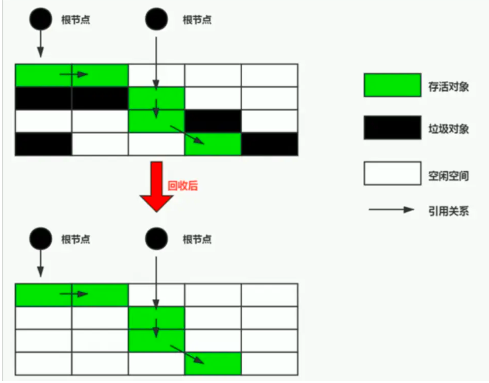

### 2.3.3 标记 - 复制算法

标记 - 复制算法常被简称为复杂算法。为了解决标记 - 清除算法面对大量可回收对象时执行效率低的问题，1969年Fenichel提出了一种称为“半区复制”(Semispace Copying)垃圾收集算法，它将可用内存按照容量划分为大小相等的两块，每次只使用其中的一款。当这一块的内存用完了，就将还存活的对象复制到另一块上面，然后再把已使用过的内存空间一次清理掉。如果内存中多数对象都是存活的，这种算法将会产生大量的内存间复制的开销，但对于多数对象都是可回收的情况，算法需要复制的就是占少数的存活对象，而且每次都是针对整个半区进行内存回收，分配内存时也就不用考虑有空间碎片的复杂情况，只要移动堆顶指针，按顺序分配即可。这样实现简单，运行高效，不过其缺陷也显而易见，这种复制回收算法的代价就是将可用内存缩小为原来的一半，空间浪费未免太多了。

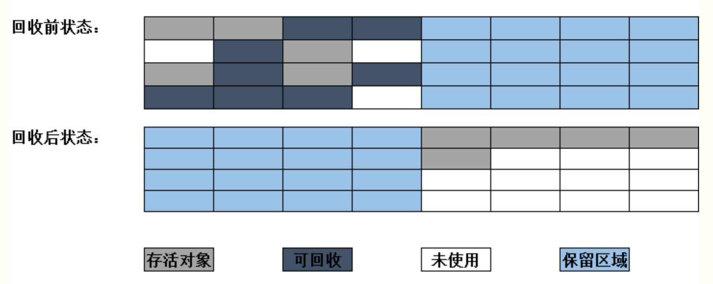

现在的商业Java虚拟机大多优先采用了复制算法去回收新生代，IBM公司曾有一项专门研究对新生代“朝生夕灭”的特点做了更量化的诠释————新生代中的对象有98%熬不过第一轮收集。因此并不需要按照1:1的比例来划分新生代的内存空间。

在1989年，Andrew Appel针对具备“朝生夕灭”特点的对象，提出了一种更优化的半区复制分代策略，现在称为“Appel式回收”。HotSpot虚拟机的Serial、ParNew等新生代收集器均采用了这种策略来设计新生代的内存布局。

Appel式回收的具体做法是把新生代分为较大的Eden空间和两块较小的Survivor空间，每次分配内存只使用Eden和气质一块Survivor。发生垃圾收集时，将Eden和Survivor中仍然存活的对象一次性复制到另外一块Survivor上，然后直接清理掉Eden和已使用过的Survivor空间。HotSpot虚拟机默认Eden和Survivor的大小比例是8:1，也即每次新生代中可用内存空间为整个新生代容量的90%（Eden的80%加上一块Survivor的10%），只有一个Survivor空间，即10%的新生代是会被“浪费”的。当然，98%的对象可被回收仅仅是“普通场景”下测得的数据，任何人都没法百分之百保证每次回收都只有不多于10%对象存活，因此Appel式回收还有一个充当罕见情况的“逃生门”的安全设计，当Survivor空间不足以容纳一次Minor GC之后存活的对象时，就需要依赖其他内存区域（实际上大多数就是老年代）进行分配担保(Handle Promotion)。

内存的分配担保好比是我们去银行贷款，如果我们信誉很好，在98%的情况下都能按时偿还，于是银行可能会默认我们下一次也能按时还款，值需要一个担保人能保证如果我们不能按时还款时，可以从它的账户里扣钱。内存担保也一样，如果另一块Survivor空间没有足够空间存放上一次新生代收集下来的存活对象，这些对象便将通过分配担保机制直接进入老年代，这对虚拟机来说就是安全的。

### 2.3.4标记 - 整理算法

标记 - 复制算法在对象存活率较高的时候进行较多的复制操作，效率将会降低。更关键的是，如果不想浪费50%的空间，就需要有额外的空间进行分配担保，以应对被使用的内存中所有对象都100%存活的极端情况，所以在老年代一般不能直接选用这种算法。

针对老年代对象的存亡特征，1974年Edward Lueders提出了另一种有针对性的“标记 - 整理”(Mark-Compact)算法，其中的标记仍然与“标记 - 清理”算法一致，但后续步骤不是直接对可回收对象进行清理，而是让所有存活的对象都向内存空间一端移动，然后直接清理掉边界以外的内存。

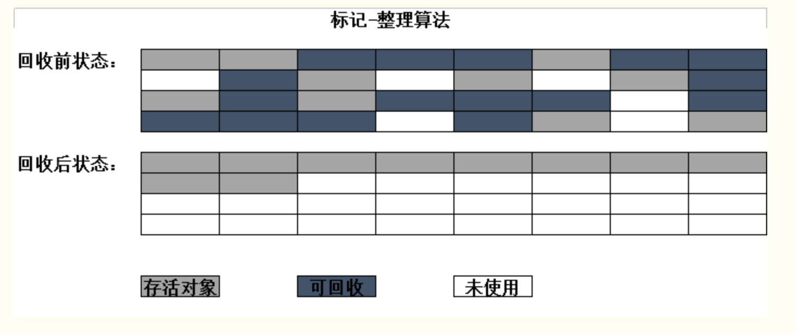

标记 - 清除算法与标记 - 整理算法的本质差异在于前者是一种非移动式的回收算法，而后者是移动式的。是否移动回收后的存活对象是一项优缺点并存的风险决策：
- 如果移动存活对象，尤其是在老年代这种每次回收都有大量对象存活区域，移动存活对象并更新所有引用这些对象的地方将会是一种极为负重的操作，而且这种操作必须全场暂停用户应用程序才能进行，这就更加让使用者不得不小心翼翼得权衡其弊端了，就这样的停顿被最初的虚拟机设计者描述为：Stop the world
- 但如果跟标记 - 清除算法那样完全不考虑移动和整理存活对象的话，弥散于堆中的存活对象导致的空间碎片化问题就只能依赖更为复杂的内存分配器和内存访问器来解决。譬如通过“分区空闲分配链表”来解决内存分配问题（计算机硬盘存储大文件就不要求物理连续的磁盘空间，能够在碎片化的硬盘上存储和访问就是硬盘分区表实现的）。内存的访问是用户程序最频繁的操作，甚至没有之一，假如在这个环节上增加了额外的负担，必会直接影响应用程序的吞吐量。

基于以上两点，是否移动对象都存在弊端，移动则内存回收时会更复杂，不移动则内存分配时更复杂。从垃圾收集的停顿时间来看，不移动对象停顿时间更短，甚至不需要停顿，但是从整个程序的吞吐量来看，移动对象更加划算。此语境中，吞吐量的实质是复制器（Mutator，可以理解为使用垃圾收集的用户程序，本书为便于理解，多数地方用“用户程序”或“用户线程”代替）与收集器的效率总和。即使不移动对象会使得收集器的效率提升一些，但因为内存分配和访问相比垃圾收集效率要高得多，这部分的耗时增加总吞吐量仍然是下降的。HotSpot虚拟机里面关注吞吐量的Parallel Old收集器是基于标记 - 整理算法的，而关注延迟的CMS收集器则是基于标记 - 清理算法的。

另外，还有一种“和稀泥”解决方式可以不再内存分配和访问上增加太大额外负担，做法就是让虚拟机平时多数时间采用标记 - 清除算法，暂时容忍内存碎片的存在，直到内存空间的碎片化程度已经大到影响对象分配时，再采用标记 - 整理算法收集一次，以获得规整的内存空间。前面提到的基于标记 - 清除的CMS收集器面临空间碎片过多时采用的就是这个处理方法。

## 2.4 HotSpot的算法细节实现

2.2、2.3节从理论原理上介绍了常见的对象存活判定算法和垃圾收集算法，Java虚拟机实现这些算法时，必须对算法的执行效率有严格的考量，才能保证虚拟机高效运行。

### 2.4.1 根节点枚举

我们以可达性分析算法中从GC Roots集合找引用链这个操作作为介绍虚拟机高效实现的第一个例子。固定可作为GC Roots的节点主要在全局性的引用（例如常量或者类静态熟悉）与执行上下文（例如栈帧中的本地变量表）中，尽管目标明确，但查找过程要做到高效并非一件容易的事情，现在Java应用越做越大，光是方法区的大小就常有数百上千兆，里面的类、常量等更是恒河沙数，若要逐个检查以这里为起源的引用肯定得消耗不少时间。

迄今为止，所有收集器在根节点枚举这一步骤时都是必须暂停用户线程的，因此毫无疑问跟节点枚举与之前提及的整理内存碎片一样会面临类似“Stop World”的困扰。现在可达性分析算法耗时最长的查找引用链的过程已经可以做到与用户线程一起并发，但根节点枚举始终还是必须在一个能保障一致性的快照中才得以进行——这里“一致性”的意思是整个枚举期间执行子系统看起来就像是被冻结在某个时间点上，不会出现分析过程中，根节点集合的对象引用关系还在不断变化的情况，若这点不能满足的话，分析结果准确性也就无法保证。这是导致垃圾收集过程必须停顿所有用户线程的其中一个重要原因，即使是号称停顿时间可控，或者（几乎）不会发生停电的CMS、G1、ZGC等收集器，枚举根节点时也必须要停顿。

由于目前主流Java虚拟机使用的都是准确式垃圾收集，所以当用户线程停顿下来之后，其实并不需要一个不漏地检查完所有执行上下文和全局的引用设置，虚拟机应当是有办法直接得到哪些地方存放着对象引用的。在HotSpot的解决方法里，是使用一组称为OopMap的数据结构来达到这个目的。一旦类的加载动作完成时，HotSpot就会把对象内什么偏移量上是什么类型的数据计算出来，在即使编译过程中，也会在特定的位置记录下栈里和寄存器里哪些位置是引用。这样收集器在扫描时就可以直接得知这些信息了，并不需要真正一个不漏地从方法区等GC Roots开始查找。

下面代码时HotSpot虚拟机客户端模式生成的一段String::hashCode()方法编译后的本地代码，可以看到在0x026eb7a9处的call指令有OopMap记录，它致命了EBX寄存器和栈中偏移量为16的内存区域中各有一个普通对象指针(Ordinary Object Pointer,OOP)的引用，有效范围为从call指令开始直到0x026eb730(指令流的起始位置) +142(OopMap记录的偏移量) = 0x026eb7be，即hlt指令为止。

```java
[Verified Entry Point]
0x026eb730:mov %eax,-0x8000(%esp)
..............
;; ImplicitNullCheckStub slow case
0x026eb7a9: call  0x026e83e0   ; OopMap(ebx=Oop [16]=Oop off=142)
                               ; *caload
                               ; - java.lang.String::hashCode@48 (line 1489)
                               ; (runtime_call)
    0x026eb7ae:push $0x83c5c18 ; (external_world)
    0x026eb7b3:call 0x026eb7b8
    0x026eb7b8:pusha
    0x026eb7b9:call 0x0822bec0 ; (runtime_call)
    0x026eb7be:hlt
```

在HotSpot中，对象的类型信息里有记录自己的OopMap，记录了在该类型的对象内什么偏移量上是什么类型的数据。所以从对象开始向外的扫描可以是准确的；这些数据是在类加载过程中计算得到的。

可以把oopMap简单理解成是调试信息。 在源代码里面每个变量都是有类型的，但是编译之后的代码就只有变量在栈上的位置了。oopMap就是一个附加的信息，告诉你栈上哪个位置本来是个什么东西。 这个信息是在JIT编译时跟机器码一起产生的。因为只有编译器知道源代码跟产生的代码的对应关系。

### 2.4.2 安全点

在OopMap的协助下，HotSpot可以快速准确地完成GC Roots枚举，但一个很现实的问题随之而来：可能导致引用关系变化，或者说导致OopMap内容变化的指令非常多，结果为每一条指令都生成对应的OopMap，那就将会需要大量的额外存储空间，这样垃圾收集伴随而来的空间成本就会变得无法忍受的高昂。

实际上HotSpot也的确没有为每条指令都生存OopMap。前面已经提到，只是在“特定的位置”记录了这些信息，这些位置被称为安全点（SafePoint）。有了这些安全点的设定，也就决定了用户程序执行时并非在代码指令流的任意位置都能停顿下来开始垃圾收集，而是强制要求必须执行到安全点后才能暂停。因此，安全点的选定既不能太少以至于让收集器等待时间过长，也不能太频繁以至于过分增大运行时的内存负荷。安全点位置的选取基本上是以“是否具有让程序长时间执行的特征”为标准进行选定的，因为每条指令执行的时间都非常短暂，程序不太可能因为指令流太长这样的原因而长时间执行，“长时间执行”的最明显特征就是指令序列的复用，例如方法调用、循环跳转、异常跳转等都属于指令序列复用，所以只有具有这些功能的指令才会产生安全点。

每个方法可能会有好几个oopMap，就是根据safepoint把一个方法的代码分成几段，每一段代码一个oopMap，作用域自然也仅限于这一段代码。 循环中引用多个对象，肯定会有多个变量，编译后占据栈上的多个位置。那这段代码的oopMap就会包含多条记录。

对于安全点，另外一个需要考虑的问题是，如何在垃圾收集发生时让所有线程(这里其实不包括执行JNI调用的线程)都跑到最近的安全点，然后停顿下来。这里有两种方案可供选择：抢先式中断(Preemptive Suspension)和主动式中断(Voluntary Suspension)。抢先式中断不需要线程的执行代码主动去配合，在垃圾收集发生时，系统首先把所有用户线程全部中断，如果发现有用户线程中断的地方不在安全点上，就恢复这条线程执行，让它一会再重新中断，直到跑到安全点上。现在几乎没有虚拟机实现抢先式中断来暂停线程相应GC事件。

而主动式中断的思想是当垃圾收集需要中断线程的时候，不直接对线程操作，仅仅简单设置一个标志位，各个线程执行过程时会不停地主动寻找这个标志，一旦发现中断标志为真，就自己在最近的安全点上主动中断挂起。轮询标志的地方和安全点是重合的，另外还要加上所有创建对象和其他需要在Java堆上分配内存的地方，这是为了检查是否即将要发生垃圾收集，避免没有足够内存分配新对象。

由于轮询操作在代码中会频繁出现，这要求它必须足够高效。HotSpot使用内存保护陷阱的方式，把轮询操作精简至只有一条汇编指令的程度。下面代码清单中的test指令就是HotSpot生成的轮询指令，当需要暂停用户线程时，虚拟机把0x160100的内存页设置为是不可读，那线程执行到test指令时就会产生一个自陷异常信号，然后在预先注册的异常处理器中挂起线程实现等待，这样仅通过一条汇编指令就完成安全点轮询和触发线程中断了。

```java
0x01b6d627:call 0x01b2b210          ; OopMap{[60]=Oop off=460}
                                    ; *invokeinterface size
                                    ; -Client1::main@113(line 23)
                                    ;   {Virtual_call}
0x01b6d62c:nop                      ; OopMap{[60]=Oop off=461}
                                    ; *if_icmplt
                                    ; -Client1::main@118(line 23)
0x01b6d62d:test %eax,0x160100       ; {poll}
0x01b6d633:mov  0x50{%esp},%esi
0x01b6d637:cmp  %eax,%esi
```

### 2.4.3 安全区域

使用安全点的设计似乎已经完美解决赫然停顿用户线程，让虚拟机进入垃圾回收状态的问题了，但是实际情况却不一定。安全点机制保证了程序执行时，在不太长的时间内就会遇到可进入垃圾收集过程的安全点。但是，程序“不执行”的时候呢？所谓的程序不执行就是没有分配处理器时间，典型的场景便是用户线程处于Sleep状态或者Blocked状态，这时候线程无法响应虚拟机的中断请求，不能再走到安全的地方去中断挂起自己，虚拟机也显然不可能持续等待线程重新被激活分配处理器时间。对于这种情况，就必须引入安全区域(Safe Region)来解决。

安全区域是指能够确保在某一段代码片段之中，引用关系不好发生变化，因此，在这个区域中任意地方开始垃圾收集都是安全的。我们也可以把安全区域看作被扩展了的安全点。

### 2.4.4 记忆集与卡表

讲解分代收集理论的时候，提到了味了解决对象跨代引用所带来的问题，垃圾收集器在新生代中建立了名为记忆集(Remembered Set)的数据结构，用以避免把整个老年代加进GC Roots扫描范围。事实上并不只是新生代、老年代之间才有跨代引用的问题，所有涉及部分区域收集(Partial Gc)行为的垃圾收集器，都会面临相同的问题，因此我们有必要进一步清理记忆集的原理和实现方式，以便在后几章节介绍最新的收集器知识时能够更好的理解。

记忆集是一种用于记录<b>从非收集区域指向收集区域</b>的指针集合的抽象数据结构，如果我们不考虑效率和成本的话，最简单的实现可以用非收集区域中所有含跨代引用的对象数组来实现这个数据结构：
```java
//以对象指针来实现记忆集的伪代码
Class RememberedSet{
    Object[] set[OBJECT_INTERGENERATIONAL_REFERENCE_SIZE];
}
```

这种记录全部含跨代引用对象的实现方案，无论是空间占用还是维护成本都相当高，而在垃圾收集的场景中，收集器只需要通过记忆集判断出某一块非收集区域是否存在有指向了收集区域的指针就可以了,并不需要了解这些跨代指针的的全部细节。那设计者在实现记忆集的时候，便可以选择更为粗犷的记录粒度来节省记忆集的存储和维护成本，下面列举了一些可供选择(当然也可以选择这个范围之外的)的记忆精度：
- 字长精度：每个记录精确到一个机器字长(就是处理器的寻址位数，如常见的32位或者64位，这个精度决定了机器访问物理内存地址的指针长度)，该字包含跨代指针。
- 对象精度：每个记录精确到一个对象，该对象里有字段含有跨代指针。
- 卡精度：每个记录精确到一个内存区域，该区域内含有跨代指针。

其中，第三种“卡精度”所指的是用一种称为“卡表”(Card Table)的方式来实现记忆集，这也是目前最常用的一种记忆集实现形式。卡表就是记忆集的一种具体体现，它定义了记忆集的记忆精度、与堆内存的映射关系。

卡表最简单的形式可以只是一个字节数组，而HotSpot虚拟机确实也是这样做的。以下这行代码是HotSpot默认的卡表标记逻辑：
```java
CARD_TABLE [this address >> 9] = 1;
```
字节数组CARD_TABLE的每一个元素都对应着其标识的内存区域中一块特定大小的内存块，这个内存块被称为“卡页”(Card Page)。一般来说，卡页大小都是以2的N次幂的字节数，通过上面代码可以看出HotSpot中使用的卡页是2的9次幂，即512字节(地址右移9位，相当于用地址除以512)。那如果卡表标识内存区域的起始地址是0x0000的话，数组CARD_TABLE的第0、1、2号元素，分别对应里地址范围为0x0000～0x01FF、0x0200~0x03FF、0x0400~0x5FF的卡页内存块。
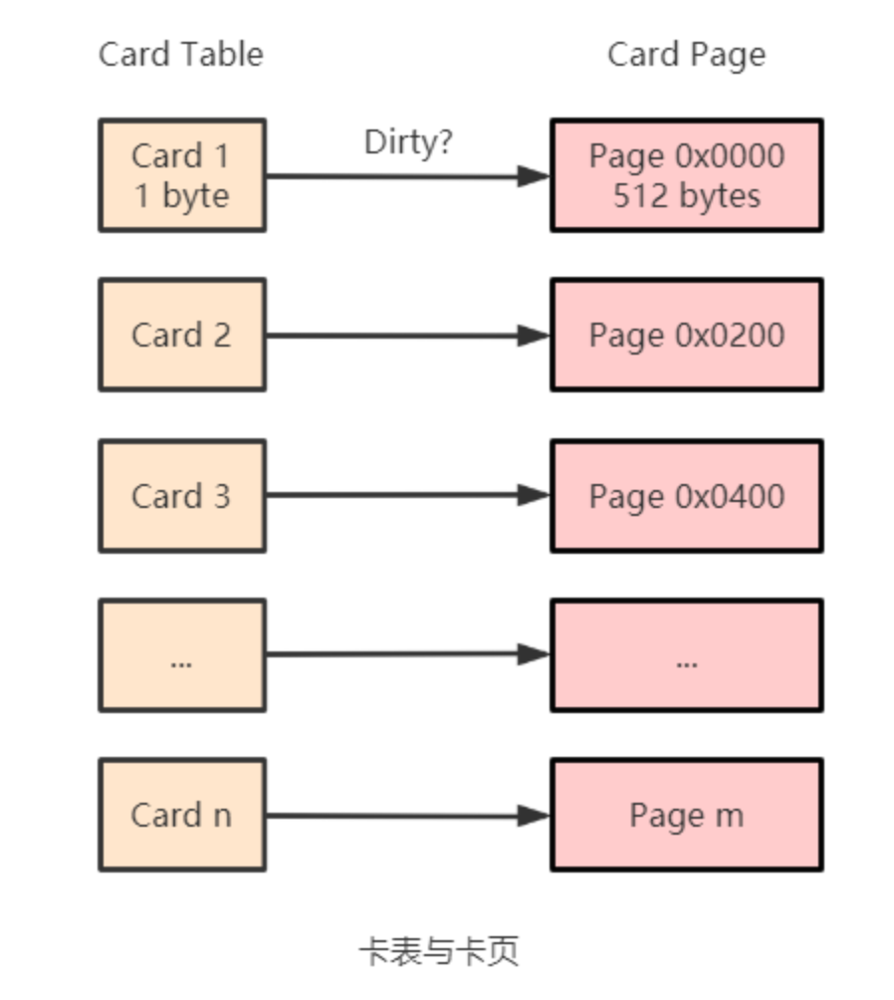

一个卡页的内存中通常包含不只一个对象，只要卡页内有一个(或更多)对象的字段存在着跨代指针，那就将对应卡表的数组元素的值标识为1，称为这个元素变脏(Dirty)，没有则标识为0.在垃圾收集发生时，只要筛选出卡表中变脏的元素，就能轻易地出哪些卡页内存块中包含跨代指针，把它们加入GC Roots中一并扫描。

### 2.4.5 写屏障

我们已经解决了如何使用记忆集来缩减GC Roots扫描范围的问题，但还没有解决卡表元素如何维护的问题，例如它们何时变脏、谁来把它们变脏等。

卡表元素何时变脏的答案是很明确的————有其他分代区域中对象引用了本区域对象时，其对应的卡表元素就应该变脏，变脏时间点原则上应该发生在引用类型字段赋值的那一刻。但问题是如何变脏，即如何在对象赋值的那一刻去更新维护卡表呢？假如是解释执行的字节码，那相对好处理，虚拟机负责每条字节码指令的执行，有充分的介入空间；但在编译执行的场景中呢？经过即使编译后的代码已经是纯粹的机器指令流了，这就必须找到一个在机器码层面的手段，把维护卡表的动作放到每一个赋值操作中。

在HotSpot虚拟机里是通过写屏障(Write Barrier)技术维护卡表状态的。写屏障可以看作在虚拟机层面对“引用类型字段赋值”这个动作的AOP切面，在引用对象赋值时会产生一个环形(Around)通知，供程序执行额外的动作，也就是说赋值的前后都在写屏障的覆盖范畴内。在赋值前的部分的写屏障叫作写前屏障(Pre-Write Barrier)，在赋值后的则叫作写后屏障(Post-Write Barrier)。HotSpot虚拟机的许多收集器中都有使用到写屏障，但直至G1收集器出现之前，其他收集器都只用到了写后屏障。下面这段代码是一段更新卡表状态的简化逻辑：
```java
void oop_field_store(oop* field, oop new_value){
    //引用字段赋值操作
    *field = new_value;
    //写后屏障，在这里完成卡表状态更新
    post_write_barrier(field, new_value);
}
```
应用写屏障后，虚拟机就会为所有赋值操作生成相应的指令，一旦收集器在写屏障中增加了更新卡表操作，无论更新的是不是老年代对新生代对象的引用，每次只要对引用进行更新，就会产生额外的开销，不过这个开销与Minor GC时扫描整个老年代的代价相比还是低得多的。

除了写屏障的开销外，卡表在高并发场景下还面临着“伪共享”(False Sharing)问题。伪共享是处理并发底层细节时一种经常需要考虑的问题，现代中央处理器的缓存系统中以缓存行(Cache Line)为单位存储的当多线程修改互相独立的变量时，如果这些变量给好共享同一个缓存行，就会彼此影响(写回、无效化或者同步)而导致性能降低，这就是伪共享问题。

假设处理器的缓存行大小为64字节，由于一个卡表元素占1个字节，64个卡表元素将共享一个缓存行。这64个卡表元素对应的卡页总的内存为64x512字节 = 32KB，也就是说如果不同线程更新的对象正好处于这32KB的内存区域内，就会导致更新卡表时正好写入同一个缓存行而影响性能。为了避免伪共享问题，一种简单的解决方案是不采用无条件的写屏障，而是先检查卡表标记，只要当该卡表元素未被标记时才将其标记为变脏，即将卡表更新的逻辑变为以下代码所示：
```java
if (CARD_TABLE [this address >> 9] != 1){
    CARD_TABLE [this address >> 9] = 1;
}
```
在JDK 7之后，HotSpot虚拟机增加了一个新的参数-XX:+UseCondCardMark，用来决定是否开启卡表更新的条件判断。开启会增加一次额外判定的开销，但能够避免伪共享问题。

### 2.4.6 并发的可达性分析

当前主流编程语言的垃圾收集器基本上都是依靠可达性分析算法来判定对象是否存活的，可达性分析算法理论上要求全过程都基于一个能保障一致性的快照中才能够进行分析，这意味着必须全部冻结用户线程的进行。在根节点枚举这个步骤中，由于GC Roots相比于整个Java堆中全部的对象毕竟还算是极少数，且在各种优化技巧的加持下，它带来的停顿已经是非常短暂且相对固定(不随堆容量而增长)的了。可从GC Roots再继续往下遍历对象图，这一步骤的停顿时间就必定会与Java堆容量直接成正比例关系了：堆越大，存储的对象越多，对象图结构越复杂，要标记更多对象而产生的停顿时间自然就更长，这听起来理所应当。

要知道包含“标记”阶段是所有追随式垃圾收集算法的共同特征，如果这个阶段会随着堆变大而等比例增加停顿时间，其影响就会波及几乎所有的垃圾收集器，同理可知，如果能够削减这部分停顿时间的话，那收益也将会是系统性的。

想解决或者降低用户线程的停顿，就要先搞清楚为什么必须在一个能保障一致性的快照上才能进行对象图的遍历？为了能解释清楚这个问题，我们引入三色标记(Tri-color Marking)作为工具来辅助推导，把遍历对象图过程中遇到的对象，按照“是否访问过”这个条件标记成以下三种颜色：
* 白色：表示对象尚未被垃圾收集器访问过。显然在可达性分析刚刚开始的阶段，所有的对象都是白色的，若在分析结束的阶段，仍然是白色的对象，即代表不可达。
* 黑色：标识对象已经被垃圾收集器访问过，且这个对象的所有引用都已经被扫描过。被色的对象代表已经扫描过，它是安全存活的，如果有其他对象引用指向了黑色对象，无须重新扫描一遍。黑色对象不可能直接(不经过黑色对象)指向某个白色对象。
* 灰色：表示对象已经被垃圾收集器访问过，但这个对象上至少存在一个引用还没有被扫描过。

关于可达性分析的扫描过程，可以把它看作对象图上一股以灰色为波峰的波纹从黑向白推进的过程，如果用户线程此时是冻结的，只有收集器线程在工作，那不会有任何问题。但如果用户线程与收集器并发工作呢？收集器在对象图上标记颜色，同时用户线程在修改引用关系————即修改对象图的结构，这样可能出现两种后果。一种是把原本消亡的对象错误标记为存活，这不是好事，但其实是可以容忍的，只不过产生了一点逃过本次收集的浮动垃圾而已，下次收集清理就好。另一种是把原本存活的对象错误标记为已消亡，这就是非常致命的错误了，程序肯定会因此发生错误。

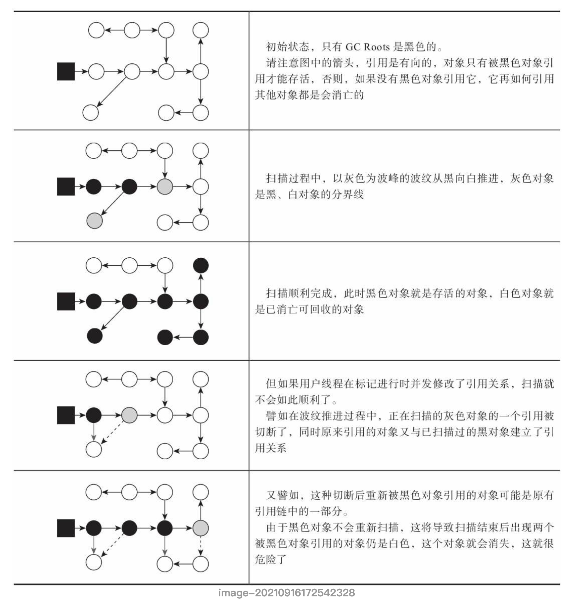

Wilson于1994年在理论上证明了，当且仅当以下两次条件同时满足时，会产生“对象消失”的问题，即原本应该为黑色的对象被误标为白色：
* 赋值器插入了一条或多条从黑色对象到白色对象的新引用。
* 赋值器删除了全部从灰色对象到该白色对象的直接或者间接引用。

因此，我们需要解决并发扫描时的对象消失问题，只需破坏这个两个条件的任意一个即可。由此分别产生了两种解决 方案：增量更新(Incremental Update)和原始快照(Snapshot At The Beginning,SATB)。

增量更新要破坏的是第一个条件，当黑色对象插入新的指向白色对象的引用关系时，就将这个新插入的引用记录下来，等并发扫描结束之后，再将这些记录过的引用关系中的黑色对象为根，重新扫描一次。这可以简单理解为：黑色对象一旦新插入了白色对象的引用之后，它就变回灰色对象了。

原始快照要破坏的是第二个条件，当灰色对象要删除指向白色对象的引用关系时，就将这个要删除的引用记录下来，在并发扫描结束之后，再将这些记录过的引用关系中的灰色对象为根，重新扫描一次。这也可以简化为：无论引用关系删除与否，都会按照刚刚开始扫描那一刻的对象图快照来进行搜索。

以上无论是对引用关系记录的插入还是删除，虚拟机的记录操作都是通过写屏障实现的。在HotSpot虚拟机中，增量更新和原始快照这两种都有实际应用，譬如，CMS是基于增量更新来做并发标记的，G1、Shenandoah是用原始快照来实现的。


## 2.5 经典垃圾收集器

如果说收集算法是内存回收的方法论，那垃圾收集器就是内存回收的实践者。《Java虚拟机规范》中对垃圾收集器应该如何实现并没有做出任何规定，因此不同的厂商、不同版本的虚拟机所包含的垃圾收集器都可能会有很大差别，不同的虚拟机一般也会提供各种参数供用户根据自己的应用特点和要求组合出各个内存分代所使用的收集器。

各种经典垃圾收集器之间的关系图。
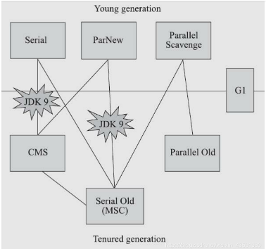

上图展示了其中作用于不同分代的收集器，如果两个收集器之间存在连线，就说明它们可以搭配使用，图中收集器所处的区域，则表示它是属于新生代收集器抑或是老年代收集器。

在介绍这些收集器各自特性之前，先明确一个观点：虽然我们会对各个收集器进行比较，但并非为了挑选一个最好的收集器出来，虽然垃圾收集器的技术在不断进步，但直到现在还没有最好的收集器出现，更加不存在“万能”的收集器，所以我们选择的只是对具体应用最合适的收集器。这单不需要多加论述就能证明：如果有一种放之四海而皆准、任何场景下都适用的完美收集器存在，HotSpot虚拟机完全没必要实现那么多种不同的收集器了。

### 2.5.1 Serial收集器

Serial收集器是最基础、历史最悠久的收集器，曾经是HotSpot虚拟机新生代收集器的唯一选择。大家只看名字就能猜到，这个收集器是一个单线程工作的收集器，但它的“单线程”的意义并不仅仅是说明它只会使用一个处理器或一条收集线程去完成垃圾收集工作，更重要的是强调在它进行垃圾收集时，必须暂停其他所有工作线程，直到它收集结束。“Stop the World”这个词听起来很酷，但这项工作是由虚拟机在后台自动发起和自动完成的，在用户不可知、不可控的情况下把用户的正常工作的线程全部停掉，这对很多应用来说都是不能接受的。

下图展示了Serial/Serial Old收集器的运行过程。
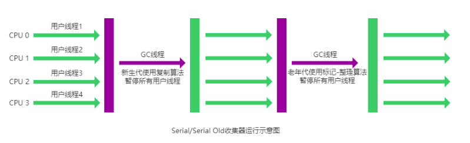

从JDK1.3开始，一直到最新的JDK13，HotSpot虚拟机的设计者开发团队为消除火灾降低用户线程因垃圾收集而导致停顿的努力一直持续着，从Serial收集器到Parallel收集器，再到Concurrent Mark Sweep(CMS)和Garbage First(G1)收集器，最终至现在垃圾收集器的最前沿成功Shenandoah和ZGC等，用户线程的停顿时间越来越短，但是仍然没办法彻底消除。

Serial收集器看似老而无用，但它依然是HotSpot虚拟机运行在客户端模式下的默认新生代收集器，有着优于其他收集器的地方，那就是简单高效，对于内存资源受限的环节，它是所有收集器里额外内存消耗(Memory Footprint)最小的；对于单核处理器或处理器核心少的环境来说，Serial收集器由于没有线程交互的开销，专心做垃圾收集自然可以获得最高的单线程收集效率。在用户桌面的应用场景一集近年来流行的部分微服务应用中，分配给虚拟机管理的内存一般来说并不会特别大，收集几十兆甚至一两百兆的新生代(仅仅是指新生代使用的内存，桌面应用甚少超过这个容量)，垃圾收集的停顿时间完全可以控制在十几、几十毫秒，最多一百多毫秒以内，只要不是频繁发生收集，这单停顿时间对许多用户来说时完全可以接受的。所以，Serial收集器对于运行在客户端模式下的虚拟机来说是一个很好的选择。

### 2.5.2 ParNew收集器

ParNew收集器实质上是Serial收集器的多线程并行版本，除了同时使用多条线程进行垃圾收集之外，其余的行为包括Serial收集器可用的所以控制参数(例如：-XX:SurvivorRatio / -XX:PretenureSizeThreshold / -XX:HandlePromotionFailure)、收集算法、Stop The World、对象分配规则、回收策略等都与Serial收集器完全一致，在实现这两种收集器也共用了相当多的代码。

下图是ParNew/Serial Old收集器运行示意图。
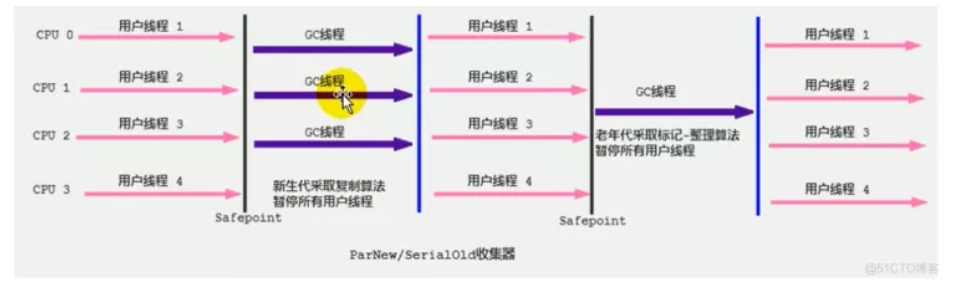

ParNew收集器除了支持多线程并行收集之外，其他与Serial收集器相比并没有太多创新之处，但它却是不少运行中服务端模式下的HotSpot虚拟机，尤其是JDK7之前的遗留系统中首选的新生代收集器，其中有一个与功能、性能无关但其实很重要的原因是：除了Serial收集器外。目前只有ParNew收集器能与CMS(Concurrent Mark Sweep)收集器配合工作。

在JDK5发布时，HotSpot虚拟机推出了一款在强交互应用中几乎可称为具有划时代意义的垃圾收集器 —— CMS收集器。这款收集器时HotSpot虚拟机中第一款真正意义上支持并发的垃圾收集器，它首次实现了让垃圾收集线程与用户线程(基本上)同时工作。

遗憾的事，CMS作为老年代的收集器，却无法与JDK1.4.0中已经存在的新生代收集器Parallel Scavenge配合工作，所以在JDK5中使用CMS来收集老年代的时候，新生代只能选择ParNew或者Serial收集器中的一个。ParNew收集器是激活CMS后(使用-XX:+UseConcMarkSweepGC选项)的默认新生代收集器，也可以使用-XX:+/-UseParNewGC选项来强制指定或者禁用它。

可以说直到CMS的出现才巩固了ParNew的地位，但随着垃圾收集器技术的不断改进，更先进的G1收集器带着CMS继承者和替代者的光环登场。G1是一个面向全堆的收集器，不再需要其他新生代收集器的配合工作。所以自JDK9开始，ParNew加CMS收集器的组合就不再是官方推荐的服务端模式下的收集器解决方法来。官方希望它能完全被G1所取代，甚至还取消了ParNew加Serial Old一集Serial加CMS这两组收集器组合的支持，并直接取消了-XX:+UseParNewGC参数，这意味着从此以后，ParNew合并到CMS，成为它专门处理新生代的组成部分。ParNew可以说是HotSpot虚拟机中第一款退出历史舞台的垃圾收集器。

ParNew收集器在单核心处理器的环境中绝对不会有比Serial收集器更好的效果，甚至由于存在线程交互的开销，ParNew收集器在通过超线程(Hyper-Threading)技术实现的伪双核处理器环境中都不能百分之百保证超越Serial收集器。当然，随着可以被使用的处理器核心数量的增加，ParNew对于垃圾收集时系统资源的高效利用还是很有好处的。它默认开启的收集线程数与处理器核心数量相同，在处理器核心非常多的环境中，可以使用-XX:ParallelGCThreads参数来限制垃圾收集的线程数。

<hr>
⚠️注意：从ParNew收集器开始，后面会多次涉及到“并发”和“并行”，在这里先解释清楚：

* 并行(Parallel):并行描述的是多条垃圾收集器线程之间的关系，说明同一时间有多条这样的线程在协同工作，通常默认此时用户线程是处于等待状态。
* 并发(Concurrent):并发描述的是垃圾收集器线程与用户线程之间的关系，说明同一时间垃圾收集器与用户线程都在运行。由于用户线程并未被冻结，所以程序仍然能响应服务请求，但由于垃圾收集器线程占用了一部分系统资源，此时应用程序的处理的吞吐量将受到一定影响。
<hr>

### 2.5.3 Parallel Scavenge收集器

Parallel Scavenge收集器也是一款新生代收集器，它同样是基于标记 - 复制算法实现的收集器，也是能够并行收集的多线程收集器......Parallel Scavenge的诸多特性从表面上看和ParNew非常相似，那它有什么特别之处呢？

Parallel Scavenge收集器的特点就是它的关注点与其他收集器不同，CMS等收集器的关注点是尽可能地缩短垃圾收集时用户线程的停顿时间，而Parallel Scavenge收集器的目标则是达到一个可控制的吞吐量(Throughput)。所谓吞吐量就是处理器用于运行用户代码的时间与处理器总消耗时间的比值，即:
``吞吐量 = (运行用户代码时间) / (运行用户代码时间 + 运行垃圾收集时间)``

如果虚拟机完成某个任务，用户代码加上垃圾收集总共消费了100分钟，其中垃圾收集占用1分钟，那么吞吐量就是99%。停顿时间越短就越适合需要与用户交互或需要保证服务响应质量的程序，良好的响应速度能提升用户体验；而高吞吐量则可以最高效率地利用处理器资源，尽快完成程序的运算任务，主要适合在后台运算而不需要太多交互的分析任务。

Parallel Scavenge收集器提供了两个参数用于精确控制吞吐量，分别是控制最大垃圾收集停顿时间-XX:MaxGCPauseMillis参数以及直接设置吞吐量大学的-XX:GCTimeRatio参数。

-XX:MaxGCPauseMillis参数允许的值是一个大于0的毫秒数，收集器将尽力保证内存回收划分的时间不超过用户设定值。不过大家也不要异想天开地认为如果把这个参数的值设置得更小一点就能使得系统的垃圾收集速度变得更快，垃圾收集停顿时间缩短是以牺牲吞吐量和新生代空间为代价换取的；系统把新生代调的小一点，收集300MB新生代肯定比收集500MB块，但这也直接导致垃圾收集发生得更频繁，原来10秒收集一次，每次停顿100毫米，现在变成5秒收集一次，每次停顿70毫秒。停顿时间确实在下降，但吞吐量也在下降了。

-XX:GCTimeRatio参数的值应设置为一个正整数，表示用户期望虚拟机消耗在GC上的时间不超过程序运行时间的``1/(1+N)``。默认值为99，含义是尽可能保证应用程序执行时间为收集器执行时间的99倍，也即收集器的时间消耗不超过总运行时间的1%。

由于与吞吐量关系密切，Parallel Scavenge收集器也经常被称作“吞吐量优先收集器”。除上述两个参数之外，Parallel Scavenge收集器还有一个参数:-XX:+UseAdaptiveSizePolicy值得关注。这是一个开关参数，当这个参数被激活之后，就不需要人工指定新生代的大小(-Xmn)、Eden与Survivor区的比例(-XX:SurvivorRatio)、晋升老年代对象大小(-XX:PretenureSizeThreshold)等细节参数了，虚拟机会根据当前系统的运行情况收集性能监控信息，动态调整这些参数以提供最合适的停顿时间或者最大的吞吐量。这种调节方式称为垃圾收集的自适应的调节策略(GC Ergonomics)。这也是Parallel Scavenge收集器区别于ParNew收集器的一个重要特性。

### 2.5.4 Serial Old收集器

Serial Old是Serial收集器的老年代版本，它同样是一个单线程收集器，使用标记 - 整理算法。这个收集器的主要意义也是供客户端模式下的HotSpot虚拟机使用。如果在服务端模式下，它也可能有两种用途：一种是在JDK5以及之前版本中与Parallel Scavenge收集器搭配使用，另外一种就是作为CMS收集器发生失败时的后备预案，在并发收集发生Concurrent Mode Failure时使用。


### 2.5.5 Parallel Old收集器

Parallel Old是Parallel Scavenge收集器的老年代版本，支持多线程并行收集，基于标记 - 整理算法实现。这个收集器是直到JDK6时才开始提供的，在此之前，新生代的Parallel Scavenge收集器一直处于相当尴尬的状态，原因是如果新生代选择了Parallel Scavenge收集器，老年代除了Serial Old收集器之外别无选择，其他表现良好的老年代收集器，如CMS无法与它配合工作。由于老年代Serial Old收集器在服务端应用性能上的 “拖累”，使用Parallel Scavenge收集器也未必能在整体上获得吞吐量最大化的效果。同样，由于单线程的老年代收集中无法充分利用服务器多处理器的并行处理能力，在老年代内存空间很而且硬件规格比较高级的运行环境中，这种组合的总吞吐量甚至不一定比ParNew加CMS的组合来得优秀。

直到Parallel Old收集器出现后，“吞吐量优先“收集器终于有了比较名副其实的搭配组合，在注重吞吐量或者处理器资源较为稀缺的场合，都可以优先考虑Parallel Scavenge加Parallel Old这个组合。Parallel Old收集器的工作过程如图。
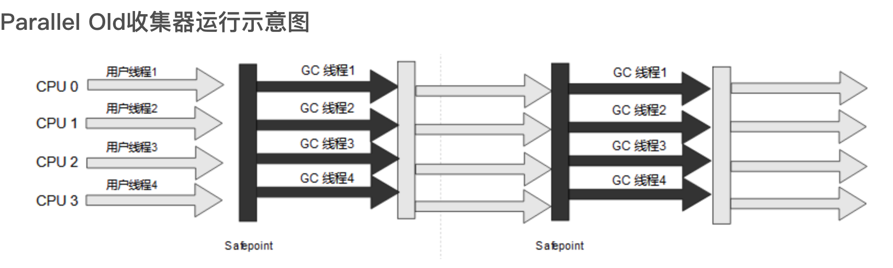

### 2.5.6 CMS收集器

CMS(Concurrent Mark Sweep)收集器是一种以获取最短回收停顿时间为目标的收集器。目前很大一部分的Java应用集中在互联网网站或者基于浏览器的B/S系统的服务端上，这类应用通常都会较为关注服务的响应速度，希望系统停顿时间尽可能短，以给用户带来良好的交互体验。CMS收集器就非常符合这类应用的需求。

从名字Mark Sweep就可以看出CMS收集器是基于标记 - 清除算法实现的，它的运作过程相对于前面几种收集器来说更复杂一些，整个过程分为四个步骤：
- 1) 初始标记(CMS initial Mark)
- 2) 并发标记(CMS concurrent Mark)
- 3) 重新标记(CMS remark)
- 4) 并发清除(CMS concurrent sweep)
  
其中，初始标记和重新标记这两个步骤需要"Stop The World"。初始标记仅仅只是标记一个GC Roots能直接关联到的对象，速度很快；并发标记阶段就是从GC Roots的直接关联对象开始遍历整个对象图的过程，这个过程耗时较长但是不需要停顿用户线程，可以与垃圾收集线程一起并发运行；而重新标记阶段则是为了修正并发标记期间，因用户程序继续运作而产生变动的那一部分对象的标记记录，这个阶段的听段时间通常会比初始标记阶段稍长一些，但也远比并发标记阶段的时间短；最后是并发清除阶段，清理删除掉标记阶段判断的已经死亡的对象，由于不需要移动存活对象，所以这个阶段也是可以与用户线程同时开发的。

由于在整个过程中耗时最长的是并发标记和并发清除阶段，垃圾收集器线程都可以与用户线程同时工作，所以在总体上来说，CMS收集器的内存回收过程是与用户线程一起并发执行的。
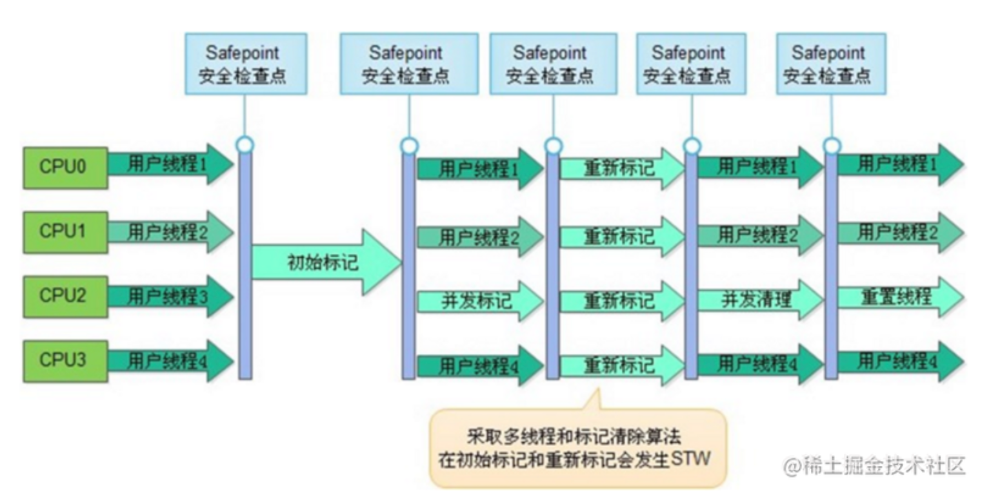

CMS是一款优秀的收集器，它最主要的优点在名字上已经体现出来，并发收集、低停顿，一些官方公开文档里面也称之为“并发低停顿收集器”(Concurrent Low Pause Collector)。CMS收集器时HotSpot虚拟机追求低停顿的第一次成功尝试，但是他还是远达不到完美的程度。至少有以下三个明显的缺点：
- 首先，CMS收集器对处理器资源非常敏感。事实上，面向并发设计的程序都对处理器资源比较敏感。在并发阶段，它虽然不会导致用户线程停顿，但却会因为占用一步吗线程(或者说处理器的计算能力)，而导致应用程序变慢，降低总吞吐量。CMS默认启动的回收线程是``(处理器核心数量 + 3) / 4``，也就是说，如果处理器核心数在四个或者以上，并发回收时垃圾收集线程只占用不少于25%的处理器运算资源，并且会随着处理器核心数量的增加而下降。但是当处理器核心数量不足四个时，CMS对用户程序的影响就可能变得很大，如果应用本来的处理器负载就很高，还要分出一半的运算能力去执行收集器线程，就可能导致用户程序的执行速度忽然大幅降低。为了缓解这个情况，虚拟机提供了一个称为“增量式并发收集器”(Incremental Concurrent Mark Sweep/i-CMS)的CMS收集器变种，所做的事情和一起单核处理器年代PC机操作系统靠抢占式多任务来模拟多核并行多任务的思想一样，是在并发标记、清理的时候让收集器线程、用户线程交替运行，尽量减少垃圾收集线程的独占资源的时间，这样整个垃圾收集的过程会更长，但对用户程序的影响就会显得较少一些，直观感受就是速度变慢的时间更多了，但速度下降幅度就没有那么明显。实践证明增量式的CMS收集器效果一般，从JDK7开始，i-CMS模式已经被声明“deprecated”，即已经过时不再提倡用户使用，到JDK9发布后i-CMS就完全被抛弃。
- 其次，由于CMS收集器无法处理“浮动垃圾”(Floating Garbage)，有可能出现“Concurrent Mode Failure“失败进而导致另一次完全“Stop The World”的Full GC的产生。在CMS的并发标记和并发清理阶段，用户线程是还在继续运行的，程序在运行自然就会伴随着新的垃圾对象不断产生，但这一部分垃圾对象是出现在标记过程结束以后，CMS无法在当次收集中处理它们，只好留待下一次垃圾收集时再清理掉。这一部分垃圾就称为“浮动垃圾”。同样是由于在垃圾收集阶段用户线程还需要持续运行，那就还需要预留足够内存空间提供给用户线程使用，因此CMS收集器不能像其他收集器那样等待到老年代几乎完全被填满了再进行收集，必须预留一部分空间供并发收集时的程序运作使用。在JDK5的默认设置下，CMS收集器当老年代使用了68%的空间后就会被激活，这是一个偏保守的设置，如果在实际应用中老年代增长并不是太快，可以适当调高参数-XX:CMSInitatingOccu-pancyFraction的值来提供CMS的触发百分比，降低内存回收频率，获取更好的性能。到了JDK6时，CMS收集器的启动阈值已经默认提升至92%。但这又会更容易面临另一种风险：要是CMS运行期间预留的内存无法满足程序分配新对象的需要，就会出现一次“并发失败”，这时候虚拟机将不得不启动后备方案：冻结用户线程的执行，临时启用Serial Old收集器来重新进行老年代的垃圾收集，但这样停顿时间就很长了。所以参数-XX:XMSInitiatingOccupancyFraction设置得太高将会很容易导致大量的并发失败产生，性能反而降低，用户应在生产环境中根据实际应用情况来权衡设置。
- 最后，CMS是一款基于“标记 - 清除：算法实现的收集器，如果读者对前面部分还有印象的话，就可能想到这意味着收集结束时会产生大量的空间碎片。空间碎片过多时，将会给打对象分配带来很大麻烦，往往会出现老年代还有很多剩余空间，但就是无法找到足够大的连续空间来分配当前对象，而不得不提前触发一次Full GC的情况。为了解决这个问题，CMS收集器提供了一个-XX:+UserCMACompactAtFullCollection开关参数(默认时开启的，词参数从JDK9开始废弃)，用于在CMS收集器不得不进行Full GC时开启内存碎片的合并整理过程，由于这个内存整理必须移动存活对象，是无法并发的。这样空间碎片问题是解决了，但停顿时间又会变长，因此虚拟机还提供了一个参-XX:CMSFullGCBeforeCompaction，这个参数的作用是要求CMS收集器在执行过若干次不整理空间的Full GC之后，下一次进入Full GC前会先进行碎片整理。

### 2.5.7 Garbage First收集器

Garbage First(简称G1)收集器是垃圾收集器技术发展历史上的里程碑式的成功，它开创了收集器面向局部收集的设计思路和机遇Region的内存布局形式。早在JDK7刚刚确立项目目标、Oracle公司制定的JDK7 RoadMap里面，G1收集器就被视作JDK7中HotSpot虚拟机的一项重要进化特征。从JDK6 Update14开始就有Early Access版本的G1收集器供开发人员实验和试用，但由此开始G1收集器的“实验状态”(Experimental)持续了数年时间，直到JDK7 Update4，Oracle才认为它达到足够成熟的商用程度，移除了“Experimental”的标识；到了JDK8 Update40的时候，G1提供并发的类卸载的支持，补全了其计划功能的最后一块拼图。这个版本以后的G1收集器才被Oracle官方称为“全功能的垃圾收集器”(Fully-Featured Garbage Collector)。

G1是一款主要面向服务端应用的垃圾收集器。HotSpot开发团队最初赋予它的期望时未来可以替换掉JDK5中发布的CMS收集器。现在这个期望目标已经实现过半了，JDK9发布之日，G1宣告取代Parallel Scavenge加Parallel Old组合，成为服务端模式下的默认垃圾收集器，而CMS则沦为被声明为“Deprecated”的收集器。如果对JDK9及以上版本的HotSpot虚拟机使用参数-XX:UseConcMarkSweepGC来开启CMS收集器的话，用户会收到一个消息，提示CMS收集器未来将被抛弃：

``Java HotSpot(TM) 64-Bit Server VM warning:Option UseConcMarkSweepGC was deprecated in version 9.0 and will likely be removed in a future release.``

但作为一款曾被广泛运用过的收集器，经过多个版本的开发迭代后，CMS(以及之前几款收集器)的代码与HotSpot的内存管理、执行、编译、监控等子系统都有千丝万缕的联系，这是历史原因导致的，并不符合职责分离的设计原则。为此，规划JDK10功能目标时，HotSpot虚拟机家提出了“统一垃圾收集器借口”，将内存回收的“行为”与“实现”进行分离，Cms以及其他收集器都重构成基于这套接口的一种实现。以此为基础，日后要移除或者加入某一款收集器，都会变得容易很多，风险也可以控制，这算是在为CMS退出历史舞台铺下最后的道路了。

作为CMS收集器的替代者和继承人，设计者们希望做出一款能够建立起“停顿预测模型”(Pause Prediction Model)的收集器，停顿预测模型的意思是能够支持指定在一个长度为M毫秒的时间片段内，消耗在垃圾收集上的时间大概率不超过N毫秒这样的目标，这几乎已经时实时Java(RTSJ)的中软实时垃圾收集器特征了。

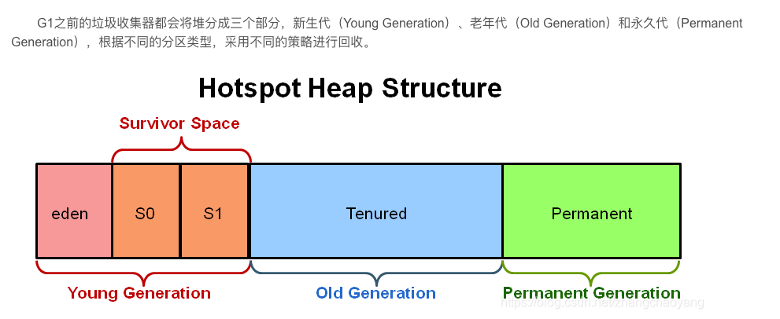

那怎么实现这个目标呢？首先要有一个思想 上的改变，在G1收集器出现之前的所有其他收集器，包括CMS在内，垃圾收集的目标范围要么是整个新生代(Minor GC)，要么就是整个老年代(Major GC)，再要么就是整个Java堆(Full GC)。而G1条出了这个牢笼，它可以面向堆内存任何部分来组成回收集(Collection Set,一般简称为CSet)进行回收，衡量标准不再是它属于哪个分代，而是哪块内存中存放的垃圾数量最多，回收收益最大，这就是G1收集器的Mixed GC模式。

G1开创的基于Region的堆内存布局是它能够实现这个目标的关键。虽然G1也仍是遵循分代收集理论设计的，但其堆内存的布局与其他收集器有非常明显的差异：G1不再坚持固定大小以及固定数量的分代区域划分，而是把连续的Java堆划分为多个大小相等的独立区域(Region)，每一个Region都可以根据需要，扮演新生代的Eden空间、Survivor空间，或者老年代空间。收集器能够对扮演不同角色的Region采用不同的策略去处理，这样无论是新创建的对象还是已经存活了一段时间、熬过多次收集的旧对象都能获取很好的收集效果。

G1堆和操作系统交互的最小管理单位称为分区（Heap Region，HR）或称堆分区。
G1的分区类型（HeapRegionType）大致可以分为四类：
- 自由分区（Free Heap Region，FHR）
- 新生代分区（Young Heap Region，YHR）
- 大对象分区（Humongous Heap Region，HHR）
- 老生代分区（Old Heap Region，OHR）

其中新生代分区又可以分为Eden和Survivor；大对象分区又可以分为：大对象头分区和大对象连续分区。

Region中还有一类特殊的Humongous区域，专门用来存储大对象。G1认为只要大小超过了一个Region容量一般的对象即可判定为大对象。每个Region的大小可以通过参数-XX:G1HeapRegionSize设定，取值范围为1MB～32MB，且应为2的N次幂。而对于那些超过了整个Region容量的超级大对象，将会被存放在N个连续的Humongous Region之中，G1的大多数行为都把Humongous Region作为老年代的一部分来进行看待。默认情况下，整个堆空间分为2048个HR（该值可以自动根据最小的堆分区大小计算得出）。

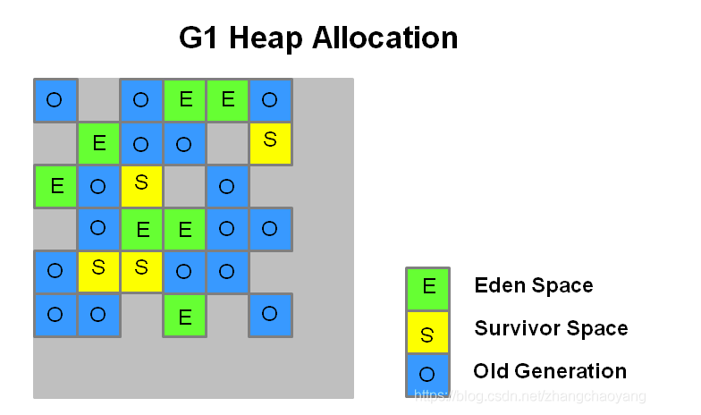

虽然G1仍然保留新生代和老年代的概念，但新生代和老年代不再是固定的了，它们都是一系列区域(不需要连续)的动态集合。G1收集器之所以能简历可预测的停顿时间模型，是因为它将Region作为单次回收的最小单元，即每次收集到的内存空间都是Region大小的整数倍，这样可以有计划地避免在整个Java堆中进行全区域的垃圾收集。更具体的处理思路是让G1收集器去跟踪各个Region里面的垃圾堆积的“价值”大小，价值即回收所获得的空间大小以及回收所需时间的经验值，然后在后台维护一个优先级列表，每次根据用户设定允许的收集停顿时间(使用参数-XX:MaxGCPauseMillis指定，默认值为200毫秒)，优先处理回收价值收益最大的那些Region，这也就是：Garbage First名字的由来。这种使用Region划分内存空间，以及具有优先级的区域回收方式，保证了G1收集器在有限的时间内获取尽可能高的收集效率。

G1将堆内存“化整为零”的“解题思路”，看起来似乎没什么太多令人惊讶之处，但其中的实现细节可以远远没有想象中那么简单，否则不会拖到很晚才正式使用。

G1收集器至少还有以下这些关键的细节问题需要解决：
- 1.将Java堆分成多个独立Region后，Region里面存在的跨Region引用对象如何解决？解决的思路我们已经知道：使用记忆集避免全堆作为GC Roots扫描，但在G1收集器上记忆集的应用要复杂很多，它的每个Region都维护了自己的记忆集，这些记忆集会记录下别的Region指向自己的指针，并标记这些指针分别在哪些卡页的范围内。G1的记忆集在存储结构的本质上是一种哈希表，Key是别的Region的起始地址，Value是一个集合，里面存储的元素是卡表的索引号。这种“双向”的卡表结构(卡表是“我指向谁”，这种结构还记录了“谁指向我”)比原来的卡表实现起来更复杂，同时由于Region数量比传统收集器的分代数量明显要多得多，因此G1收集器要比其他的传统垃圾收集器有着更高的内存占用负担。根据经验，G1至少要耗费大约相当于Java堆容量10%至20%的额外内存来维持收集器工作。
- 2.在并发标记阶段如何保证收集线程与用户线程互不干扰地运行？这里首先要解决的是用户线程改变对象引用关系时，必须保证其不能打破原本的对象图结构，导致标记结果出现错误：CMS收集器采用增量更新算法实现，而G1是通过原始快照算法来实现的。此外，垃圾收集堆用户线程的影响还体现在回收过程中新创建对象的内存分配上，程序要继续运行就肯定会持续有新对象被创建，G1为每一个Region设计了两个名为TAMS(Top at Mark Start)指针，把Region中的一部分空间划分出来用于并发回收过程中的新对象分配，并发回收时新分配的对象地址都必须要在这两个指针位置以上。G1收集器默认在这个地址以上的对象是被隐式标记过的，即默认它们时存活的，不纳入回收范围。与CMS中的“Concurrent Mode Failure“失败会导致Full GC类似，如果内存回收的速度赶不上内存分配的速度，G1收集器也要被迫冻结用户线程执行，导致Full GC而产生长时间STW。
- 3.怎么建立可靠的停顿预测模型？用户通过-XX:MaxGCPauseMillis参数指定的停顿时间只意味着垃圾收集发生之前的期望值，但G1收集器要怎么做才能满足用户的期望呢？G1收集器的停顿预测模型是以衰减均值(Decaying Average)为理论基础来实现的，在垃圾收集过程中，G1收集器会记录每个Region的回收耗时、每个Region记忆集里的脏卡数量等各个可测量的步骤花费的成本，并分析得出平均值、标准偏差、置信度等统计信息。这里强调的“衰减平均值”是指它会比普通的平均值更容易受到新数据的影响，平均值代表整体的平均状态，但衰减平均值更准确地代表“最近的”平均状态。换句话说，Region的统计状态越新越能决定其回收的价值。然后通过这些信息预测现在开始回收的话，由哪些Region组成回收集才可以在不超过期望停顿时间的约束下获得最高的收益。

如果我们不去计算用户线程运行过程中的动作(如使用写屏障维护记忆集的操作)，G1收集器的运作过程大致分为以下四个步骤：
- 初始标记(Initial Marking)：仅仅只是标记一下GC Roots能直接关联到的对象，并且修改TAMS指针的值，让下一阶段用户线程并发运行时，能正确地在可用的Region中分配新对象。这个阶段需要停顿线程，但耗时很短，而且是借用进行Minor GC的时候同步完成的，所以G1收集器在这个阶段实际并没有额外的停顿。
- 并发标记(Concurrent Marking)：从GC Roots开始对堆中的对象进行可达性分析，递归扫描珍哥哥对立的对象图，找出要回收的对象，这阶段耗时较长，但可与用户程序并发执行。当对象图扫描完成以后，还要重新处理SATB记录下的在并发时有引用变动的对象。
- 最终标记(Final Marking)：对用户线程做另一个短暂的暂停，用于处理并发阶段结束后仍遗留下来的最好少量的SATB记录。
- 筛选回收(Live Data Counting and Evacuation)：负责更新Region的统计数据，对各个Region的回收价值和成本进行排序，根据用户所期望的停顿时间来制定回收计划，可以自由选择任意多个Region构成回收集，然后把决定回收的那一部分Region的存活对象复制到空的Region中，再清理掉整个旧Region的全部空间。这里的操作涉及存活对象的移动，是必须暂停用户线程，由多条收集器线程并行完成的。

从上述阶段的描述可以看出，G1收集器除了并发标记外，其余阶段也是要完全暂停用户线程的，换言之，它并非存粹地追求低延迟，官方给它的设定的目标是在延迟可控的情况下获得尽可能高的吞吐量，所以才能担当起“全功能收集器”的重任与期望。

从Oracle官方透露出来的信息可获知，回收阶段(Evacuation)其实本也有想过设计成与用户程序一起并发执行，但这个事情很复杂，考虑到G1只是回收一部分Region，停顿时间是用户可控制的，所以并不迫切去实现，而选择把这个特性放到了G1之后出现的低延迟垃圾收集器中。另外，还考虑到G1不是仅仅面向低延迟，停顿用户线程能够最大幅度提高垃圾收集效率，为了保证吞吐量所以才选择了完全暂停用户线程的方案。

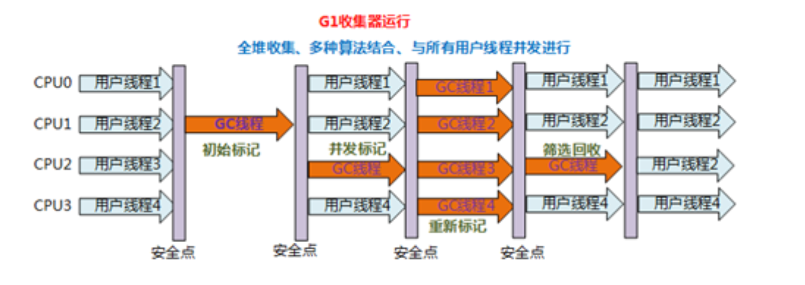

毫无疑问，可以由用户指定期望的停顿时间是G1收集器很强大的一个功能，设置不同的期望停顿时间，可使得G1在不同应用场景中取得关注吞吐量和关注延迟之间的最佳平衡。不过，这里设置的“期望值”必须是符合实际的，不能异想天开，毕竟G1是要冻结用户线程来复制对象的，这个停顿时间再怎么低也得有个限度。它默认的停顿目标位两百毫秒，一般来说，回收阶段占到几十到一百甚至接近两百毫秒都很正常，但如果我们把停顿时间调的很低，很可能出现的结果就是由于停顿时间太短，导致每次选出来的回收集只占堆内存的很小一部分，收集器收集的速度跟不上分配器分配的素的，导致垃圾堆积，最终引发Full GC反而降低性能，所以通常把期望停顿时间设置为一两百毫秒。

从G1开始，最先进的垃圾收集器的设置导向都不约而同地变为追求能够应付应用的内存分配速度(Allocation Rate)，而不追求一次把整个Java堆全部清理干净。这样，应用在分配，同时收集器在收集，只要收集的速度跟得上对象分配的速度，那一切就能运作的很完美。这种新的收集器设计思路从工程实现上看是从G1开始兴起的，所以说G1是收集器技术发展的一个里程碑。

G1收集器常会被拿来与CMS收集器互相比较，毕竟他们都是非常关注停顿时间的控制，官方资料将它们并成为“The Mostly Concurrent Collectors“。在未来，G1收集器最终要取代CMS。

相比于CMS，G1优点很多，暂且不论可以指定最大停顿时间、分Region的内存布局、按收益动态缺点回收集这些创新性设计带来的红利，单从最传统的算法理论上看，G1也更具有发展潜力。与CMS”标记 - 清理“算法不同，G1从整体来看是基于”标记 - 整理“算法实现的收集器，但从局部(两个Region之间)又是基于“标记 - 复制”算法实现的，无论如何，，G1运作期间都不会产生内存空间碎片，垃圾收集完成之后能提供规整的可用内存。这种特性有利于程序长时间运行，在程序为大对象分配内存时不容易因无法找到联系内存空间而提前触发下一次收集。

不过，G1相对于CMS仍然不是全方位优势，比起CMS，G1的弱项如在用户线程运行过程中，G1无论是为了垃圾收集产生的内存占用(双向卡表)还是程序运行时的额外执行负载(Region效率计算)都比CMS要高。

就内存占用来说，虽然G1和CMS都使用卡表来处理跨代指针，但G1的卡表实现更为复杂，而且堆中每个Region，无论扮演的是新生代还是老年代角色，都必须有一份卡表，这导致G1的记忆集可能会占整个堆容量的20%乃至更多的内存空间；相比起来CMS的卡表就相当简单，只有唯一一份，而且只需要处理老年代到新生代的引用，反过来不需要，由于新生代的对象具有朝生夕灭的不稳定性，引用变化频繁，能省下这个区域的维护开销是很划算的。

在执行负载的角度上，同样由于两个收集器各自的细节实现特点导致了用户程序运行时的负载会有不同，比如它们都使用到写屏障，CMS用写后屏障来更新维护卡表；而G1除了使用写后屏障来进行同样的(由于G1的卡表结构复杂，其实是更繁琐的)卡表维护操作外，为了实现原始快照搜索(SATB)算法，还需要使用写前屏障来跟踪并发时的指针变化情况。相比起增量更新算法，原始快照能够减少并发标记和重新标记阶段的消耗，避免CMS那样在最终标记阶段停顿时间过长的缺点，但是在用户程序运行过程中确实会产生由于跟踪引用变化带来的额外负担。由于G1对写屏障的复杂操作要比CMS消耗更多的运算资源，所以CMS的写屏障实现是直接的同步操作，而G1就不得不将其实现为类似于消息队列的结构，把写前屏障和写后屏障中要做的事情都放到队列里面，然后再异步处理。

## 2.6 低延迟垃圾收集器

HotSpot虚拟机的垃圾收集器从Serial发展到CMS再到G1，经历了快20年，已经相当成熟了，但离完美还差一点。
怎么样的收集器才算完美呢？

衡量收集器的三项最重要的指标是：内存占用(Footprint)、吞吐量(Throughput)和延迟(Latency)，三者共同构成了一个“不可能三角”。三者总体的表现会随着技术进步越来越好，但是要在这三方面具有卓越表现的“完美”收集器难之又难。

在内存只能用、吞吐量和延迟这三项指标中，延迟的重要性日均凸显。其原因是随着计算机硬件的发展、性能的提升，我们越来越能容忍收集器多占用一点内存；硬件性能增长，对软件系统的处理能力是有直接收益的，硬件的规格和性能越好，也有助于降低收集器运行时对应用程序的影响，换句话说，吞吐量越高。但对延迟则不是很符合直观思维的：虚拟机要回收完整的1TB的堆内存，毫无疑问是要比回收1GB的堆内存耗费更多时间的。由此，我们就不难理解为何延迟会成为垃圾收集器最被重视的性能指标了。

目前接触过的垃圾收集器的停顿状况对比。
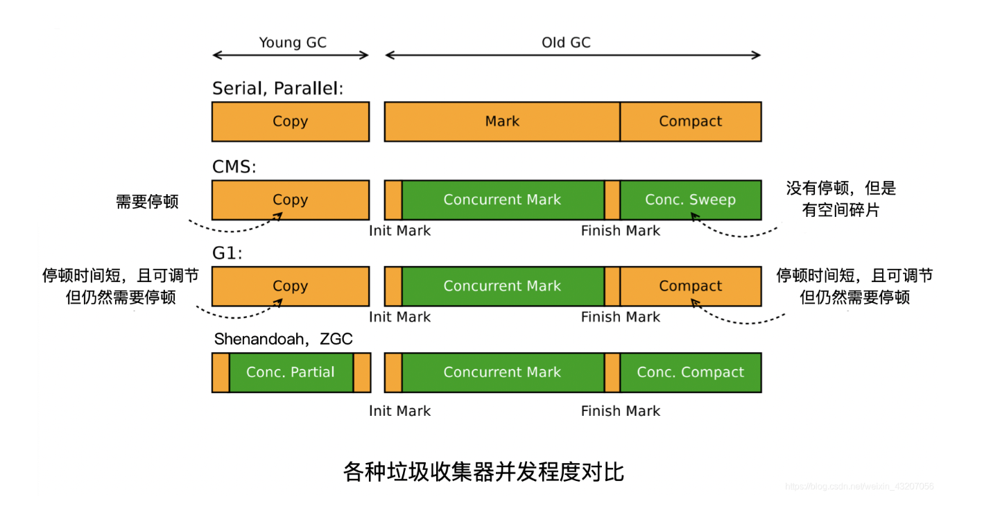

如图，浅色阶段标识必须挂起用户，深色表示收集器线程与用户线程并发工作。图中，在CMS和G1之前的全部收集器，其工作的所有步骤都会产生“Stop The World”式的停顿；CMS和G1分别使用增量更新和原始快照计数，实现了标记阶段的并发，不会因为管理的堆内存变大，要标记的对象变多而导致停顿时间变长。但是对于标记阶段之后的处理，仍未得到妥善解决。CMS使用标记 - 清除算法，虽然避免了整理阶段收集器带来的停顿，但是清除算法无论如何优化改进，在设计原理上都避免不了空间碎片的产生，随着空间碎片的不断淤积最终依然逃不过STW。G1虽然可以按更小的粒度进行回收，从而抑制整理阶段出现时间过长的停顿，但毕竟也是要暂停的。

最后两款收集器Shenandoah和ZGC，几乎整个过程都是并发的，只有初始标记、最终标记这些阶段有短暂的停顿，这部分停顿的时间基本上是固定的，与堆的容量、堆中对象的数量没有正比关系。实际上，它们都可以在任意可管理的堆容量下，实现垃圾收集的停顿都不超过十毫秒的目标。这两种仍处于实验阶段，被命名为“低延迟垃圾收集器”(Low-Latency Garbage Collector)。

### 2.6.1 Shenandoah收集器

在本书众多垃圾收集器中，Shenandoah是最孤独的一个。Shenandoah作为第一款不由Oracle出品的收集器，不可避免地受到一些官方的排挤。OracleJDK12中明确拒绝支持Shenandoah收集器，并执意在打包OracleJDK时通过条件编译完全排除掉了Shenandoah的代码。换句话说，Shenandoah是只有OpenJDK才会包含，而OracleJDK不存在的收集器。

最初Shenandoah是由RedHat公司独立发展的新型收集器项目，在14年RedHat把Shenandoah贡献给了OpenJDK，并推动它成为OpenJDK12的正式特性之一，也就是JEP 198.这个项目的目标是实现一种能在任何堆内存大小下都可以把垃圾收集的停顿时间限制在十毫秒以内的收集器，这意味着相比CMS和G1，Shenandoah不仅要进行并发的垃圾标记，还要并发地进行对象的清理后的整理工作。

从代码历史渊源上讲，Shenandoah更像G1下一代继承者，它们有相似的堆内存布局，在初始标记、并发标记等许多鹅几段的处理思路高度一致，甚至还直接共享了一部分代码，这使得部分堆G1的打磨改进和Bug修改会同时反映在Shenandoah之上，而由于Shenandoah加入多带来的一些新特性，也有部分会出现在G1收集器中，譬如在并发失败后的“逃生门”的Full GC，G1就是由于合并了Shenandoah代码才获得多线程Full GC的支持。

那Shenandoah相对于G1有哪些改进呢？虽然Shenandoah也是使用基于Region堆内存布局，同样有着用于存放大对象的Humongous Region，默认的回收策略也同样是优先处理回收价值最大的Region......但在管理堆内存方面，它与G1至少有三个明显的不同：
- 最重要的是支持并发的整理算法，G1的回收阶段是可以多线程并行的，但却不能与用户线程并发，这点作为Shenandoah最核心的功能稍后会着重讲解。
- 其次，Shenandoah是默认不使用分代收集的，换言之，不会有专门的新生代Region或者老年代Region的存在，没有实现分代，并不是说分代对Shenandoah没有价值，这更多是出于性价比的衡量，基于工作量上的考虑而将其放到优先级较低的位置上。
- 最后，Shenandoah摒弃了G1中耗费大量内存和计算资源去维护的记忆集，改用了名为“连接矩阵”(Connection Matrix)的全局数据结构来记录跨Region的引用关系，降低了处理跨代指针时的记忆集维护消耗，也降低了伪共享问题的发生概率。连接矩阵可以理解为一张二位表格，如果Region N有对象指向Region M，就在表格的N行M列打上一个标记。在回收时通过这张表就可以得出哪些Region之间产生了跨Region的引用。

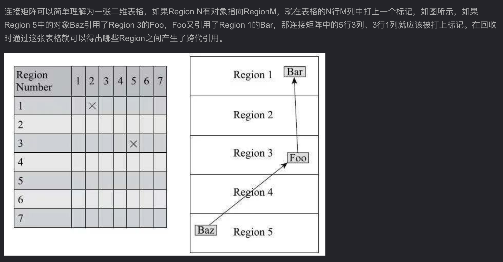

Shenandoah收集器的工作过程大致分为以下九个阶段：
- 🌟初始标记(Initial Marking)：与G1一样，首先标记与GC Roots直接关联的对象，这个阶段仍是STW的，但停顿时间与堆大小无关，只与GC Roots的数量有关。
- 🌟并发标记(Concurrent Marking)：与G1一样，遍历对象图，标记出全部可达的对象，这个阶段是与用户线程并发的，时间长短取决于堆中存活对象的数量以及对象图的结构复杂程度。
- 🌟最终标记(Final Marking)：与G1一样，处理剩余的SATB扫描，并在这个阶段统计出回收价值最高的Region，将这些Region构成一组回收集(Collection Set)。最终标记阶段也会有一小段短暂的停顿。

