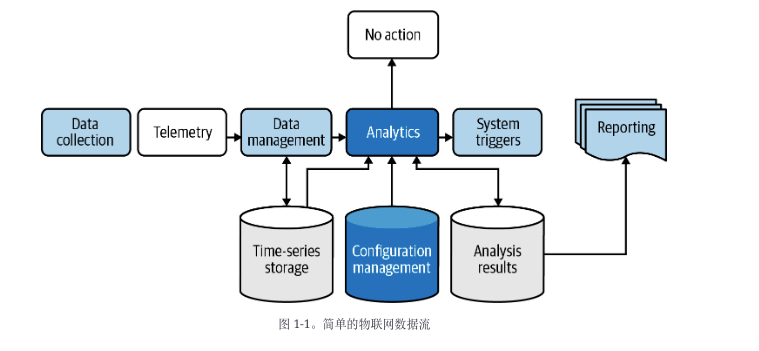
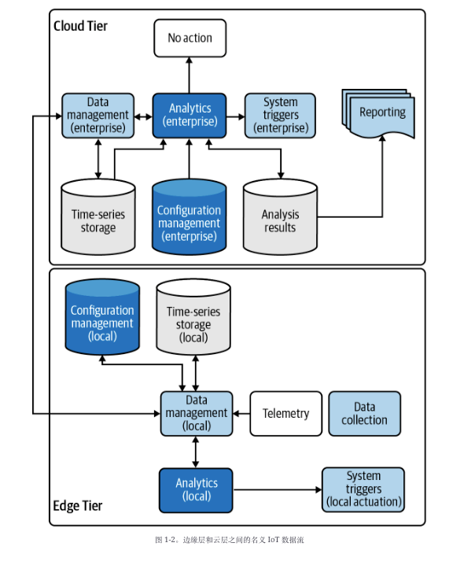

# Chapter One: Intro
您可能已经通过  现在物联网可能是巨大的、笨重的，而且很难驯服。为了规划前进的道路，我们首先要确定要解决的问题领域，然后创建一个架构来设计和构建我们的物联网解决方案。

### 你将在本章中学到什么
为了帮助您真正了解如何构建物联网系统并且应该如何构建，我将根据前面的问题深入研究一些基本的架构概念，并将其作为每个编程活动的基础。从那里，您将构建一个逐层解决问题的解决方案，并在您完成后续每一章时添加更多功能。

当然，不言而喻，正确的开发工具可能会节省您的时间和挫败感，更不用说帮助您进行测试、验证和部署了。有许多优秀的开源和商业开发工具和框架可以为您提供支持。

如果您作为开发人员已经有一段时间了，我希望您有自己的特定开发环境偏好，最适合您的编程风格和方法。我当然有我的，虽然我提供的示例将基于我喜欢的工具集，但我在本章中的目标不是指定您必须使用的工具，而是帮助您以一种使您能够移动的方式加速物联网开发快速退出并最终为未来的开发项目选择自己的工具。

我提出的概念将是最重要的；可以更改编程语言、工具（及其各自的版本）和方法。这些概念代表了一致软件开发的一些基础：系统设计、编码和测试。

### 定义你的系统
制造问题陈述可能是这个难题中最重要的部分。让我们首先起草一些相当简单但足以涵盖各种有趣的物联网挑战的东西：

我想了解我家的环境，它如何随时间变化，并进行调整以提高舒适度，同时节省开支。

看起来很简单，但这是一个非常广泛的目标。我们可以通过在问题陈述中定义关键动作和对象来缩小范围。我们的目标是隔离什么、为什么和如何。让我们首先看看是什么和为什么，然后确定设计应该考虑作为这个过程的一部分的任何行动。

#### 解决问题
本书中的练习将侧重于构建一个物联网解决方案，以帮助您了解您的家庭环境并做出适当的响应。假设是你想知道你房子里发生了什么（在合理的范围内），并在必要时采取某种行动（例如，如果温度太高，打开空调）。

这部分您的设计方法考虑了三个关键活动：

- 措施：收集数据
让我们根据可以感知的内容来定义它，例如温度、湿度等。这以遥测（测量数据）的捕获和传输为中心。动作——或者更确切地说，动作类别——将被命名为数据集合，并将包括以下数据项（您可以稍后添加更多）：
    - 温度
    - 相对湿度
    - 气压
    - 系统性能（CPU、内存、存储的利用率指标）
- 模型：根据给定基线确定相关变化
    决定哪些数据是相关的无论值的变化是否重要，我们不仅需要收集数据，还需要存储和趋势关于我们可以感知的项目的时间序列数据（如温度、湿度等，如前面的定义所示）。  这通常称为数据→信息转换。我将这个类别称为数据管理。
- 管理：采取行动
  我们将建立一些基本规则来确定我们是否越过了任何重要的阈值，这只是意味着如果超过需要某种类型的操作（例如，调高或调低恒温器）的阈值，我们将向某物发送信号。这通常称为信息→知识转换。我将这个类别称为系统触发器。
#### 定义相关结果
现在我们知道我们需要采取哪些步骤，让我们探索问题陈述的原因部分。我们可以用以下两点来总结这一点：

- 增加舒适度：理想情况下，我们希望在生活环境中保持一致的温度和湿度。当我们考虑房间的数量、它们的使用方式等等时，事情会变得有点复杂。我将此操作类别称为配置管理，它与数据管理和系统触发器密切相关。

- 省钱：这有点棘手。最明显的省钱方法就是不花钱！由于我们可能需要分配财政资源来加热、冷却或加湿给定区域，我们希望优化——不要太多（浪费），也不要太少（我们最终可能会在冬天用水管结冰） . 由于我们在这里可能需要处理一些复杂性——包括公用事业成本、季节性变化等，以及与配置管理相关的任何事情——我们可能需要一些更高级的分析来处理这些问题。我将此称为动作类别分析。

您可能已经注意到，what和why部分中的每个步骤都有一个操作类别名称，一旦我们进入how ，这将有助于解决方案设计。提醒一下，这些类别是数据收集、数据管理、系统触发器、配置管理和分析。作为我们实施方法的一部分，我们将进一步深入研究其中的每一个。

尽管问题陈述表面上看起来相当平庸，但事实证明，解决问题所需要做的事情实际上在许多物联网系统中很常见。有必要从源头收集数据，存储和分析数据，并在某些指标表明这样做有益时采取行动。一旦你定义了你的物联网架构并开始构建实现它的组件——即使它特定于这个问题——你就会看到它如何应用于许多其他问题领域。

让我们快速看一下代表这个决策过程的简单数据流；在图 1-1描绘的数据流图中，每个动作类别都被突出显示。

Data Collection数据收集
Telemetry遥感
Data management数据管理
Analytics分析
Time-seriers storage时序存储
Configuration management配置管理
Analysis results分析结果
System triggers系统触发机制
Reporting报告
大多数物联网系统至少需要我提到的五个动作类别中的一些。这意味着我们可以定义一个架构，将这些映射到系统图中，然后开始创建实现部分系统的软件组件。

这就是我们工程师的乐趣开始的地方，所以让我们开始使用可以支持我们的问题陈述的架构定义（实际上可以为其他人重用）。

#### 构建解决方案
组织、结构和清晰度是标志一个好的架构，但太多会导致僵化的系统无法很好地扩展以满足未来的需求。如果我们试图建立一个能够满足我们所有合理需求的架构，我们将永远不会完成（或者甚至可能永远不会开始）！这是关于平衡的，所以让我们在定义架构时考虑到未来的灵活性，但也让我们保持相对良好的界限。这将使您能够专注于快速找到解决方案，同时仍然允许将来进行更新。但首先，需要定义一些关键术语，以帮助建立基线架构构造来构建您的解决方案。


您可能还记得前言中的图 P-1，物联网系统通常在设计时考虑到至少两个（有时是三个或更多）架构层。这允许在物理上和逻辑上分离功能，从而允许灵活的部署方案。<b>这就是说，从技术上讲，在云层中运行的云服务可以在世界任何地方，而在边缘层中运行的设备必须与要测量的物理系统位于同一位置。</b>正如图 P-1所暗示的，这种分层的一个示例可能包括带有传感器或执行器的受限设备与网关设备通信，而网关设备又与基于云的服务通信，反之亦然。

因为我们需要一个地方来实现这五类功能，所以确定它们在架构中的位置很重要，这样我们就可以让一些东西在靠近操作的地方运行，而另一些在你和我可以访问的云中运行（甚至调整）功能很容易。回顾前言中的边缘层和云层架构，让我们看看如何将每个动作类别从“内容”和“原因”映射到每个层：

- 边缘层（CDA和GDA）：数据收集、数据管理、设备触发器、配置管理和分析
- Cloud Tier云服务：数据管理、配置管理和分析
  
为什么边缘层和云层包含类似的功能？这部分是出于必要，但也因为，好吧，我们可以。随着计算能力的提高以及业务需求要求“尽可能接近边缘”的计算和分析能力，边缘和云之间的技术边界和职责分离变得越来越模糊。例如，一些自主决策可能不需要消息通过互联网到达云端再返回，因为边缘层可以直接管理它们（在某些情况下应该）。因此，无论何时何地合理，都必须考虑这种能力。

图 1-2显示了图 1-1中的简单数据流如何适应分层架构。



同样，请注意我们有一些共同的责任，其中一些行动类别在两个层级中实现。通常，重复工作是一件坏事——但在这种情况下，它可能是一个优势！分析可用于根据一些基本设置确定是否应将触发器发送到设备 - 例如，如果您家中的温度超过 30ºC，您可能希望立即触发 HVAC 并开始将设备冷却至，比如说，22ºC。无需依赖 Cloud Tier 中的远程基于云的服务来执行此操作，尽管通知 Cloud Tier 正在发生这种情况并可能存储一些历史数据以供以后分析会很有用。

我们的架构开始成形。现在我们只需要一种将其映射到系统图的方法，这样我们就可以与物理世界进行交互（使用传感器和执行器）。最好在边缘层内构建事物以避免不必要地将组件暴露给互联网。该功能可以作为应用程序来实现，该应用程序可以直接在设备上运行，也可以在笔记本电脑或其他通用计算系统上运行，并具有可以模拟传感器和执行器行为的模拟逻辑。这将作为您将在本章开始开发的两个应用程序之一的基础。

由于您最终会想要访问互联网，因此您的设计应该包括一个网关来处理这种需求和其他需求。此功能可以作为您将在本章中开始开发的第二个应用程序的一部分来实现。此应用程序将设计为在网关设备上运行（或者，同样，在膝上型电脑或其他通用计算系统上）。您的网关设备应用程序和受限设备应用程序将构成 IoT 设计的“边缘”，我将其称为未来架构的边缘层。

您还需要以一种安全但可从网关设备和人类访问的方式部署分析服务、存储功能和事件管理器。有很多方法可以做到这一点，尽管我将专注于使用一个或多个云服务来实现大部分功能。

图 1-3提供了一个新视图，可以进一步了解您将要构建的内容以及如何开始合并我提到的五个操作类别。它以灰色框表示云层内的云服务和边缘层内的两个应用程序，它们将分别包含受限设备和网关设备的功能。


让我们更深入地研究一下：

- CDA受限设备应用程序
  您将构建此软件应用程序以作为模拟的一部分运行 开发环境中的受限设备，它将提供数据收集和系统触发功能。它将处理设备传感器（从环境中读取数据）和执行器（触发动作，例如打开或关闭 HVAC）之间的接口。当需要启动时，它还将在采取行动方面发挥作用。最终，它将连接到通信库以向网关设备应用程序发送消息并从其接收消息。
- GDA网关设备应用程序
  您将构建此软件应用程序以作为模拟的一部分运行开发环境中的网关设备，它将提供数据管理、分析和配置管理功能。它的主要作用是管理数据以及 CDA 和云层中存在的云服务之间的连接。它会酌情在本地管理数据，有时会通过向受限设备发送触发驱动的命令来采取行动。它还将管理一些配置设置——即那些代表您环境的标称范围的设置——并在收到新的遥测数据时执行一些初始分析。
- 云服务
  所有云服务应用程序和功能通常都会完成大量繁重的数据处理和存储工作，因为它们理论上可以无限扩展。这只是意味着，如果设计得当，您可以添加任意数量的设备，存储尽可能多的数据想要并深入分析该数据（趋势、高点、低点、配置值等），同时将任何相关见解传递给人类最终用户，甚至可能根据任何定义的阈值生成边缘层操作过境点。从技术上讲，物联网环境中的云服务可以处理前面提到的所有动作类别，但数据收集除外（这意味着它们不直接执行传感或驱动动作）。您将构建一些云服务来处理此功能，但主要会利用一些云服务提供商已经提供的通用服务。

将它们放在一个详细的逻辑架构中，图 1-4显示了我们两个架构层中的每个主要逻辑组件如何与其他组件交互。


我们将使用图1-3和1-4作为本书中所有练习的基线架构。

现在我们已经掌握了我们面临的问题，让我们设置我们的开发环境，这样我们就可以开始编写代码了。

### 设置您的开发和测试环境

跨不同的操作系统、硬件配置和配置系统构建和部署代码绝非易事。  对于典型的物联网项目，我们不仅要处理不同的硬件组件，还要处理跨这些平台开发和部署的多种方式，更不用说各种云服务的各种持续集成/持续部署 (CI/CD) 特性了我们经常工作的提供者环境。

面对所有这些挑战，我们如何开始？首先，我们要解决什么问题？作为开发人员，您希望在代码中实现您的物联网设计，对其进行测试，将其打包成可以轻松分发到一个或多个系统的东西，然后安全地部署它。我们可以从构建、测试和部署阶段来考虑我们的开发挑战，这些阶段也映射到两个架构层：边缘层（遥测生成和执行）和云层（远程计算基础设施）。我将在第四部分稍后介绍云层中的功能，而第一、二和三部分将重点关注边缘层。

尽管典型物联网生态系统的边缘层可能有专门的硬件来处理，但出于我们的目的，您可以模拟大部分所需的系统行为，甚至可以在本地开发环境中模拟一些硬件组件。这将使部署变得更加容易，并且非常适合本书中所有必需的练习。

有很多方法可以启动和运行物联网开发。本书中的练习侧重于构建集成的模拟部署方法，如下所述。硬件集成是完全可选的，超出了本书的范围，但将在 第 4 章中作为可选练习非常简要地引用。

- 集成模拟部署
这种方法不需要任何专用设备，并且允许您将开发工作站（笔记本电脑）用作网关设备和受限设备。这意味着您将在本地计算环境中运行 GDA 和 CDA。您将通过构建基本软件模拟器来模拟您的传感和驱动硬件，以在您的 CDA 中捕获此功能。除了在线发布的可选的第 4 章练习之外，本书的所有必需练习都应该可以使用这种部署方法来实现。
- 分离的物理部署
这需要一个硬件设备，例如 Raspberry Pi，它使您能够连接到真实的传感器和执行器并与之交互。尽管许多现成的单板计算 (SBC) 设备可以用作成熟的计算工作站，我将其称为您的受限设备，它将直接在设备上运行您的 CDA。与集成模拟部署方法一样，您将在本地计算环境中运行 GDA。
- 混合物理部署
此方法与分离部署方法几乎相同，但将在 SBC 设备上同时运行您的 CDA 和 GDA。这在技术上意味着您可以选择将每个应用程序部署到不同的 SBC，尽管对于列出的任何练习都不是必需的。

虽然本书中的练习侧重于集成模拟部署方法，但如果您选择最后两种部署路径中的任何一种，则有很多便宜的 SBC 可能适合您。本书中唯一需要硬件的练习是第 4 章中的可选练习，虽然您可以在其他硬件平台上实现这些练习，但它们的设计考虑了以下硬件：Raspberry Pi Model 3 或 4 和 Sense HAT 板（连接到其通用输入/输出 [GPIO] 并使用内部集成电路 [I2C] 总线进行设备通信）。如果您为这些练习选择不同的设备，您可能需要考虑包含以下功能的设备：GPIO 功能、通过 WiFi 或以太网的 I2C、TCP/IP 和 UDP/IP 网络、支持基于 Linux 的操作系统（例如Debian 或衍生产品），以及支持Python 3 和 Java 11（或更高版本）。

书中的练习将侧重于集成模拟部署路径。第二部分介绍了与物理世界集成的概念，我将在第 4 章讨论一些硬件集成概念，同时继续关注模拟数据和模拟硬件。

无论选择何种部署路径，所有练习和示例都假定您将在单个工作站上进行开发和部署。这涉及一个三步过程，包括准备开发环境、定义测试策略以及确定构建和部署自动化方法。我将介绍这些步骤的基础知识以帮助您在本章中开始，但也会在您深入研究具有额外依赖关系以及测试和自动化需求的后续练习时添加每个步骤。

#### 第一步：配置开发环境
略
#### 第二步：定义测试策略
现在你的为您的 GDA 和 CDA 建立了开发环境，我们可以讨论您将如何测试您将要开发的代码。显然，良好的测试是任何工程工作中至关重要的部分，编程也不例外。您构建的每个应用程序都应该经过彻底测试，无论它是完全独立于其他应用程序工作还是与其他系统紧密集成。此外，您编写的每个代码单元都应进行测试，以确保其行为符合预期。究竟什么是单​​位？出于我们的目的，一个单元总是将被表示为您要测试的函数或方法。

<hr>
tips:函数和方法有什么区别？简单地说，函数是一组命名的代码，它执行一项任务（例如将两个数字相加）并返回一个结果。如果函数接受任何输入，它将作为一个或多个参数传递。方法几乎与函数相同，但附加到对象上。在面向对象的说法中，对象只是一个被实例化的类，而一个类是组件的正式定义——它的方法、参数、构造和解构逻辑。本书中的所有 Java 示例都将以类的形式表示，其中方法定义为每个类的一部分。Python 可以写成带有函数的脚本形式，也可以写成带有方法的类，但我更喜欢写带有方法的 Python 类，本书中的每个 Python 示例都会这样做，只有少数例外.
<hr>

##### 单元、集成和性能测试
有很多方法可以测试软件应用程序和系统，并且有一些关于该主题的优秀书籍、文章和博客。开发一个有效的物联网解决方案需要仔细注意测试——在应用程序内以及不同应用程序和系统之间。出于您将开发的解决方案的目的，我将只关注三个：单元测试、集成测试和性能测试。

单元测试是代码为测试可访问的最小代码单元而编写的模块，例如函数或方法。编写这些测试是为了验证给定函数或方法的一组输入是否返回预期结果。边界条件也经常被测试，以确保函数或方法可以适当地处理这些类型的条件。

<hr>
tips:一个代码单元在技术上可以是单行、多行代码，甚至是整个代码库。就我们的目的而言，一个单元是指可以通过本地系统上可用的单个接口访问的一行或多行代码或整个代码库，即封装单元功能的函数或方法并且可以从您的测试应用程序中调用。例如，此功能可以是排序算法、计算，甚至是一个或多个附加功能或方法的入口点。
<hr>

集成测试对于物联网来说非常重要，因为它们可用于验证系统和应用程序之间的连接和交互是否按预期工作。假设您想使用嵌入在测试类中的基本数据集来测试排序算法——您通常会编写一个或多个单元测试，执行每个测试，并验证一切正常。

但是，如果排序算法需要从可通过本地网络甚至互联网访问的数据存储库中提取数据怎么办？那么，你可能会问？好吧，现在您有了另一个依赖项来运行您的排序测试。在执行排序单元测试之前，您需要一个集成测试来验证数据存储库连接是否可用且正常工作。

这些类型的依赖关系可以使集成测试在任何环境中都具有挑战性，对于物联网来说更是如此，因为有时需要设置服务器来运行专门的协议来测试我们的东西。因此，为了使您的测试环境尽可能简单，所有集成测试都将手动执行和验证。

最后是性能测试对于测试系统处理各种条件的速度或效率非常有用。例如，当需要测量响应时间或支持的并发或同时连接的数量时，它们可以与单元测试和集成测试一起使用。

假设有许多不同的系统需要从数据存储库中检索数据列表，并且每个系统都希望在应用程序将数据列表返回给它们之前对其进行排序。暂时忽略系统设计和数据库架构优化，可以使用一系列性能测试来计时每个系统请求的响应能力（从初始请求到响应），以及可以访问您的应用程序的并发系统数量在它不再充分响应之前。

性能测试的另一个方面是测试您的应用程序的系统负载正在运行，这对于物联网应用程序非常有用。物联网设备通常在某些方面受到限制——内存、CPU、存储等——而云服务可以根据我们的需要进行扩展。因此，我们的第一个 IoT 应用程序（将在第 2 章中介绍）理所当然地将为单独监控每个设备的性能奠定基础。

由于性能测试通常与集成和单元测试齐头并进，我们将继续使用Maven 和专门的单元测试，以及需要的开源工具。

#### 第三步：管理您的设计和开发工作流程


第 1 章入门
物联网基础知识和开发环境设置

前方有路，

荆棘和荆棘，然后它就会清除。

差不多好了。耐心。

基本概念：确定要解决的问题领域并将架构定义为物联网解决方案的基线；建立一个以物联网为中心的开发环境，支持多种部署选项。

您可能已经通过  现在物联网可能是巨大的、笨重的，而且很难驯服。为了规划前进的道路，我们首先要确定要解决的问题领域，然后创建一个架构来设计和构建我们的物联网解决方案。

让我们从建立基线的几个关键问题开始：您要解决什么问题？它从哪里开始和结束？为什么需要物联网生态系统？所有的部分将如何协同工作来解决这个问题？如果一切都按设计进行，您可以期待什么结果？我们将详细探讨每个问题，并在此过程中构建满足我们需求的端到端、集成的 IoT 解决方案。

你将在本章中学到什么
为了帮助您真正了解如何构建物联网系统并且应该如何构建，我将根据前面的问题深入研究一些基本的架构概念，并将其作为每个编程活动的基础。从那里，您将构建一个逐层解决问题的解决方案，并在您完成后续每一章时添加更多功能。

当然，不言而喻，正确的开发工具可能会节省您的时间和挫败感，更不用说帮助您进行测试、验证和部署了。有许多优秀的开源和商业开发工具和框架可以为您提供支持。

如果您作为开发人员已经有一段时间了，我希望您有自己的特定开发环境偏好，最适合您的编程风格和方法。我当然有我的，虽然我提供的示例将基于我喜欢的工具集，但我在本章中的目标不是指定您必须使用的工具，而是帮助您以一种使您能够移动的方式加速物联网开发快速退出并最终为未来的开发项目选择自己的工具。

我提出的概念将是最重要的；可以更改编程语言、工具（及其各自的版本）和方法。这些概念代表了一致软件开发的一些基础：系统设计、编码和测试。

定义你的系统
制造问题陈述可能是这个难题中最重要的部分。让我们首先起草一些相当简单但足以涵盖各种有趣的物联网挑战的东西：

我想了解我家的环境，它如何随时间变化，并进行调整以提高舒适度，同时节省开支。

看起来很简单，但这是一个非常广泛的目标。我们可以通过在问题陈述中定义关键动作和对象来缩小范围。我们的目标是隔离什么、为什么和如何。让我们首先看看是什么和为什么，然后确定设计应该考虑作为这个过程的一部分的任何行动。

解决问题
本书中的练习将侧重于构建一个物联网解决方案，以帮助您了解您的家庭环境并做出适当的响应。假设是你想知道你房子里发生了什么（在合理的范围内），并在必要时采取某种行动（例如，如果温度太高，打开空调）。

这部分您的设计方法考虑了三个关键活动：

措施：收集数据
让我们根据可以感知的内容来定义它，例如温度、湿度等。这以遥测（测量数据）的捕获和传输为中心。动作——或者更确切地说，动作类别——将被命名为数据集合，并将包括以下数据项（您可以稍后添加更多）：

温度

相对湿度

气压

系统性能（CPU、内存、存储的利用率指标）

模型：根据给定基线确定相关变化
决定哪些数据是相关的无论值的变化是否重要，我们不仅需要收集数据，还需要存储和趋势关于我们可以感知的项目的时间序列数据（如温度、湿度等，如前面的定义所示）。  这通常称为数据→信息转换。我将这个类别称为数据管理。
管理：采取行动
我们将建立一些基本规则来确定我们是否越过了任何重要的阈值，这只是意味着如果超过需要某种类型的操作（例如，调高或调低恒温器）的阈值，我们将向某物发送信号。这通常称为信息→知识转换。我将这个类别称为系统触发器。
在我的大学物联网课程中，我经常谈论测量、模型和管理。对我来说，它们代表了任何物联网设计的核心方面，最终推动实现系统的指定业务目标或结果。

定义相关结果
现在我们知道我们需要采取哪些步骤，让我们探索问题陈述的原因部分。我们可以用以下两点来总结这一点：

增加舒适度：理想情况下，我们希望在生活环境中保持一致的温度和湿度。当我们考虑房间的数量、它们的使用方式等等时，事情会变得有点复杂。我将此操作类别称为配置管理，它与数据管理和系统触发器密切相关。

省钱：这有点棘手。最明显的省钱方法就是不花钱！由于我们可能需要分配财政资源来加热、冷却或加湿给定区域，我们希望优化——不要太多（浪费），也不要太少（我们最终可能会在冬天用水管结冰） . 由于我们在这里可能需要处理一些复杂性——包括公用事业成本、季节性变化等，以及与配置管理相关的任何事情——我们可能需要一些更高级的分析来处理这些问题。我将此称为动作类别分析。

您可能已经注意到，what和why部分中的每个步骤都有一个操作类别名称，一旦我们进入how ，这将有助于解决方案设计。提醒一下，这些类别是数据收集、数据管理、系统触发器、配置管理和分析。作为我们实施方法的一部分，我们将进一步深入研究其中的每一个。

尽管问题陈述表面上看起来相当平庸，但事实证明，解决问题所需要做的事情实际上在许多物联网系统中很常见。有必要从源头收集数据，存储和分析数据，并在某些指标表明这样做有益时采取行动。一旦你定义了你的物联网架构并开始构建实现它的组件——即使它特定于这个问题——你就会看到它如何应用于许多其他问题领域。

让我们快速看一下代表这个决策过程的简单数据流；在图 1-1描绘的数据流图中，每个动作类别都被突出显示。

简单的物联网数据流
图 1-1。简单的物联网数据流
大多数物联网系统至少需要我提到的五个动作类别中的一些。这意味着我们可以定义一个架构，将这些映射到系统图中，然后开始创建实现部分系统的软件组件。

这就是我们工程师的乐趣开始的地方，所以让我们开始使用可以支持我们的问题陈述的架构定义（实际上可以为其他人重用）。

构建解决方案
组织、结构和清晰度是标志一个好的架构，但太多会导致僵化的系统无法很好地扩展以满足未来的需求。如果我们试图建立一个能够满足我们所有合理需求的架构，我们将永远不会完成（或者甚至可能永远不会开始）！这是关于平衡的，所以让我们在定义架构时考虑到未来的灵活性，但也让我们保持相对良好的界限。这将使您能够专注于快速找到解决方案，同时仍然允许将来进行更新。但首先，需要定义一些关键术语，以帮助建立基线架构构造来构建您的解决方案。

您可能还记得前言中的图 P-1，物联网系统通常在设计时考虑到至少两个（有时是三个或更多）架构层。这允许在物理上和逻辑上分离功能，从而允许灵活的部署方案。这就是说，从技术上讲，在云层中运行的云服务可以在世界任何地方，而在边缘层中运行的设备必须与要测量的物理系统位于同一位置。正如图 P-1所暗示的，这种分层的一个示例可能包括带有传感器或执行器的受限设备与网关设备通信，而网关设备又与基于云的服务通信，反之亦然。

因为我们需要一个地方来实现这五类功能，所以确定它们在架构中的位置很重要，这样我们就可以让一些东西在靠近操作的地方运行，而另一些在你和我可以访问的云中运行（甚至调整）功能很容易。回顾前言中的边缘层和云层架构，让我们看看如何将每个动作类别从“内容”和“原因”映射到每个层：

边缘层（受限设备和网关设备）：数据收集、数据管理、设备触发器、配置管理和分析

Cloud Tier（云服务）：数据管理、配置管理和分析

为什么边缘层和云层包含类似的功能？这部分是出于必要，但也因为，好吧，我们可以。随着计算能力的提高以及业务需求要求“尽可能接近边缘”的计算和分析能力，边缘和云之间的技术边界和职责分离变得越来越模糊。例如，一些自主决策可能不需要消息通过互联网到达云端再返回，因为边缘层可以直接管理它们（在某些情况下应该）。因此，无论何时何地合理，都必须考虑这种能力。

图 1-2显示了图 1-1中的简单数据流如何适应分层架构。

边缘层和云层之间的名义 IoT 数据流
图 1-2。边缘层和云层之间的名义 IoT 数据流
同样，请注意我们有一些共同的责任，其中一些行动类别在两个层级中实现。通常，重复工作是一件坏事——但在这种情况下，它可能是一个优势！分析可用于根据一些基本设置确定是否应将触发器发送到设备 - 例如，如果您家中的温度超过 30ºC，您可能希望立即触发 HVAC 并开始将设备冷却至，比如说，22ºC。无需依赖 Cloud Tier 中的远程基于云的服务来执行此操作，尽管通知 Cloud Tier 正在发生这种情况并可能存储一些历史数据以供以后分析会很有用。

我们的架构开始成形。现在我们只需要一种将其映射到系统图的方法，这样我们就可以与物理世界进行交互（使用传感器和执行器）。最好在边缘层内构建事物以避免不必要地将组件暴露给互联网。该功能可以作为应用程序来实现，该应用程序可以直接在设备上运行，也可以在笔记本电脑或其他通用计算系统上运行，并具有可以模拟传感器和执行器行为的模拟逻辑。这将作为您将在本章开始开发的两个应用程序之一的基础。

由于您最终会想要访问互联网，因此您的设计应该包括一个网关来处理这种需求和其他需求。此功能可以作为您将在本章中开始开发的第二个应用程序的一部分来实现。此应用程序将设计为在网关设备上运行（或者，同样，在膝上型电脑或其他通用计算系统上）。您的网关设备应用程序和受限设备应用程序将构成 IoT 设计的“边缘”，我将其称为未来架构的边缘层。

您还需要以一种安全但可从网关设备和人类访问的方式部署分析服务、存储功能和事件管理器。有很多方法可以做到这一点，尽管我将专注于使用一个或多个云服务来实现大部分功能。

图 1-3提供了一个新视图，可以进一步了解您将要构建的内容以及如何开始合并我提到的五个操作类别。它以灰色框表示云层内的云服务和边缘层内的两个应用程序，它们将分别包含受限设备和网关设备的功能。

具有边缘和云层的概念物联网简化逻辑架构
图 1-3。具有边缘和云层的概念物联网简化逻辑架构
让我们更深入地研究一下：

受限设备应用程序 (CDA)
您将构建此软件应用程序以作为模拟的一部分运行 开发环境中的受限设备，它将提供数据收集和系统触发功能。它将处理设备传感器（从环境中读取数据）和执行器（触发动作，例如打开或关闭 HVAC）之间的接口。当需要启动时，它还将在采取行动方面发挥作用。最终，它将连接到通信库以向网关设备应用程序发送消息并从其接收消息。
网关设备应用程序 (GDA)
您将构建此软件应用程序以作为模拟的一部分运行开发环境中的网关设备，它将提供数据管理、分析和配置管理功能。它的主要作用是管理数据以及 CDA 和云层中存在的云服务之间的连接。它会酌情在本地管理数据，有时会通过向受限设备发送触发驱动的命令来采取行动。它还将管理一些配置设置——即那些代表您环境的标称范围的设置——并在收到新的遥测数据时执行一些初始分析。
云服务
所有云服务应用程序和功能通常都会完成大量繁重的数据处理和存储工作，因为它们理论上可以无限扩展。这只是意味着，如果设计得当，您可以添加任意数量的设备，存储尽可能多的数据想要并深入分析该数据（趋势、高点、低点、配置值等），同时将任何相关见解传递给人类最终用户，甚至可能根据任何定义的阈值生成边缘层操作过境点。从技术上讲，物联网环境中的云服务可以处理前面提到的所有动作类别，但数据收集除外（这意味着它们不直接执行传感或驱动动作）。您将构建一些云服务来处理此功能，但主要会利用一些云服务提供商已经提供的通用服务。
将它们放在一个详细的逻辑架构中，图 1-4显示了我们两个架构层中的每个主要逻辑组件如何与其他组件交互。

具有边缘和云层的概念物联网详细逻辑架构
图 1-4。具有边缘和云层的概念物联网详细逻辑架构
我们将使用图1-3和1-4作为本书中所有练习的基线架构。

现在我们已经掌握了我们面临的问题，让我们设置我们的开发环境，这样我们就可以开始编写代码了。

设置您的开发和测试环境
跨不同的操作系统、硬件配置和配置系统构建和部署代码绝非易事。  对于典型的物联网项目，我们不仅要处理不同的硬件组件，还要处理跨这些平台开发和部署的多种方式，更不用说各种云服务的各种持续集成/持续部署 (CI/CD) 特性了我们经常工作的提供者环境。

面对所有这些挑战，我们如何开始？首先，我们要解决什么问题？作为开发人员，您希望在代码中实现您的物联网设计，对其进行测试，将其打包成可以轻松分发到一个或多个系统的东西，然后安全地部署它。我们可以从构建、测试和部署阶段来考虑我们的开发挑战，这些阶段也映射到两个架构层：边缘层（遥测生成和执行）和云层（远程计算基础设施）。我将在第四部分稍后介绍云层中的功能，而第一、二和三部分将重点关注边缘层。

尽管典型物联网生态系统的边缘层可能有专门的硬件来处理，但出于我们的目的，您可以模拟大部分所需的系统行为，甚至可以在本地开发环境中模拟一些硬件组件。这将使部署变得更加容易，并且非常适合本书中所有必需的练习。

有很多方法可以启动和运行物联网开发。本书中的练习侧重于构建集成的模拟部署方法，如下所述。硬件集成是完全可选的，超出了本书的范围，但将在 第 4 章中作为可选练习非常简要地引用。

集成模拟部署
这种方法不需要任何专用设备，并且允许您将开发工作站（笔记本电脑）用作网关设备和受限设备。这意味着您将在本地计算环境中运行 GDA 和 CDA。您将通过构建基本软件模拟器来模拟您的传感和驱动硬件，以在您的 CDA 中捕获此功能。除了在线发布的可选的第 4 章练习之外，本书的所有必需练习都应该可以使用这种部署方法来实现。
分离的物理部署
这需要一个硬件设备，例如 Raspberry Pi，它使您能够连接到真实的传感器和执行器并与之交互。尽管许多现成的单板计算 (SBC) 设备可以用作成熟的计算工作站，我将其称为您的受限设备，它将直接在设备上运行您的 CDA。与集成模拟部署方法一样，您将在本地计算环境中运行 GDA。

笔记
如前言所述，IETF RFC 7228 文档定义了各种类型的受限设备（也称为受限节点）。这些类包括 0 类（非常受限）、1 类（受限）和 2 类（有些受限）。1为了我们的目的，我们将假设我们的 CDA 可以在 2 类甚至更强大的设备上运行，这些设备通常支持完整的基于 IP 的网络堆栈，这意味着我们将在本书中处理的协议通常可以在这些类型的设备上运行。尽管将 2 类设备直接连接到互联网在技术上是可行的，但所有示例和练习都将通过 GDA 与互联网间接交互。

混合物理部署
此方法与分离部署方法几乎相同，但将在 SBC 设备上同时运行您的 CDA 和 GDA。这在技术上意味着您可以选择将每个应用程序部署到不同的 SBC，尽管对于列出的任何练习都不是必需的。
虽然本书中的练习侧重于集成模拟部署方法，但如果您选择最后两种部署路径中的任何一种，则有很多便宜的 SBC 可能适合您。本书中唯一需要硬件的练习是第 4 章中的可选练习，虽然您可以在其他硬件平台上实现这些练习，但它们的设计考虑了以下硬件：Raspberry Pi Model 3 或 4 和 Sense HAT 板（连接到其通用输入/输出 [GPIO] 并使用内部集成电路 [I2C] 总线进行设备通信）。如果您为这些练习选择不同的设备，您可能需要考虑包含以下功能的设备：GPIO 功能、通过 WiFi 或以太网的 I2C、TCP/IP 和 UDP/IP 网络、支持基于 Linux 的操作系统（例如Debian 或衍生产品），以及支持Python 3 和 Java 11（或更高版本）。

书中的练习将侧重于集成模拟部署路径。第二部分介绍了与物理世界集成的概念，我将在第 4 章讨论一些硬件集成概念，同时继续关注模拟数据和模拟硬件。

无论选择何种部署路径，所有练习和示例都假定您将在单个工作站上进行开发和部署。这涉及一个三步过程，包括准备开发环境、定义测试策略以及确定构建和部署自动化方法。我将介绍这些步骤的基础知识以帮助您在本章中开始，但也会在您深入研究具有额外依赖关系以及测试和自动化需求的后续练习时添加每个步骤。

笔记
您可能已经有使用自己的开发环境在 Java 和 Python 中开发应用程序的经验。如果是这样，请务必查看第一步——准备你的开发环境——以确保你的开发环境，包括你的操作系统、Java 运行时和 Python 解释器，都与练习要求兼容。

第一步：准备你的开发环境
回想一下，您的 CDA 将被写入在 Python 中，您的 GDA 将用 Java 编写。虽然这在技术上意味着任何支持 Python 3.7 或更高版本的操作系统和Java 11 或更高版本可以大多数练习的工作，有一些特定于 Linux 的依赖项在设置开发环境之前，您应该注意：

第 4 章：我将在本章中讨论的硬件模拟器需要基于 Unix 的环境以及 X11服务器以支持其图形用户界面 (GUI)。Linux 和macOS 应该可以工作，而 Windows 需要 Windows Subsystem for Linux (WSL) 2和 X11 服务器。

第 8 章：基于 Python 的 CoAP 3服务器是一个可选练习，并已使用第 9 章中的 Java 客户端在 Windows 10、macOS 和 Linux 上进行了部分测试。在撰写本文时，您可能需要在基于 Linux 的环境中运行这些测试。

第 9 章：一些基于 Python 的 CoAP 客户端练习目前依赖于特定于 Linux 的绑定。在撰写本文时，您可能需要在基于 Linux 的环境中运行这些测试。

虽然我将讨论 Linux、macOS 和 Windows 的设置，但我建议您使用 Linux 作为您的开发环境，以避免我刚才提到的一些集成挑战。请务必通读PIOT-CFG-01-001，了解有关操作环境设置和库兼容性注意事项的更多信息。练习所依赖的许多开源库都得到了积极维护；然而，情况并非普遍如此。请务必检查每个库的最新测试版本及其操作环境兼容性限制。

笔记
我自己的大部分开发都是在 Windows 10 上完成的，大部分应用程序执行和测试都是使用带有 Ubuntu 20.04LTS 内核的 WSL 完成的。如果您必须使用非 Linux 操作环境，您仍然可以跳过第 4章、第 8章和第 9章中的练习，而依赖第 3 章和第 3 章中描述的数据模拟器来构建您的端到端 IoT 解决方案。用于连接的MQTT 4协议。但是，请务必通读所有内容，因为每个内容都将提供有关如何在未来发展您的应用程序的进一步见解。

您可以确保您的工作站安装了正确的东西来支持这些语言按照以下步骤操作及其相关的依赖项：

确保您的工作站上安装了 Python 3.7 或更高版本（撰写本文时的最新版本是 3.10，尽管我的开发和测试主要是在 WSL 中使用 Python 3.8.5 完成的）。要检查它是否已经安装，请执行以下操作：

打开终端或控制台窗口并键入以下内容（确保在参数前使用两个破折号）

Linux/macOS：

$ python3 --版本
视窗：

C:\programmingtheiot> python --version
它应该返回类似于以下内容的输出：

蟒蛇 3.8.5
如果返回的版本低于 3.7，或者出现错误（例如，“未找到”），则需要安装 Python 3.7 或更高版本。按照https://www.python.org/downloads上适用于您的操作系统（Windows、macOS、Linux）的说明进行操作。

笔记
在某些情况下，您可能需要下载 Python 的源代码，然后构建和安装可执行文件。如果您需要走这条路，请查看https://devguide.python.org/setup/上的说明。作为提醒，这个过程可能需要一段时间。

确保 pip 已安装在您的工作站上。如果没有，您可以通过下载引导和安装脚本来安装 pip 。如果您使用的是 WSL 或 Ubuntu，则可能需要使用 apt 包管理器安装 pip。

打开终端或控制台窗口并键入以下内容（再次在参数前使用两个破折号）：

$点子--版本
它应该返回类似于以下内容的输出：

点 21.0.1
如果 pip 未安装，或者您的版本已过期，请使用 Python 执行 pip 安装脚本。键入以下命令：

Linux/macOS：

$ python3 get-pip.py
视窗：

C:\programmingtheiot> python get-pip.py
确保您的工作站上安装了 Java 11 或更高版本（撰写本文时 OpenJDK 的最新版本是 JDK 18）。您可以使用以下步骤检查它是否已经安装，或者如果没有安装它：

打开终端或控制台窗口并键入以下内容（参数前有两个破折号，尽管它可能只使用一个破折号）：

$ java --版本
它应该返回如下内容（确保它至少是 Java 11）：

openjdk 14.0.2 2020-07-14 
OpenJDK Runtime Environment (build 14.0.2+12-Ubuntu-120.04) 
OpenJDK 64-Bit Server VM (build 14.0.2+12-Ubuntu-120.04, 混合模式,
共享)
如果出现错误（例如，“未找到”），则需要安装 Java 11 或更高版本。按照OpenJDK 网站上针对您的平台（Windows、macOS 或 Linux）的说明进行操作。

确保在您的工作站上安装了 Git。如果没有，你可以很容易地安装 Git。转到“安装 Git”并查看特定操作系统的说明。

本书中任何练习以及设置开发环境的先决条件是对源代码管理和版本控制工具 Git 有基本的了解。许多 IDE 已经通过嵌入式 Git 客户端启用了源代码管理。在上一步中，您通过命令行安装了 Git，以便可以独立于 IDE 运行 Git 命令。有关从命令行使用 Git 的更多信息，请参阅Git 教程文档。

小费
您可以在本地开发工作站上将 Git 用作独立的源代码管理工具，并使用多种方式在云中管理您的源代码免费和商业服务。GitHub 5是我用来托管代码存储库和最新练习说明（也嵌入了许多解决方案）的服务。在完成本书中的每个练习时，请务必遵循本书的看板，因为它将包含最新信息。

创建一个工作开发目录，并下载本书的源代码和单元测试：

打开终端或控制台窗口，创建一个新的工作开发目录，然后切换到该目录。然后键入以下内容：

Linux/macOS：

mkdir $HOME/programmingtheiot 
cd $HOME/programmingtheiot
视窗：

mkdir C:\programmingtheiot 
cd C:\programmingtheiot
克隆通过键入以下内容来获取本书的以下两个源代码存储库：

$ git clone https://github.com/programmingtheiot/python-components.git 
$ git clone https://github.com/programmingtheiot/java-components.git
设置您的 Python 环境。使用虚拟环境来隔离 Python 依赖项和库通常是最简单的，但不是必需的。

有一把在您的系统上为 Python 建立虚拟执行环境的方法，我在这一步中的目标不是全部讨论。Python 3.3 或更高版本提供了一个虚拟环境模块，因此您不必安装 virtualenv，除非这是您首选的 Python 虚拟化方法。您可以在https://docs.python.org/3/library/venv.html阅读有关使用 venv 模块的更多信息。

创建一个虚拟 Python 环境。打开终端或控制台窗口，将目录更改为所需的虚拟环境安装路径（例如，$HOME/programmingtheiot/piotvenv，尽管您可以选择任何您喜欢的目录），然后创建虚拟环境（venv），如下所示：

Linux/macOS：

$ python3 -m venv $HOME/programmingtheiot/piotvenv
视窗：

C:\programmingtheiot> python -m venv C:\programmingtheiot\piotvenv
安装必要的 Python 模块。您可以通过键入 以下内容来执行此操作：

Linux/macOS：

$ cd $HOME/programmingtheiot 
$ 。piotvenv/bin/activate 
(piotvenv) $ pip install -r ./python-components/requirements.txt
视窗：

cd C:\programmingtheiot 
C:\programmingtheiot> piotvenv\Scripts\activate.bat 
(piotvenv) C:\programmingtheiot> 
pip install -r .\python-components\requirements.txt
确保可以激活您的 virtualenv。您可以activate（使用激活脚本）然后deactivate从命令行轻松地使用 virtualenv（使用 deactivate 命令）：

Linux/macOS：

$ . piotvenv/bin/激活
(piotvenv) $ 停用
视窗：

C:\programmingtheiot> piotvenv\Scripts\activate.bat 
(piotvenv) C:\programmingtheiot> 停用
至此，您的开发工作站大部分已配置完毕。下一步是配置您的开发环境并克隆本书的示例源代码。

配置集成开发环境 (IDE)
有许多出色的工具和 IDE 可以帮助您（开发人员）编写、测试和部署用 Java 和 Python 编写的应用程序。有些工具我非常熟悉并且可以很好地满足我的开发需求。我的猜测是你也差不多，并且有自己的工具偏好。只要工具满足一些基本要求，您使用哪个工具集并不重要。对我来说，这些包括代码高亮和补全、代码格式化和重构、调试、编译和打包、单元和其他测试以及源代码控制。

我使用安装了PyDev的Eclipse IDE开发了本书中的示例，因为它满足要求我已经指定并提供了许多我在开发项目中经常使用的其他便利功能。您可能熟悉其他 IDE，例如Visual Studio Code和IntelliJ IDEA，它们都支持 Java 和 Python。当然，本书中练习的 IDE 选择完全取决于您。

如果您已经熟悉使用不同的 IDE 编写、测试和管理软件应用程序，那么本节的大部分内容将是老生常谈。但是，我建议您通读一遍，因为本节为您的 GDA 和 CDA 的开发奠定了基础。

设置您的网关设备应用程序项目
这一步的第一步过程是安装用于 Java 开发的最新 Eclipse IDE。您可以在https://www.eclipse.org/downloads找到 Eclipse 的最新下载链接。您会注意到有许多不同风格的 IDE 可用。出于我们的目的，您可以简单地选择“面向 Java 开发人员的 Eclipse IDE”。然后按照说明将 IDE 安装到本地系统。

安装后，启动 Eclipse，选择 File → Import，找到 Git → “Projects from Git”，然后单击 Next。

选择“现有本地存储库”，然后单击下一步。如果您的主路径中已经有一些 Git 存储库，Eclipse 可能会选择它们并将它们作为选项显示在下一个对话框（未显示）中导入。要拉入新克隆的存储库，请单击添加，这将带您进入下一个对话框，如图 1-5所示。从这里，您可以添加新的 Git 存储库。

在我的工作站上，我要导入的存储库位于E:\aking\programmingtheiot\java-components。你的名字很可能有不同的名字，所以一定要正确输入！

从本地 Git 存储库导入 java-components
图 1-5。java-components从本地 Git 存储库导入
单击完成，您将看到您的新存储库已添加到您可以导入的存储库列表中。突出显示这个新存储库并单击下一步。然后 Eclipse 将向您显示另一个对话框，并要求您使用几个选项之一导入项目，如图 1-6所示。

将 java-components 导入为现有的 Eclipse 项目
图 1-6。导入java-components为现有的 Eclipse 项目
您现在有一个选择：您可以java-components使用新项目向导将其作为现有 Eclipse 项目导入，也可以作为通用项目导入。除非您想完全定制您的项目环境，否则我推荐第一个选项——导入现有的 Eclipse 项目。此过程将.project在工作目录中查找文件（我已将其包含在您已克隆的每个存储库中），从而生成一个名为piot-java-components. 如果您希望创建自己的项目，可以使用相应的向导将其删除并作为新项目导入。

单击 Finish，您将看到您的新项目已添加到 Eclipse Package Explorer 中的项目列表中，默认情况下该项目应位于 IDE 屏幕的左侧。如果您没有立即在 Package Explorer 中看到您的项目，只需将 IDE 的视角更改为“Java”（或 CDA 的“Python”）。

您的 GDA 项目现在已在 Eclipse 中设置，因此让我们探索其中的文件。在 Eclipse 中导航到这个项目并单击插入符号 (>) 以进一步展开它，如图 1-7所示。

GDA 项目现已设置并可以使用
图 1-7。GDA 项目现已设置并可以使用
笔记
如果您不喜欢项目名称怎么办？没问题 - 您可以右键单击piot-java-components名称，选择重命名，键入新名称，然后单击确定。只要知道我将在整本书中继续使用原始名称来引用该项目:)。

您会注意到项目中已经包含许多文件——一个GatewayDeviceApp在programmingtheiot.gda.app包中，另一个在顶层，称为pom.xml。TheGatewayDeviceApp是一个可以帮助您入门的占位符，尽管您可以将其替换为您自己的。但是，我建议您保持相同的命名约定，因为pom.xml依赖于它来编译、测试和打包代码。如果您已经熟悉 Maven，请随意进行任何您想要的更改。

请记住，如果您计划从命令行构建 GDA，  如果您的环境中尚未安装Maven ，则需要安装它。

小费
对于那些不太熟悉 Maven 的人，pom.xml是 Maven 的主要配置文件，其中包含加载依赖项的说明、它们各自的版本、应用程序的命名约定、构建说明，当然还有打包说明。这些依赖项中的大多数已经包含在内，但如果您发现其他依赖项有用，您可能希望添加自己的依赖项。您还会注意到 Maven 有自己的默认目录结构，我为 Java 存储库保留了它。要了解有关这些和其他 Maven 功能的更多信息，我建议您完成五分钟的Maven 教程。

现在，为了确保您的 GDA 开发环境设置正确，您可以在 IDE 中构建和运行 GDA（这已在 Eclipse 中进行了测试）。只需执行以下操作：

确保您的工作站已连接到 Internet。

运行您的 GDA 应用程序在 Eclipse 中。

再次右键单击项目java-components并向下滚动到“运行方式”，这次单击“Java 应用程序”。

检查 Eclipse IDE 屏幕底部控制台中的输出。输出类似于以下内容：

2020 年 7 月 4 日下午 3:10:49 Programmingtheiot.gda.app.GatewayDeviceApp 
initConfig 信息：正在尝试加载配置。
2020 年 7 月 4 日 3:10:49 PM Programmingtheiot.gda.app.GatewayDeviceApp 
startApp INFO：正在启动 GDA... 
2020 年 7 月 4 日 3:10:49 PM Programmingtheiot.gda.app.GatewayDeviceApp 
startApp INFO：GDA 运行成功。
如果您选择构建 GDA 并从命令行运行它，您需要告诉 Maven 跳过测试，因为它们会失败（因为目前还没有要测试的实现）。在 Linux shell 中，您可以在 GDA 的顶级源目录中使用以下命令：

$ mvn install -DskipTests
此时，您已准备好开始为 GDA 编写自己的代码。现在让我们为 CDA 设置您的开发工作站。

设置您的受限设备应用程序项目
此过程将模拟 GDA 设置过程，但需要将 PyDev 添加到 Eclipse。以下是帮助您入门的活动摘要。

如果它尚未运行，请启动 Eclipse IDE。在单独的窗口或屏幕中，打开 Web 浏览器并导航到PyDev Python IDE for Eclipse 下载页面；从网页中拖动 PyDev “Install” 图标并将其放在 Eclipse IDE 顶部附近（您将看到一个绿色的“加号”图标出现，这是您可以将其放入 IDE 的指示符）。然后 Eclipse 将自动为您安装 PyDev 及其依赖项。

安装 PyDev 后，如果您在上一节中选择创建它，您可以切换 Python 解释器以使用 venv（或 virtualenv）环境。选择首选项 → PyDev → 解释器 → “Python 解释器”。Eclipse 将显示一个类似于图 1-8所示的对话框。

添加新的 Python 解释器
图 1-8。添加新的 Python 解释器
然后使用“Browse for python/pypy.exe”选项添加一个新的解释器，并在下一个弹出窗口中提供相关信息。完成后，选择 venv（或 virtualenv）解释器并单击向上，直到它位于列表顶部。此时，venv（或 virtualenv）将成为您的默认 Python 解释器，如图 1-9 所示。

单击“应用并关闭”。

Virtualenv Python 解释器现在设置为默认值
图 1-9。Virtualenv Python 解释器现在设置为默认值
完成这些步骤后，选择文件 → 导入并导入python-components您已经从 GitHub 克隆的 Git 存储库。同样，这与图1-5、1-6和1-7中显示的先前步骤几乎相同，除了您将导入python-components从 GitHub 克隆的 Git 存储库。

在我的工作站上，我要导入的存储库位于：

C:\programmingtheiot\python-components
与 GDA 一样，您的存储库名称可能会有所不同，因此请务必使用正确的路径。我还在.project这个存储库中包含了 Eclipse 文件，因此您可以将它作为 Eclipse 项目导入。这将默认为 Python，因此它将使用 PyDev 作为项目模板。同样，您可以使用任何您喜欢的方式导入，但我的建议是像使用 GDA 一样导入它。

完成导入过程后，您会在 Package Explorer 中看到一个名为piot-python-components. 现在，您已经在 Eclipse IDE 中设置了 CDA 组件。

要查看其中的文件，导航到piot-python-components插入符号 (>) 并单击以进一步展开它，如图 1-10所示。

CDA 项目现已设置并可以使用
图 1-10。CDA 项目现已设置并可以使用
您会注意到项目中已经包含许多 Python 文件，其中一个ConstrainedDeviceApp.py位于programmingtheiot.cda.app包中，它是 CDA 的应用程序包装器。每个包里也有__init__.py文件；这些是 Python 解释器用来确定要搜索 Python 文件的目录的空文件（您现在可以忽略这些）。很像前面给出的 GDA 示例（并用 Java 编写），这ConstrainedDeviceApp只是一个占位符，可以帮助您入门。

还有两个 .txt 文件：requirements.txt 和 basic_imports.txt。这些应该是相同的——我创建了第二个来消除与本书这个版本没有使用的其他需求文件的歧义。requirements.txt 文件将用于安装支持即将到来的 CDA 编程练习所需的库依赖项。

警告
PYTHONPATH如果您广泛使用过 Python，那么您可能对环境变量很熟悉。由于我试图保持 GDA 和 CDA 打包方案相似，您可能需要告诉 PyDev（和您的 virtualenv 环境）如何导航此目录结构以运行您的应用程序。通过执行以下操作确保 src/main/python和src/test/python 路径均已设置PYTHONPATH：右键单击“piot-python-components”，选择“PyDev - PYTHONPATH”，然后单击“添加源文件夹， ”如图 1-11所示。选择main下的python文件夹，然后单击 Apply。对test下的python文件夹执行相同的操作。单击“应用并关闭”完成。

在 PyDev 和 Eclipse 中更新 PYTHONPATH 环境变量
图 1-11。PYTHONPATH在 PyDev 和 Eclipse 中更新环境变量
在 Eclipse 中运行您的 CDA 应用程序。

右键点击再次在项目“piot-python-components”上，向下滚动到“Run As”，这次单击“Python Run”。

检查 Eclipse IDE 屏幕底部控制台中的输出。与您的 GDA 测试运行一样，应该没有错误，输出类似于以下内容：

2020-07-06 17:15:39,654:INFO:Attempting to load configuration... 
2020-07-06 17:15:39,655:INFO:Starting CDA... 
2020-07-06 17:15:39,655:INFO :CDA 运行成功。
应用程序配置
运行 CDA 和 GDA 后，您已经可能注意到与配置相关的日志消息，当然您还记得本章前面对配置管理的讨论。由于您将为每个应用程序处理许多不同的配置参数，因此我在每个代码存储库中提供了一个基本实用程序类来帮助解决这个问题——它被命名为ConfigUtil.

在 Python 中，ConfigUtil委托给它的内置configparser模块，在 Java 中，ConfigUtil委托给 Apache 的commons-configuration 库。两者都允许您加载默认配置文件 ( ./config/PiotConfig.props ) 或自定义版本。

确保 CDA 和 GDA 正确加载每个存储库的默认配置文件的最简单方法是更新 DEFAULT_CONFIG_FILE_NAME  config/PiotConfig.props 的 属性以引用每个存储库 类中PiotConfig.props的完全限定（绝对）文件名ConfigConst （找到在每个存储库的 ./programmingtheiot/common 目录中）。

这是 CDA 在修改后更新的 DEFAULT_CONFIG_FILE_NAME 属性的 Windows 特定示例（当然，如果/当使用 WSL 或 Linux 时，您需要更改以映射到您自己的文件并使用不同的路径命名约定）：

DEFAULT_CONFIG_FILE_NAME = "C:\programmingtheiot\python-components\config\
  PiotConfig.props"
对于本书中的练习，您需要的许多“常量”已经在每个存储库的ConfigConst类中定义，尽管您可以（并且可能需要）添加自己的。

CDA 和 GDA 的配置文件格式相同。以下是 CDA 的PiotConfig.props中的一个简短示例：

[ConstrainedDevice] 
deviceLocationID = constraineddevice001 
enableEmulator = False 
enableSenseHAT = False 
enableMqttClient = True 
enableCoapClient = False 
enableLogging = True 
pollCycleSecs = 60 
testGdaDataPath = /tmp/gda-data 
testCdaDataPath = /tmp/cda-data
这是来自 GDA 的PiotConfig.props的片段：

[GatewayDevice] 
deviceLocationID = gatewaydevice001 
enableLogging = True 
pollCycleSecs = 60 
enableMqttClient = True 
enableCoapServer = False 
enableCloudClient = False 
enableSmtpClient = False 
enablePersistenceClient = False 
testGdaDataPath = /tmp/gda-data 
testCdaDataPath = /tmp/cda-data
请注意，这些部分由括号中包含的关键字指定，并且属性采用 key = value 格式。这使得添加新部分和键/值对等变得容易。

在每个实现中解决的一种特殊情况ConfigUtil是能够定义和加载一个单独的配置文件，该文件包含不应成为存储库配置一部分的凭据或其他敏感数据。每个部分都允许您为 指定一个值credFile，这是一个映射到本地文件的键，该文件可以而且应该位于存储库之外。

警告
如果您查看 CDA 和 GDA 的PiotConfig.props，您可能会注意到它包含credFile某些部分的条目。这样做的原因是将密码引用、用户身份验证令牌、API 密钥等移出主配置文件，以便可以单独引用。将诸如此类的秘密保存在您的存储库之外是非常重要的——您不应该将用户名、密码、私钥或任何其他敏感数据提交到您的 Git 存储库。如果您需要一种存储此类信息的方法，您可能需要仔细阅读文章“加密的秘密”，以在 GitHub 中了解有关此过程的更多信息。凭据的安全存储是一个重要主题，但它超出了本书的范围。

我在这里描述的配置方法是相当基本的，仅用于测试和原型设计目的。如果您已经编程了一段时间，那么您可能已经制定了应用程序配置策略和解决方案。随意调整我在此处介绍的配置功能以满足您的特定需求。

此时，您的 GDA 和 CDA 都应该在您的 IDE 中设置并工作，并且您应该熟悉配置逻辑的功能。现在您可以开始为这两个应用程序编写自己的代码了！

然而，在我们进入第 2 章的练习之前，我们还应该讨论两个主题：测试和自动化。

第二步：定义你的测试策略
现在你的为您的 GDA 和 CDA 建立了开发环境，我们可以讨论您将如何测试您将要开发的代码。显然，良好的测试是任何工程工作中至关重要的部分，编程也不例外。您构建的每个应用程序都应该经过彻底测试，无论它是完全独立于其他应用程序工作还是与其他系统紧密集成。此外，您编写的每个代码单元都应进行测试，以确保其行为符合预期。究竟什么是单​​位？出于我们的目的，一个单元总是将被表示为您要测试的函数或方法。

小费
函数和方法有什么区别？简单地说，函数是一组命名的代码，它执行一项任务（例如将两个数字相加）并返回一个结果。如果函数接受任何输入，它将作为一个或多个参数传递。方法几乎与函数相同，但附加到对象上。在面向对象的说法中，对象只是一个被实例化的类，而一个类是组件的正式定义——它的方法、参数、构造和解构逻辑。本书中的所有 Java 示例都将以类的形式表示，其中方法定义为每个类的一部分。Python 可以写成带有函数的脚本形式，也可以写成带有方法的类，但我更喜欢写带有方法的 Python 类，本书中的每个 Python 示例都会这样做，只有少数例外。

单元、集成和性能测试
有很多方法可以测试软件应用程序和系统，并且有一些关于该主题的优秀书籍、文章和博客。开发一个有效的物联网解决方案需要仔细注意测试——在应用程序内以及不同应用程序和系统之间。出于您将开发的解决方案的目的，我将只关注三个：单元测试、集成测试和性能测试。

单元测试是代码为测试可访问的最小代码单元而编写的模块，例如函数或方法。编写这些测试是为了验证给定函数或方法的一组输入是否返回预期结果。边界条件也经常被测试，以确保函数或方法可以适当地处理这些类型的条件。

小费
一个代码单元在技术上可以是单行、多行代码，甚至是整个代码库。就我们的目的而言，一个单元是指可以通过本地系统上可用的单个接口访问的一行或多行代码或整个代码库，即封装单元功能的函数或方法并且可以从您的测试应用程序中调用。例如，此功能可以是排序算法、计算，甚至是一个或多个附加功能或方法的入口点。

我使用JUnit对 Java 代码进行单元测试（包括在 Eclipse 中），使用 Python 的 unittest framework 6对 Python 代码进行单元测试（标准 Python 解释器的一部分，在 PyDev 中可用）。你没有安装如果您使用的是 Eclipse 和 PyDev，则可以在 IDE 中编写和执行单元测试的任何其他组件。

笔记
在您的 GDA 项目中，您可能已经注意到源代码的两个目录结构：一个用于位于 ./src/main/java 的 Java 源代码，另一个用于位于./src/test/java的Java 单元测试代码。这是 Maven 项目的默认约定，因此我也选择对 CDA 使用相同的目录命名约定（当然，将“java”替换为“python”）。

您可能已经注意到 CDA 和 GDA 项目分别包含一个./src/test/python目录和一个./src/test/java目录。我提供了大部分单元测试和许多集成测试供您使用，以检查您的实现是否有效，并按每一章进行细分。这些将适用于核心练习，尽管它们并不打算涵盖所有可能的边缘情况。对于额外的测试覆盖率以及所有可选练习，您必须创建自己的单元和/或集成测试。

这是一个简单的 Java 单元测试示例，使用 JUnit 检查该方法是否addTwoIntegers()按预期运行：

@Test 
public int testAddTwoIntegers(int a, int b) 
{ 
  // TODO：一定要实现 MyClass 和 addTwoIntegers() 方法！
  MyClass mc = new MyClass(); 
  
  // 基线断言
  assertTrue(mc.addTwoIntegers(0, 0) == 0); 
  assertTrue(mc.addTwoIntegers(1, 2) == 3); 
  assertTrue(mc.addTwoIntegers(-1, 1) == 0); 
  assertTrue(mc.addTwoIntegers(-1, -2) == -3); 
  assertFalse(mc.addTwoIntegers(1, 2) == 4); 
  assertFalse(mc.addTwoIntegers(-1, -2) == -4); 
}
如果您有一个包含两个单独单元测试的测试类，但您只想运行一个呢？只需在注解@Ignore之前添加@Test，JUnit 将跳过该特定测试。删除注释以重新启用测试。

让我们看看同样的Python 中的示例，使用 Python 3 的内置 unittest框架：
```python
def testAddTwoIntegers(self, a, b): 
    // TODO: 一定要实现 MyClass 和 addTwoIntegers() 方法！
    MyClass mc = MyClass() 

    # 基线断言
    self.assertTrue(mc.addTwoIntegers(0, 0) == 0) 
    self.assertTrue(mc.addTwoIntegers(1, 2) == 3) 
    self.assertTrue(mc.addTwoIntegers(- 1, 1) == 0) 
    self.assertTrue(mc.addTwoIntegers(-1, -2) == -3) 
    self.assertFalse(mc.addTwoIntegers(1, 2) == 4) 
    self.assertFalse(mc.addTwoIntegers (-1, -2) == -4)
```
unittest 框架与 JUnit 非常相似，允许您根据需要禁用特定测试。在方法声明之前添加@unittest.skip("Put your reason here.")or@unittest.skip作为注解，框架将跳过该特定测试。

笔记
python-components和存储库中的单元测试java-components可以作为自动化测试从命令行或 IDE 中运行。 也就是说，您可以编写脚本使其作为构建的一部分自动运行，并且每个都将通过或失败，具体取决于被测单元的实现。

集成测试对于物联网来说非常重要，因为它们可用于验证系统和应用程序之间的连接和交互是否按预期工作。假设您想使用嵌入在测试类中的基本数据集来测试排序算法——您通常会编写一个或多个单元测试，执行每个测试，并验证一切正常。

但是，如果排序算法需要从可通过本地网络甚至互联网访问的数据存储库中提取数据怎么办？那么，你可能会问？好吧，现在您有了另一个依赖项来运行您的排序测试。在执行排序单元测试之前，您需要一个集成测试来验证数据存储库连接是否可用且正常工作。

这些类型的依赖关系可以使集成测试在任何环境中都具有挑战性，对于物联网来说更是如此，因为有时需要设置服务器来运行专门的协议来测试我们的东西。因此，为了使您的测试环境尽可能简单，所有集成测试都将手动执行和验证。

笔记
手动执行和验证意味着python-components和java-components存储库中的集成测试旨在由您从命令行执行，并且必须观察以确定成功或失败。虽然从技术上讲，有些可以在您的 IDE 中执行，甚至可以包含在自动化测试执行环境中，但其他一些则需要在执行之前进行一些设置（在测试注释本身或被测试模块的需求卡中描述）。我建议你坚持只从命令行执行它们。

最后是性能测试对于测试系统处理各种条件的速度或效率非常有用。例如，当需要测量响应时间或支持的并发或同时连接的数量时，它们可以与单元测试和集成测试一起使用。

假设有许多不同的系统需要从数据存储库中检索数据列表，并且每个系统都希望在应用程序将数据列表返回给它们之前对其进行排序。暂时忽略系统设计和数据库架构优化，可以使用一系列性能测试来计时每个系统请求的响应能力（从初始请求到响应），以及可以访问您的应用程序的并发系统数量在它不再充分响应之前。

性能测试的另一个方面是测试您的应用程序的系统负载正在运行，这对于物联网应用程序非常有用。物联网设备通常在某些方面受到限制——内存、CPU、存储等——而云服务可以根据我们的需要进行扩展。因此，我们的第一个 IoT 应用程序（将在第 2 章中介绍）理所当然地将为单独监控每个设备的性能奠定基础。

由于性能测试通常与集成和单元测试齐头并进，我们将继续使用Maven 和专门的单元测试，以及需要的开源工具。

笔记
python-components和存储库中的性能测试java-components都设计为手动测试，必须通过观察来确定成功或失败，其方式与前面描述的集成测试大致相同。同样，自动化在技术上是可行的，但超出了本书的范围。确保在执行之前查看每个测试的设置程序，这些程序被描述为练习的一部分或包含在模块的需求卡中。

有许多可用的性能测试工具，您也可以编写自己的。就本书而言，系统到系统和通信协议性能测试是完全可选的，我将在第 10 章中仅简要介绍该主题。如果您想了解有关自定义性能测试的更多信息，您可能需要研究为此目的而设计的工具，例如Locust，它允许您编写自己的性能测试脚本并包括基于 Web 的用户界面 (UI)。

本书练习的测试技巧
为本书中的每个练习提供的示例代码包括单元测试，您可以使用它来测试您将编写的代码。这些单元测试作为您已经拉入您的 GDA 和 CDA 项目（分别）的存储库的一部分提供，它们是java-components确保您的实施正常工作的关键。python-components

一些练习还包含集成测试，您可以按原样使用或修改以满足您的特定需求。我还包含了一些示例性能测试，您可以使用它们来测试您的某些代码在负载下的执行情况。

您对每个练习的实施应该以100的成功通过每个提供的单元测试。如果您认为它们有助于验证您开发的功能，欢迎您添加更多单元测试。在您实施每个练习时，提供的集成测试和性能测试也将成为有用的验证工具。

请记住，测试是你的朋友——就像朋友一样，它们不应该被忽视。编写和维护它们肯定很耗时，但任何良好的友谊都需要投资。这些测试——无论是单元、集成还是性能——将帮助您验证您的设计并验证您的功能是否正常工作。

第三步：管理您的设计和开发工作流程
所以你已经知道如何你想编写代码并测试它——太棒了！但是，如果您可以管理所有需求、源代码和 CI/CD 管道，那不是很好吗？让我们在最后一步解决这个问题，这就是管理您的整个开发过程工作流程。这包括需求跟踪、源代码管理和 CI/CD 自动化。

你可能讨厌我说构建物联网系统很难，这主要是因为边缘层的性质（因为我们经常需要处理不同类型的设备、通信范式、操作环境、安全约束等等上）。幸运的是，有许多现代 CI/CD 工具可用于帮助渡过这些困境。让我们看看这些工具的一些选择要求，然后探讨如何构建一个满足我们需求的 CI/CD 管道。

您的 IoT CI/CD 管道应支持安全身份验证和授权、来自类似 Linux 的命令行的可编写脚本、与 Git 和容器化基础架构的集成，以及在本地环境和云托管环境中运行管道的能力。

