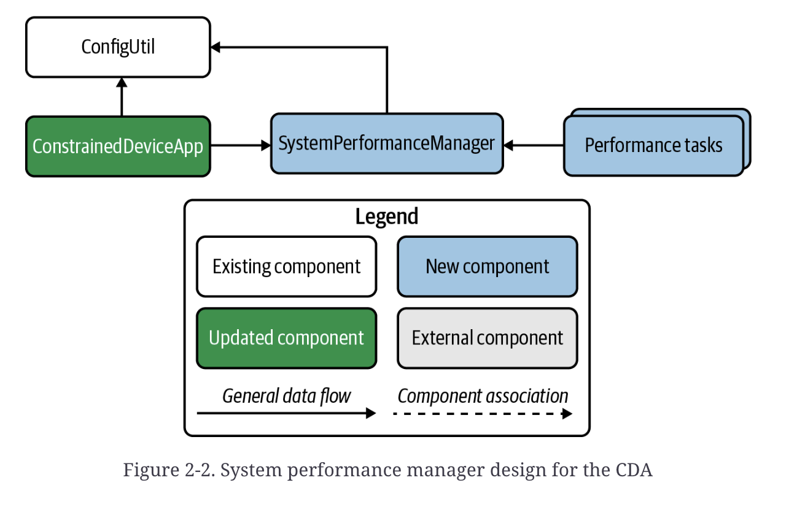
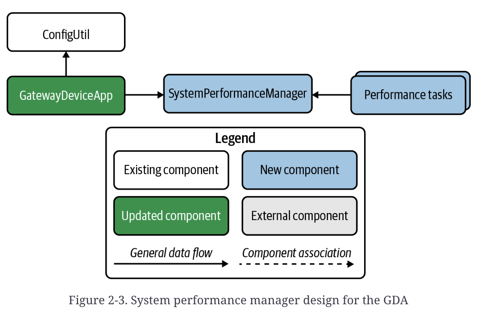

# Charpter2:Initial Edge Tier Applications

<b>Fundamental Concepts</b>:Build two IoT performance monitoring applications—one as an IoT gateway, and the other as an IoT constrained device.

## Design Concepts
如果您考虑您的应用程序需要做的所有事情来解决这个问题，并考虑测试系统行为和性能的重要性，那么您将希望从一开始就“融入”一些重要的功能。

如果可能，您还需要确保您的应用程序可以在不重新设计的情况下进行扩展。 当然，我们几乎不可能设计出一个永远不需要更改的系统！ 也就是说，我们可以牢记三个设计原则，这将有助于减轻重新设计和重构工作（也称为“技术债务”）：
- 1.模块化Modularity：创建执行特定任务（或密切相关的任务）的软件组件。模块化背后的概念应该是关注点分离，这是计算机科学和应用程序设计中经常使用的术语，用于定义系统的架构方式。简而言之，创建服务于非常特定目的的软件模块。不要煮沸海洋。

- 2.接口Interfaces：定义良好的接口或契约可以使软件设计既优雅又高效。设计不良的界面可能会破坏它。接口提供了与模块交互的规则，并为系统的行为提供了一些理智。

- 3.验证Validation：我已经谈了很多关于测试的内容，验证当然是测试给定系统质量的一部分。验证包括在系统内强制执行某些行为的制衡，包括其名义运行条件，不包括可能导致问题（或损害）的那些。例如，测试可能允许范围很广的值，例如将 100ºC 的最高温度值传递给仿真器。但是，如果该仿真器是家庭供暖系统的抽象，则更合理的最大值可能会低得多。系统必须足够聪明来处理这个问题并采取相应的行动（例如，丢弃值、记录警告或错误消息）。
  
## Tracking Your Requirements
正如我在第 1 章中提到的，跟踪您将要实施的问题是一个好主意。 您如何管理这取决于您； 有很多方法可以密切关注您正在处理的工作，并且您可以使用大量的在线工具来执行此操作。

GitHub 在每个存储库中都内置了一个问题跟踪器，当然，您可以使用它，或者您甚至可以创建一个单独的存储库来跟踪跨越 CDA 和 GDA 的问题（这实际上是本书中列出的要求-练习- 任务被管理）。

为方便起见，我创建了一个单独的存储库，其中仅包含 12 个问题——每个章节一个问题（或者更确切地说，每个实验室模块，因为它们被标记）。 如果您愿意，可以使用此存储库 - 每个问题都包含一个简单的复选框，用于每个实验室模块中的每个练习，无论是 CDA、GDA 还是两者。

## Programming Exercises
这是您（最终）开始编码的地方！ 在这些练习中，您将深入探讨讨论系统性能的要求以及如何将此功能添加到您的 CDA 和 GDA 中。

系统性能System performance是系统验证的一部分——它允许您跟踪每个 IoT 应用程序在其中运行的系统正在使用多少内存、CPU 甚至磁盘存储。 此外，此功能的设计将开始运用我在本章前面提到的模块化和接口定义的原则。 您将看到如何将这些概念应用到本章中的练习以及所有其他章节的练习中。

最终，应该清楚如何通过遵循这些原则向 CDA 和 GDA 添加更多功能。

设计 GDA 和 CDA 的第一步是创建一个应用程序包装器，它可以确定需要加载哪些功能，然后一致地启动这些功能。

Figures 2-2 and 2-3 show the system performance manager design for the CDA and GDA, respectively. 

These designs are a bit different from those shown in Figures 1-15 and 1-16, right?  You’ll see in Chapter 3 how this is “corrected,” and yes, it does  mean that a very, very small amount of technical debt is being introduced in this chapter (where the application wrappers for the CDA and GDA each talk directly to ``SystemPerformanceManager``, as opposed to ``DeviceDataManager``).The purpose behind this is more educational—that is, it’s intended to help you quickly build and get some functional capability in place that doesn’t require much rework to integrate with the final end-state design.

Before we dig into coding, I want to quickly note that your initial GDA and CDA designs for this chapter will look very similar to each other. They’ll collect some basic telemetry, which for now will include just CPU utilization and memory utilization, and simply log the data to the console. It won’t be long before you’ll have both applications talking to each other.

### Add System Performance Tasks to the CDA
``ConstrainedDeviceApp`` is the entry point for the application and creates the instance of, and manages, ``SystemPerformanceManager``. There are also two other performance task components: ``SystemCpuUtilTask`` and ``SystemMemUtilTask``. As their names imply, these are components that will collect—you guessed it—system  CPU utilization and system memory utilization. These components will be managed by ``SystemPerformanceManager`` and run as asynchronous threads that update one of the methods you’ll define within ``SystemPerformanceManager``.
(译)``ConstrainedDeviceApp`` 是应用程序的入口点，它创建并管理 ``SystemPerformanceManager`` 的实例。 还有另外两个性能任务组件：``SystemCpuUtilTask`` 和 ``SystemMemUtilTask``。 正如它们的名字所暗示的那样，这些组件将收集（您猜对了）系统 CPU 利用率和系统内存利用率。 这些组件将由 ``SystemPerformanceManager`` 管理，并作为异步线程运行，更新您将在 ``SystemPerformanceManager`` 中定义的方法之一。

