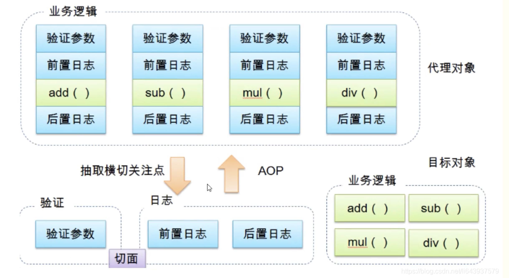
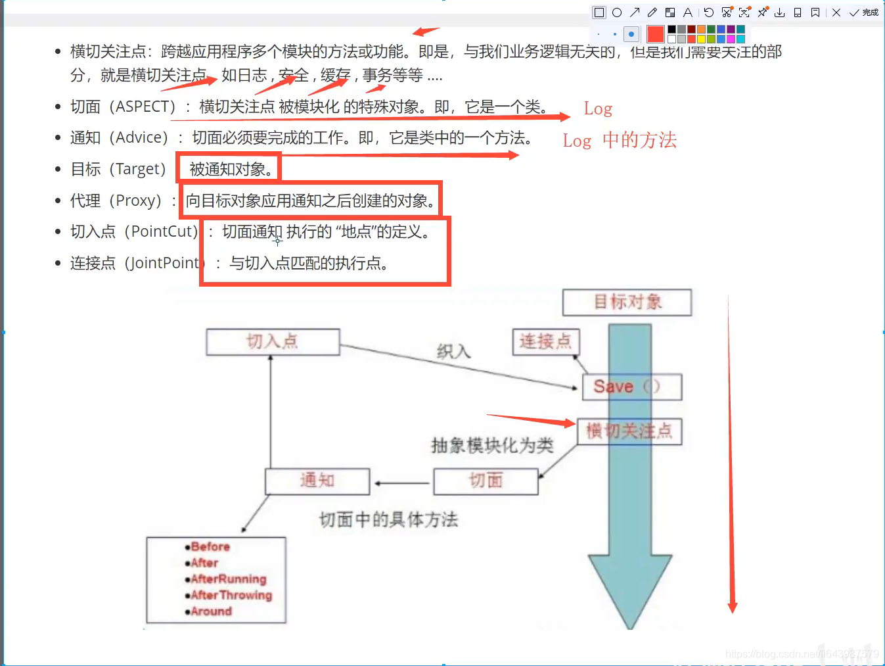
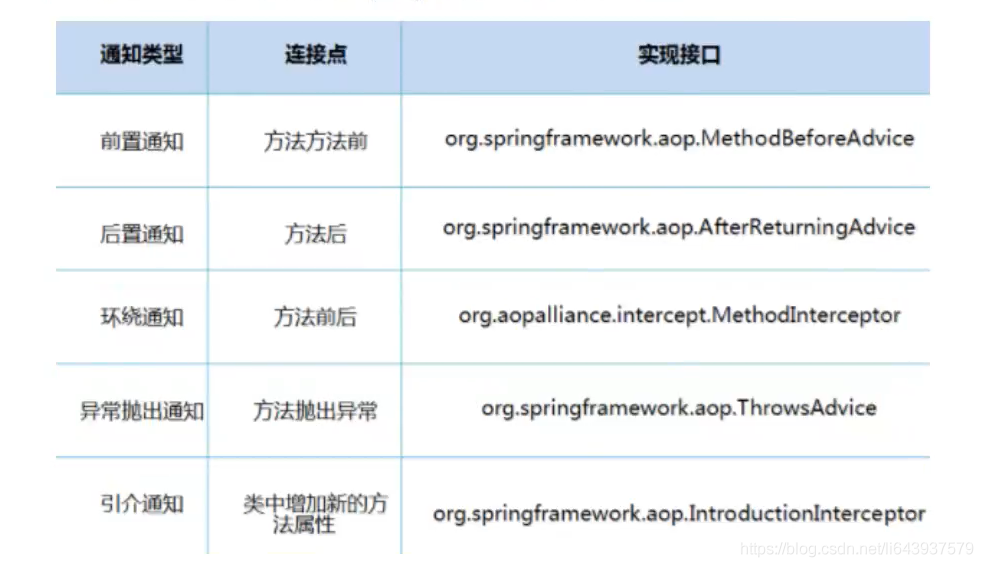

# AOP
## 1.什么是AOP
AOP（Aspect Oriented Programming）意为：面向切面编程，通过预编译方式和运行期动态代理实现程序功能的统一维护的一种技术。AOP是OOP的延续，是软件开发中的一个热点，也是Spring框架中的一个重要内容，是函数式编程的一种衍生范型。利用AOP可以对业务逻辑的各个部分进行隔离，从而使得业务逻辑各部分之间的耦合度降低，提高程序的可重用性，同时提高了开发的效率。



## 2.AOP在Spring中的作用
提供声明式事务；允许用户自定义切面
- 横切关注点：跨越应用程序多个模块的方法或功能。即是，与我们业务逻辑无关的，但是我们需要关注的部分，就是横切关注点。如日志，安全，缓存，事务等等…
- 切面（ASPECT）：横切关注点被模块化的特殊对象。即，它是一个类。
- 通知（Advice）：切面必须要完成的工作。即，它是类中的一个方法。
- 目标（Target）：被通知对象。
- 代理（Proxy）：向目标对象应用通知之后创建的对象。
- 切入点（PointCut）：切面通知执行的“地点”的定义。
- 连接点（JointPoint）：与切入点匹配的执行点。

SpringAOP中，通过Advice定义横切逻辑，Spring中支持5种类型的Advice：

即AOP在不改变原有代码的情况下，去增加新的功能。
## 3.使用Spring实现AOP
【重点】使用AOP织入，需要导入一个依赖包
```xml
<!-- https://mvnrepository.com/artifact/org.aspectj/aspectjweaver -->
<dependency>
    <groupId>org.aspectj</groupId>
    <artifactId>aspectjweaver</artifactId>
    <version>1.9.9.1</version>
    <scope>runtime</scope>
</dependency>
```
### 方式一：使用Spring的API接口【主要是SpringAPI接口实现】
1.在service包下，定义UserService业务接口和UserServiceImpl实现类
```java
public interface UserService {
    public void add();
    public void delete();
    public void update();
    public void select();
}
public class UserServiceImpl implements UserService {
    public void add() {
        System.out.println("增加了一个用户！");
    }

    public void delete() {
        System.out.println("删除了一个用户！");
    }

    public void update() {
        System.out.println("更新了一个用户！");
    }

    public void select() {
        System.out.println("查询了一个用户！");
    }
}
```
2.在log包下，定义我们的增强类，一个Log前置增强和一个AfterLog后置增强类
```java
public class Log implements MethodBeforeAdvice {

    //method: 要执行的目标对象的方法
    //args：参数
    //target：目标对象
    public void before(Method method, Object[] agrs, Object target) throws Throwable {
        System.out.println(target.getClass().getName()+"的"+method.getName()+"被执行了");
    }
}
public class AfterLog implements AfterReturningAdvice {

    //returnValue： 返回值
    public void afterReturning(Object returnValue, Method method, Object[] args, Object target) throws Throwable {
        System.out.println("执行了"+method.getName()+"方法，返回结果为："+returnValue);
    }
}
```
3.最后去spring的文件中注册 , 并实现aop切入实现 , 注意导入约束，配置applicationContext.xml文件
```xml
<?xml version="1.0" encoding="UTF-8"?>
<beans xmlns="http://www.springframework.org/schema/beans"
       xmlns:xsi="http://www.w3.org/2001/XMLSchema-instance"
       xmlns:aop="http://www.springframework.org/schema/aop"
       xsi:schemaLocation="http://www.springframework.org/schema/beans
        https://www.springframework.org/schema/beans/spring-beans.xsd
        http://www.springframework.org/schema/aop
        https://www.springframework.org/schema/aop/spring-aop.xsd">

    <!--注册bean-->
    <bean id="userService" class="com.kuang.service.UserServiceImpl"/>
    <bean id="log" class="com.kuang.log.Log"/>
    <bean id="afterLog" class="com.kuang.log.AfterLog"/>

    <!--方式一：使用原生Spring API接口-->
    <!--配置aop:需要导入aop的约束-->
    <aop:config>
        <!--切入点：expression：表达式，execution(要执行的位置！* * * * *)-->
        <aop:pointcut id="pointcut" expression="execution(* com.kuang.service.UserServiceImpl.*(..))"/>

        <!--执行环绕增加！-->
        <aop:advisor advice-ref="log" pointcut-ref="pointcut"/>
        <aop:advisor advice-ref="afterLog" pointcut-ref="pointcut"/>
    </aop:config>

</beans>
```
4.测试
```java
public class MyTest {
    public static void main(String[] args) {
        ApplicationContext context = new ClassPathXmlApplicationContext("applicationContext.xml");

        //动态代理代理的是接口：注意点
        UserService userService = (UserService) context.getBean("userService");

        userService.add();
		//userService.select();
    }
}
```
### 方式二： 自定义类来实现AOP【主要是切面定义】
1.在diy包下定义自己的DiyPointCut切入类
```java
public class DiyPointCut {
    public void before(){
        System.out.println("======方法执行前======");
    }

    public void after(){
        System.out.println("======方法执行后======");
    }
}
```
2.去spring中配置文件
```xml
<!--方式二：自定义类-->
<bean id="diy" class="com.kuang.diy.DiyPointCut"/>

<aop:config>
    <!--自定义切面，ref 要引用的类-->
    <aop:aspect ref="diy">
        <!--切入点-->
        <aop:pointcut id="point" expression="execution(* com.kuang.service.UserServiceImpl.*(..))"/>
        <!--通知-->
        <aop:before method="before" pointcut-ref="point"/>
        <aop:after method="after" pointcut-ref="point"/>
    </aop:aspect>
</aop:config>
```
3.测试
```java
public class MyTest {
    public static void main(String[] args) {
        ApplicationContext context = new ClassPathXmlApplicationContext("applicationContext.xml");

        //动态代理代理的是接口：注意点
        UserService userService = (UserService) context.getBean("userService");

        userService.add();
		userService.select();
    }
}
```
### 方式三：使用注解实现！
1.在diy包下定义注解实现的AnnotationPointCut增强类
```java
//声明式事务！
@Aspect //标注这个类是一个切面
public class AnnotationPointCut {

    @Before("execution(* com.kuang.service.UserServiceImpl.*(..))")
    public void before(){
        System.out.println("====方法执行前====");
    }

    @After("execution(* com.kuang.service.UserServiceImpl.*(..))")
    public void after(){
        System.out.println("====方法执行后====");
    }

    //在环绕增强中，我们可以给定一个参数，代表我们要获取处理切入的点；
    @Around("execution(* com.kuang.service.UserServiceImpl.*(..))")
    public void around(ProceedingJoinPoint jp) throws Throwable{
        System.out.println("环绕前");

        Signature signature = jp.getSignature();// 获得签名
        System.out.println("signature:"+signature);

        Object proceed = jp.proceed(); //执行方法

        System.out.println("环绕后");

        System.out.println(proceed);
    }

}
```
2.在Spring配置文件中，注册bean，并增加支持注解的配置。
```xml
<!--方式三：使用注解-->
<bean id="annotationPointCut" class="com.kuang.diy.AnnotationPointCut"/>
<!--开启注解支持！ JDK(默认是 proxy-target-class="false")  cglib（proxy-target-class="true"）-->
<aop:aspectj-autoproxy/>
```
3.测试
```java
import com.kuang.service.UserService;
import org.springframework.context.ApplicationContext;
import org.springframework.context.support.ClassPathXmlApplicationContext;

public class MyTest {
    public static void main(String[] args) {
        ApplicationContext context = new ClassPathXmlApplicationContext("applicationContext.xml");

        //动态代理的是接口:注意点
        UserService userService = (UserService) context.getBean("userService");

        userService.add();
        userService.delete();
    }
}

```