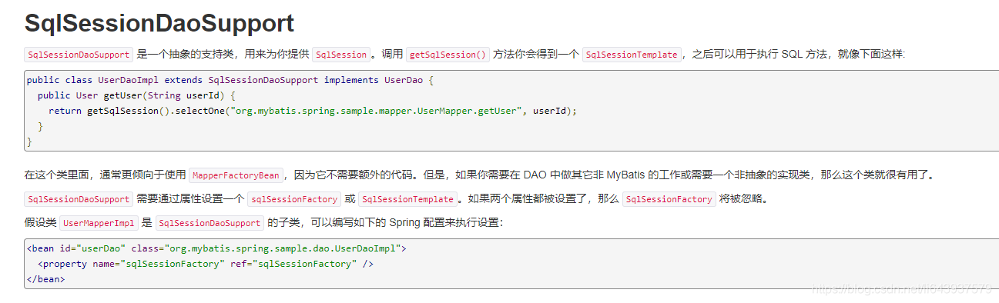

# Mybatis-Spring
什么是MyBatis-Spring？

MyBatis-Spring 会帮助你将 MyBatis 代码无缝地整合到 Spring 中。

文档链接：http://mybatis.org/spring/zh/index.html

如果使用 Maven 作为构建工具，仅需要在 pom.xml 中加入以下代码即可：
```xml
<!-- https://mvnrepository.com/artifact/org.mybatis/mybatis-spring -->
<dependency>
    <groupId>org.mybatis</groupId>
    <artifactId>mybatis-spring</artifactId>
    <version>2.0.2</version>
</dependency>
```
##整合实现一：
1.引入Spring配置文件spring-dao.xml
```xml
<?xml version="1.0" encoding="UTF-8"?>
<beans xmlns="http://www.springframework.org/schema/beans"
       xmlns:xsi="http://www.w3.org/2001/XMLSchema-instance"
       xmlns:aop="http://www.springframework.org/schema/aop"
       xsi:schemaLocation="http://www.springframework.org/schema/beans
        https://www.springframework.org/schema/beans/spring-beans.xsd
        http://www.springframework.org/schema/aop
        https://www.springframework.org/schema/aop/spring-aop.xsd">

</beans>
```
2.配置数据源替换mybaits的数据源
```xml
<!--DataSource:使用Spring的数据源替换Mybatis的配置 c3p0 dbcp druid
    我们这里使用Spring提供的JDBC：-->
<bean id="dataSource" class="org.springframework.jdbc.datasource.DriverManagerDataSource">
    <property name="driverClassName" value="com.mysql.jdbc.Driver"/>
    <property name="url" value="jdbc:mysql://localhost:3306/mybatis?useSSL=false&amp;useUnicode=true&amp;characterEncoding=UTF-8"/>
    <property name="username" value="root"/>
    <property name="password" value="123456"/>
</bean>
```
3.配置SqlSessionFactory，关联MyBatis
```xml
<!--sqlSessionFactory-->
<bean id="sqlSessionFactory" class="org.mybatis.spring.SqlSessionFactoryBean">
    <property name="dataSource" ref="dataSource" />
    <!--关联mybatis配置文件-->
    <property name="configLocation" value="classpath:mybatis-config.xml"/>
    <property name="mapperLocations" value="classpath:com/kuang/mapper/*.xml"/>
</bean>
```
4.注册sqlSessionTemplate，关联sqlSessionFactory
```xml
<!--SqlSessionTemplate:就是我们使用的sqlSession-->
<bean id="sqlSession" class="org.mybatis.spring.SqlSessionTemplate">
    <!--只能使用构造器注入sqlSessionFactory，因为它没有set方法-->
    <constructor-arg index="0" ref="sqlSessionFactory" />
</bean>
```
5.需要UserMapper接口的UserMapperImpl 实现类，私有化sqlSessionTemplate
```java
public class UserMapperImpl implements UserMapper {

    //我们的所有操作，都使用sqlSession来执行，在原来，现在都使用SqlsessionTemplate
    private SqlSessionTemplate sqlSession;

    public void setSqlSession(SqlSessionTemplate sqlSession) {
        this.sqlSession = sqlSession;
    }

    public List<User> selectUser() {
        UserMapper mapper = sqlSession.getMapper(UserMapper.class);
        return mapper.selectUser();
    }
}
```
6.将自己写的实现类，注入到Spring配置文件中。
```xml
<bean id="userMapper" class="com.kuang.mapper.UserMapperImpl">
    <property name="sqlSession" ref="sqlSession"/>
</bean>
```
7.测试使用即可！
```java
@Test
public void test () throws IOException {

    ApplicationContext context = new ClassPathXmlApplicationContext("spring-dao.xml");

    UserMapper userMapper = context.getBean("userMapper", UserMapper.class);
    for (User user : userMapper.selectUser()) {
        System.out.println(user);
    }
}
```
spring-dao.xml整体代码
```xml
<?xml version="1.0" encoding="UTF-8"?>
<beans xmlns="http://www.springframework.org/schema/beans"
       xmlns:xsi="http://www.w3.org/2001/XMLSchema-instance"
       xmlns:aop="http://www.springframework.org/schema/aop"
       xsi:schemaLocation="http://www.springframework.org/schema/beans
        https://www.springframework.org/schema/beans/spring-beans.xsd
        http://www.springframework.org/schema/aop
        https://www.springframework.org/schema/aop/spring-aop.xsd">

    <!--DataSource:使用Spring的数据源替换Mybatis的配置 c3p0 dbcp druid
我们这里使用Spring提供的JDBC：-->
    <bean id="dataSource" class="org.springframework.jdbc.datasource.DriverManagerDataSource">
        <property name="driverClassName" value="com.mysql.cj.jdbc.Driver"/>
        <property name="url" value="jdbc:mysql://localhost:3306/mybatis?useSSL=false&amp;useUnicode=true&amp;characterEncoding=UTF-8"/>
        <property name="username" value="root"/>
        <property name="password" value="123456"/>
    </bean>

    <!--sqlSessionFactory-->
    <bean id="sqlSessionFactory" class="org.mybatis.spring.SqlSessionFactoryBean">
        <property name="dataSource" ref="dataSource" />
        <!--关联mybatis配置文件-->
        <property name="configLocation" value="classpath:mybatis-config.xml"/>
        <property name="mapperLocations" value="classpath:com/kuang/mapper/*.xml"/>
    </bean>

    <!--SqlSessionTemplate:就是我们使用的sqlSession-->
    <bean id="sqlSession" class="org.mybatis.spring.SqlSessionTemplate">
        <!--只能使用构造器注入sqlSessionFactory，因为它没有set方法-->
        <constructor-arg index="0" ref="sqlSessionFactory" />
    </bean>

    <bean id="userMapper" class="com.kuang.mapper.UserMapperImpl">
        <property name="sqlSession" ref="sqlSession"/>
    </bean>

</beans>
```
<strong>注意</strong>：在进行测试的时候记得把mybatis-config.xml文件里面的代码删除掉！！！

进行完spring整合后，发现mybatis里面几乎没有东西了。

mybatis-config.xml代码
```xml
<?xml version="1.0" encoding="UTF-8" ?>
<!DOCTYPE configuration
        PUBLIC "-//mybatis.org//DTD Config 3.0//EN"
        "http://mybatis.org/dtd/mybatis-3-config.dtd">
<configuration>

    <typeAliases>
        <package name="com.kuang.pojo"/>
    </typeAliases>
</configuration>
```
进行完spring-dao.xml配置之后我们就可以直接使用配置文件，在applicationContext.xml里面使用,一样能得出现查询的结果

applicationContext.xml代码
```xml
<?xml version="1.0" encoding="UTF-8"?>
<beans xmlns="http://www.springframework.org/schema/beans"
       xmlns:xsi="http://www.w3.org/2001/XMLSchema-instance"
       xmlns:aop="http://www.springframework.org/schema/aop"
       xsi:schemaLocation="http://www.springframework.org/schema/beans
        https://www.springframework.org/schema/beans/spring-beans.xsd
        http://www.springframework.org/schema/aop
        https://www.springframework.org/schema/aop/spring-aop.xsd">

   <import resource="spring-dao.xml"/>
    <!---->
    <bean id="userMapper" class="com.kuang.mapper.UserMapperImpl">
        <property name="sqlSession" ref="sqlSession"/>
    </bean>

</beans>
```
Mytest
```java
public class MyTest {

    @Test
    public void test() throws IOException {
     ApplicationContext context = new ClassPathXmlApplicationContext("applicationContext.xml");

        UserMapper userMapper = context.getBean("userMapper", UserMapper.class);
        for (User user : userMapper.selectUser()) {
            System.out.println(user);
        }
    }
}
```
## 整合实现二：

mybatis-spring1.2.3版以上的才有这个，官方文档截图：

dao继承Support类 , 直接利用 getSqlSession() 获得 , 然后直接注入SqlSessionFactory . 比起整合方式一 , 不需要管理SqlSessionTemplate , 而且对事务的支持更加友好 . 可跟踪源码查看。

测试：

将我们上面写的UserMapperImpl修改一下
```java
public class UserMapperImpl extends SqlSessionDaoSupport implements UserMapper {

    public List<User> selectUser() {
        
        return getSqlSession().getMapper(UserMapper.class).selectUser();
    }
}
```
注入到Spring配置文件中。
```xml
<bean id="userMapper" class="com.kuang.mapper.UserMapperImpl">
    <property name="sqlSessionFactory" ref="sqlSessionFactory" />
</bean>
```
测试
```java
@Test
public void test () throws IOException {

    ApplicationContext context = new ClassPathXmlApplicationContext("spring-dao.xml");
    
    UserMapper userMapper = context.getBean("userMapper", UserMapper.class);
    for (User user : userMapper.selectUser()) {
        System.out.println(user);
    }
}
```
## 总结
https://mybatis.org/spring/zh/getting-started.html
Spring和Mybatis的整合主要是通过Spring的DriverManagerDataResource类来实现

即
```xml
<!-- 头文件 -->
<beans xmlns="http://www.springframework.org/schema/beans"
       xmlns:xsi="http://www.w3.org/2001/XMLSchema-instance"
       xmlns:context="http://www.springframework.org/schema/context"
       xmlns:aop="http://www.springframework.org/schema/aop"
       xsi:schemaLocation="http://www.springframework.org/schema/beans
	        https://www.springframework.org/schema/beans/spring-beans.xsd
	        http://www.springframework.org/schema/context
	        https://www.springframework.org/schema/context/spring-context.xsd
		    http://www.springframework.org/schema/aop
        	https://www.springframework.org/schema/aop/spring-aop.xsd">
<!-- 配置mybatis -->
<bean id="随便赋值一个名字，一般使用dataSource" class="org.springframework.jdbc.datasource.DriverManagerDataSource">
    <!-- property中写连接数据库的各种参数 -->
    <property name="driverClassName" value="com.mysql.jdbc.Driver"/>
    <property name="url" value="jdbc:mysql://localhost:3306/mybatis?characterEncoding=utf-8&amp;serverTimezone=UTC&amp;useSSL=false"/>
    <property name="username" value="root"/>
    <property name="password" value="1234"/>
</bean>
```
<b>那么，在只使用Mybatis的情况下</b><br>要让AbstractSqlSessionFactory使用IO接口得到的这个config文件;
让SqlSessionFactoryBuilder.build()生成JDBC的SqlSessionFactory；
然后用SqlSessionFactory的openSession()方法来实现sql语句。
<br>
<b>在整合Spring和Mybatis的话</b><br>上述所要生成的SqlSessionFactory以及后面的SqlSession都可以使用bean来生成
生成sqlSessionFactory
```xml
<!--    sqlSessionFactory-->
<bean id="sqlSessionFactory" class="org.mybatis.spring.SqlSessionFactoryBean">
    <property name="dataSource" ref="dataSource"/>
<!--        绑定mybatis配置文件-->
    <property name="configLocation" value="classpath:mybatis-config.xml"/>
    <!-- 定义了mapperLocation，也可以把这个mapper写到外面
    class="org.mybatis.spring.mapper.MapperFactoryBean"-->
    <property name="mapperLocations" value="classpath:com/kuang/dao/*.xml"/>

</bean>
```
生成sqlSessionTemplate，也就是sqlSession，sqlSessionTemplate没有set()方法，只能构造器注入
```xml
<!-- qlSession就是sqlSessionTemplate -->
<bean id="sqlSession" class="org.mybatis.spring.SqlSessionTemplate">
<!--但是SqlSessionTemplate没有set方法，不能和FactoryBean一样直接设置property属性，所以要通过构造器注入，来new这个对象-->
    <constructor-arg ref="sqlSessionFactory"/>
</bean>
```
如果选择使用Spring来实现Mybatis，必须创建接口实现类，因为！！！jdk proxy，就是jdk代理
https://blog.csdn.net/Dream_Weave/article/details/84542346
注入实现类
```xml
<!--注入实现类-->
<bean id="userMapperImpl" class="com.kuang.dao.UserMapperImpl">
    <property name="session" ref="sqlSession"/>
</bean>
```