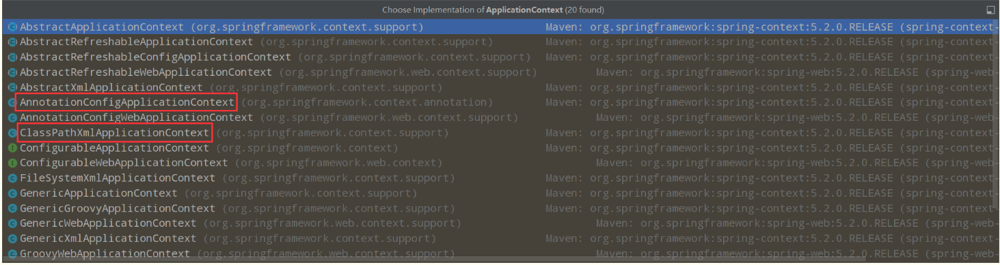

# 使用Java的方式配置Spring
我们现在要完全不使用Spring的xml配置了，全权交给Java来做！

JavaConfig 原来是 Spring 的一个子项目，它通过 Java 类的方式提供 Bean 的定义信息，在 Spring4 的版本， JavaConfig 已正式成为 Spring4 的核心功能 。



实体类
```java
package com.kuang.pojo;

import org.springframework.beans.factory.annotation.Value;
import org.springframework.stereotype.Component;

@Component
public class User {
    private String name;

    public String getName() {
        return name;
    }
    @Value("秦疆")
    public void setName(String name) {
        this.name = name;
    }

    /**
     * 注意：1. 如果开启包扫描，加载配置类以后就可以通过反射拿到配置类中的对象了，
     * 2. @Bean只写在方法上，返回的是一个对象，但一般不获取已经在容器中的对象
     * 3. @Bean 可以用于通过方法获取数据库连接池Connection这种对象
     *
     */
    @Override
    public String toString() {
        return "User{" +
                "name='" + name + '\'' +
                '}';
    }
}
```
<font color=red>
    1. 如果开启包扫描，加载配置类以后就可以通过反射拿到配置类中的对象了<br>
    2. @Bean只写在方法上，返回的是一个对象，但一般不获取已经在容器中的对象<br>
    3. @Bean 可以用于通过方法获取数据库连接池Connection这种对象
</font>

配置文件
```java
package com.kuang.config;

import com.kuang.pojo.User;
import org.springframework.context.annotation.Bean;
import org.springframework.context.annotation.ComponentScan;
import org.springframework.context.annotation.Configuration;
import org.springframework.context.annotation.Import;

/*
如果开启包扫描，加载配置类以后就可以通过反射拿到配置类中的对象了，
@Bean只写在方法上，返回的是一个对象，但一般不获取已经在容器中的对象
@Bean 可以用于通过方法获取数据库连接池Connection这种对象
 */
@Configuration
@ComponentScan("com.kuang.pojo")
@Import(config2.class)
public class config {
    @Bean
    public User getUser(){
        return new User();
    }
}

public class config2 {
}
```
<font color=red>
    1.如果开启包扫描，加载配置类以后就可以通过反射拿到配置类中的对象了<br>
    2.@Bean只写在方法上，返回的是一个对象，但一般不获取已经在容器中的对象<br>
    3.@Bean 可以用于通过方法获取数据库连接池Connection这种对象
</font>

测试类
```java
import com.kuang.config.config;
import com.kuang.pojo.User;
import org.springframework.context.annotation.AnnotationConfigApplicationContext;

public class test {
    public static void main(String[] args) {
        AnnotationConfigApplicationContext annotationConfigApplicationContext = new AnnotationConfigApplicationContext(config.class);
        User user = annotationConfigApplicationContext.getBean("user", User.class);
        User user1 = annotationConfigApplicationContext.getBean("getUser", User.class);
        System.out.println(user1.hashCode());
        System.out.println(user.hashCode());
    }
}

Hashcode输出结果：
2073621255
1208121709
/*
在使用@Configuration声明配置类时，有两种方法来生成Bean
1. 在配置类中定义一个方法，用@Bean来注解声明
2. 在User类上用@Component注解，并在配置类上@ComponentScan("User类的路径")，这样会自动扫描，getBean的时候使用的id就是类名小写（user）

如果两种方法都使用，会建两个对象，@Component建立的对象用getBean("user")获取，配置类中@Bean声明的用getBean("getUser")获取，这两个对象是不同的

 */
 ```
在使用@Configuration声明配置类时，有两种方法来生成Bean
1. 在配置类中定义一个方法，用@Bean来注解声明
2. 在User类上用@Component注解，并在配置类上@ComponentScan("User类的路径")，这样会自动扫描，getBean的时候使用的id就是类名小写（user）

如果两种方法都使用，会建两个对象，@Component建立的对象用getBean("user")获取，配置类中@Bean声明的用getBean("getUser")获取，这两个对象是不同的