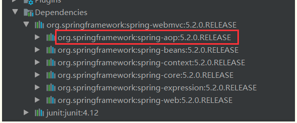

# 使用注解开发
在Spring4之后，要使用注解开发，必须保证aop包导入了

使用注解需要导入约束，配置注解的支持！
```xml
<?xml version="1.0" encoding="UTF-8"?>
<beans xmlns="http://www.springframework.org/schema/beans"
        xmlns:xsi="http://www.w3.org/2001/XMLSchema-instance"
        xmlns:context="http://www.springframework.org/schema/context"
        xsi:schemaLocation="http://www.springframework.org/schema/beans
            https://www.springframework.org/schema/beans/spring-beans.xsd
            http://www.springframework.org/schema/context
            https://www.springframework.org/schema/context/spring-context.xsd">
        
        <!--开启注解的支持，这个是需要在每个属性上面添加@Autowire注解才能生效-->
        <context:annotation-config/>

        <!--开启注解支持，使用了context:component-scan来让对象自动装配 扫描指定包下的注解就会生效
        要求：@Componentz加在class上
        -->
        <context:component-scan base-package="com.kuang.pojo"/>
</beans>

```
## 1. bean
   我们之前都是使用 bean 的标签进行bean注入，但是实际开发中，我们一般都会使用注解！
   1.配置扫描那些包下的注解
    ```xml
    <!--指定注解扫描包-->
    <context:component-scan base-package="com.kuang.pojo"/>
    ```
   2.在制定包下编写类，增加注释
   ```java
    @Component("user")
    // 相当于配置文件中 <bean id="user" class="当前注解的类"/>
    public class User {
        public String name = "狂神";
    }
   ```
   3.测试
   ```java
    @Test
    public void test(){
        ApplicationContext applicationContext =
            new ClassPathXmlApplicationContext("beans.xml");
        User user = (User) applicationContext.getBean("user");
        System.out.println(user.name);
    }
   ```
## 2. 属性如何注入
   使用注解注入属性

    1.可以不用提供set方法，直接在直接名上添加@value("值")
    ```java
    @Component("user")
    // 相当于配置文件中 <bean id="user" class="当前注解的类"/>
    public class User {
        @Value("狂神")
        // 相当于配置文件中 <property name="name" value="狂神"/>
        public String name;
    }
    ```
    2.如果提供了set方法，在set方法上添加@value("值")
    ```java
    @Component("user")
    public class User {

        public String name;

        @Value("狂神")
        public void setName(String name) {
            this.name = name;
        }
    }
    ```
## 3. 衍生的注解
   我们这些注解，就是替代了在配置文件当中配置步骤而已！更加的方便快捷！

    <b>@Component三个衍生注解</b>

    为了更好的进行分层，Spring可以使用其它三个注解，功能一样，目前使用哪一个功能都一样。

    - @Controller： web层
    - @Service：service层
    - @Repository：dao层

    写上这些注释，就相当于将这个类交给Spring管理装配了！
## 4. 自动装配
   在Bean的自动装配已经讲过了，可以回顾！

    - @Autowired：自动装配通过类型，名字。如果Autowired不能唯一自动装配上属性，则需要通过@Qualifier(value = "xxx")去配置。
    - @Nullable 字段标记了了这个注解，说明这个字段可以为null;
    - @Resource：自动装配通过名字，类型。
## 5. 作用域
   @scope

    - singleton：默认的，Spring会采用单例模式创建这个对象。关闭工厂 ，所有的对象都会销毁。
    - prototype：多例模式。关闭工厂 ，所有的对象不会销毁。内部的垃圾回收机制会回收
  ```java
    @Component
    @Scope("singleton")
    public class User {

        //相当于  <property name="name" value="狂神"/>
        @Value("狂神")
        public String name;
    }
```
## 6. 小结
   <b>xml与注解：</b>

     - xml更加万能，适用于任何场合！维护简单方便
     - 注解不是自己类使用不了，维护相队复杂！
  
    <b>xml与注解实践：</b>
    - xml用来管理bean；
    - 注解只负责完成属性的注入；
    - 我们在使用的过程中，只需要注意一个问题：必须让注解生效，就需要开启注解的支持

    ```xml
        <!--指定要扫描的包，这个包下的注解就会生效-->
        <context:component-scan base-package="com.kuang"/>
        <!--开启注解的支持-->
        <context:annotation-config/>
    ```
    <b>作用：</b>
    - 进行注解驱动注册，从而使注解生效
    - 用于激活那些已经在spring容器里注册过的bean上面的注解，也就是显示的向Spring注册
    - 如果不扫描包，就需要手动配置bean
    - 如果不加注解驱动，则注入的值为null！
