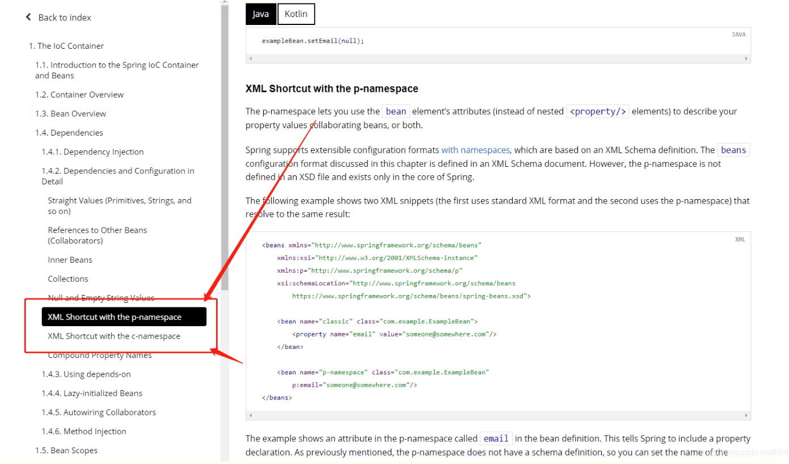
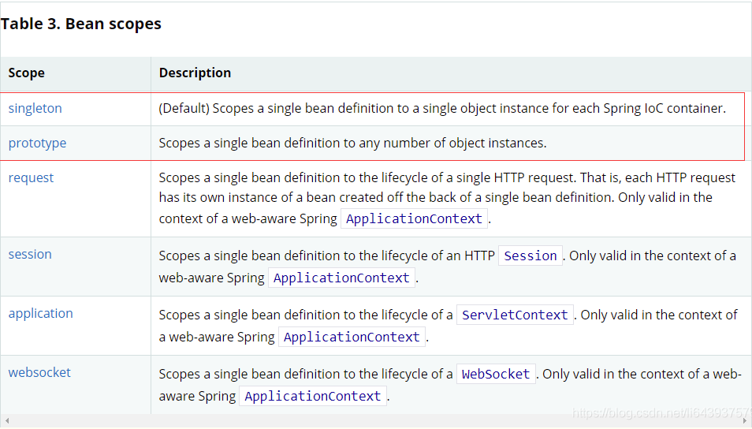
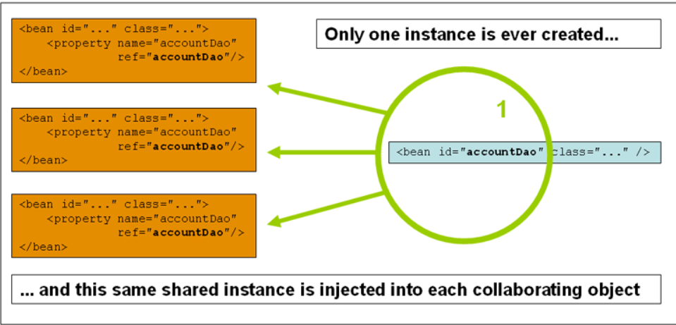
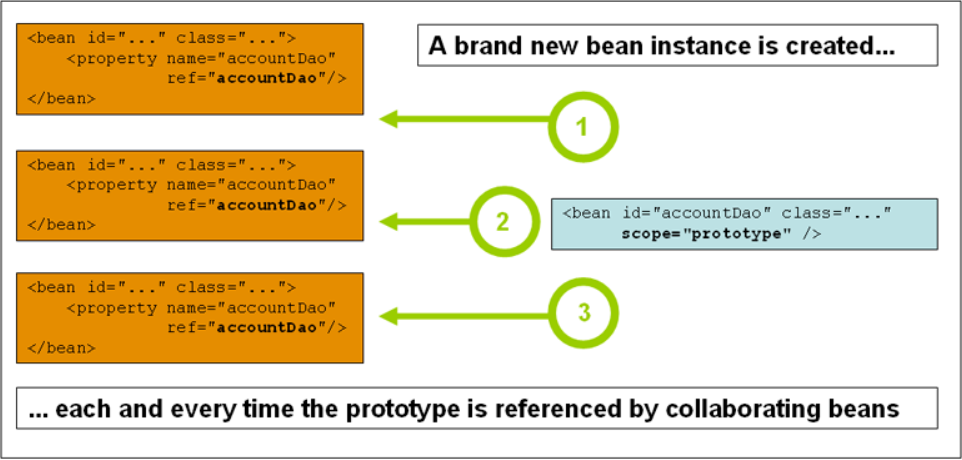

# 依赖注入

## 一、构造器注入

使用的是在study03中的一般构造方法
```xml
<?xml version="1.0" encoding="UTF-8"?>
<beans xmlns="http://www.springframework.org/schema/beans"
xmlns:xsi="http://www.w3.org/2001/XMLSchema-instance"
xsi:schemaLocation="http://www.springframework.org/schema/beans
https://www.springframework.org/schema/beans/spring-beans.xsd">


    <!--使用Spring来创建对象，在Spring这些都称为Bean
    类型 变量名 = new 类型();
    Hello hello = new Hello();

    id = 变量名
    class = new的对象
    property 相当于给对象中的属性设置一个值！
    等同于 Hello hello = new hello(name:"Spring");
        -->
    <bean id="user" class="com.kuang.pojo.User">
<!--        同时使用property和constructor标签，会自动使用有参构造-->
<!--        有参构造的三种方式-->
<!--        1。写属姓名-->
<!--        <constructor-arg name="name" value="狂神"/>-->
<!--        2。写下标-->
<!--        <constructor-arg index="0" value="狂神"/>-->
<!--        3.写类型(明确的类型)-->
        <constructor-arg type="java.lang.String" value="大狂神"/>
<!--        但是！spring还是没有办法避免创建那些在main程序中没有使用的对象，只要注册到spring里面了，就一定会创建-->
    </bean>

<!--    <alias name="user" alias="user2"/> 其实没什么用，可以在bean下的name属性只鹅姐其别名，并且可以使用多个别名，都可以输出(多个别名之间可以使用空格，逗号，分号隔开)-->
<!--import一般用于团队开发，可以将多个配置文件，导入合并为一个<import resource="applicationContext.xml"-->
</beans>

```
## <font color=red>二、set方式注入 ！！！***重点***</font>
### 1. 依赖注入：set注入！
   1. 依赖：bean对象的创建依赖于容器
   2. 注入：bean对象中的所有属性，由容器来注入

【环境搭建】

1. 复杂类型
```java
public class Address {
    private String address;

    public String getAddress() {
        return address;
    }

    public void setAddress(String address) {
        this.address = address;
    }
}

```
2. 真实测试对象
```java
package com.kuang.pojo;

import java.util.*;

public class Student {

    private String name;
    private Address address;
    private String[] books;
    private List<String> hobbies;
    private Map<String,String> card;
    private Set<String> games;
    private String wife;
    private Properties info;

    public String getName() {
        return name;
    }

    public void setName(String name) {
        this.name = name;
    }

    public Address getAddress() {
        return address;
    }

    public void setAddress(Address address) {
        this.address = address;
    }

    public String[] getBooks() {
        return books;
    }

    public void setBooks(String[] books) {
        this.books = books;
    }

    public List<String> getHobbies() {
        return hobbies;
    }

    public void setHobbies(List<String> hobbies) {
        this.hobbies = hobbies;
    }

    public Map<String, String> getCard() {
        return card;
    }

    public void setCard(Map<String, String> card) {
        this.card = card;
    }

    public Set<String> getGames() {
        return games;
    }

    public void setGames(Set<String> games) {
        this.games = games;
    }

    public String getWife() {
        return wife;
    }

    public void setWife(String wife) {
        this.wife = wife;
    }

    public Properties getInfo() {
        return info;
    }

    public void setInfo(Properties info) {
        this.info = info;
    }

    @Override
    public String toString() {
        return "Student{" +
                "name='" + name + '\'' +
                ", address=" + address +
                ", books=" + Arrays.toString(books) +
                ", hobbies=" + hobbies +
                ", card=" + card +
                ", games=" + games +
                ", wife='" + wife + '\'' +
                ", info=" + info +
                '}';
    }
}

```

3. beans
```xml
<?xml version="1.0" encoding="UTF-8"?>
<beans xmlns="http://www.springframework.org/schema/beans"
       xmlns:xsi="http://www.w3.org/2001/XMLSchema-instance"
       xsi:schemaLocation="http://www.springframework.org/schema/beans
        https://www.springframework.org/schema/beans/spring-beans.xsd">
    <bean name="student" class="com.kuang.pojo.Student">
        <property name="name" value="你真棒！"/>
    </bean>
</beans>

```
4. 测试类
```java
public class MyTest {
    public static void main(String[] args) {
        ApplicationContext context = new ClassPathXmlApplicationContext("beans.xml");

        Student student = (Student) context.getBean("student");
        System.out.println(student.getName());
    }
}

```
5. 完善信息
```xml
<?xml version="1.0" encoding="UTF-8"?>
<beans xmlns="http://www.springframework.org/schema/beans"
       xmlns:xsi="http://www.w3.org/2001/XMLSchema-instance"
       xsi:schemaLocation="http://www.springframework.org/schema/beans
        https://www.springframework.org/schema/beans/spring-beans.xsd">
    <bean id="address" class="com.kuang.pojo.Address">
        <property name="address" value="波士顿"/>
    </bean>
    <bean id="student" class="com.kuang.pojo.Student">
        <!--第一种：普通值注入，value-->
        <property name="name" value="辣子鸡"/>
        <!--第二种：复杂类型，bean注入，ref-->
        <property name="address" ref="address"/>
        <!--arrays数组注入，ref-->
        <property name="books">
            <array>
                <value>数据结构与算法</value>
                <value>计算机组成原理</value>
                <value>计算机网络</value>
                <value>操作系统</value>
            </array>
        </property>
        <!--List注入-->
        <property name="hobbies">
            <list>
                <value>散步</value>
                <value>看风景</value>
                <value>品尝美食</value>
            </list>
        </property>
        <!--map注入-->
        <property name="card">
            <map>
                <entry key="身份证" value="123567785671352"></entry>
                <entry key="银行卡" value="124354562543414"></entry>
            </map>
        </property>
        <!--set注入-->
        <property name="games">
            <set>
                <value>LoL</value>
                <value>DNF</value>
                <value>Stream</value>
            </set>
        </property>
        <!--null注入-->
        <property name="wife">
            <null></null>
        </property>
        <!--Properties-->
        <property name="info">
            <props>
                <prop key="driver">201929201</prop>
                <prop key="urk">120.324.23:123</prop>
                <prop key="user">辣子鸡</prop>
                <prop key="pwd">2134535</prop>
            </props>
        </property>
    </bean>
</beans>

```
## 三、拓展方式注入
我们可以使用p命名空间和c命名空间进行注入。

User类
```java
package com.kuang.pojo;

public class User {
    private String name;
    private int age;

    public String getName() {
        return name;
    }

    public void setName(String name) {
        this.name = name;
    }

    public int getAge() {
        return age;
    }

    public void setAge(int age) {
        this.age = age;
    }

    @Override
    public String toString() {
        return "User{" +
                "name='" + name + '\'' +
                ", age=" + age +
                '}';
    }
}

```
拓展Spring配置

<font color=red>p命名空间注入 ---> 对应set注入  ---> 无参构造器和set方法</font><br>
<font color=red>c命名空间注入 ---> 对应构造器注入  ---> 有参构造器</font>

```xml
<?xml version="1.0" encoding="UTF-8"?>
<beans xmlns="http://www.springframework.org/schema/beans"
       xmlns:xsi="http://www.w3.org/2001/XMLSchema-instance"
       xmlns:p="http://www.springframework.org/schema/p"
       xsi:schemaLocation="http://www.springframework.org/schema/beans
        https://www.springframework.org/schema/beans/spring-beans.xsd">
    <!--p命名空间注入，可以直接注入属性的值：property-->
    <!--p命名就是set方式注入，需要无参构造和set方法-->
    <bean id="user" class="com.kuang.pojo.User" p:age="30" p:name="辣子鸡"/>

    <bean id="user" class="com.kuang.pojo.User" c:age="30" c:name="辣子鸡"/>
    <!--c命名空间注入的时候，还可以选择index下标-->
</beans>
```

测试类
```java
public static void main(String[] args) {
    ApplicationContext context = new ClassPathXmlApplicationContext("extendApplicationContext.xml");
    User user = context.getBean("user", User.class);
    System.out.println(user.toString());
}
输出结果为：User{name='辣子鸡', age=30}
```
<strong>注意点：p命名空间和c命名空间不能直接使用，需要导入xml约束</strong>
```http request
xmlns:p="http://www.springframework.org/schema/p"
xmlns:c="http://www.springframework.org/schema/c"
```

## 四、Bean的作用域

### 1.单例模式（Spring默认机制）
```xml
<bean id="user2" class="com.kuang.pojo.User" c:name="狂神" c:age="22" scope="singleton"/>
```

测试结果
```java
public static void main(String[] args) {
    ApplicationContext context = new ClassPathXmlApplicationContext("extendApplicationContext.xml");
    User user = context.getBean("user", User.class);
    User user2 = context.getBean("user", User.class);
    System.out.println(user==user2);
}
结果是：true
```
### 2.prototype模式 原型模式

```xml
<bean id="user" class="com.kuang.pojo.User" c:age="30" c:name="辣子鸡" scope="prototype"/>
```
测试结果
```java
public static void main(String[] args) {
    ApplicationContext context = new ClassPathXmlApplicationContext("extendApplicationContext.xml");
    User user = context.getBean("user", User.class);
    User user2 = context.getBean("user", User.class);
    System.out.println(user==user2);
}
结果是：false
```
### 3.其他模式：request，session，application
这些只能在web开发中用到！

